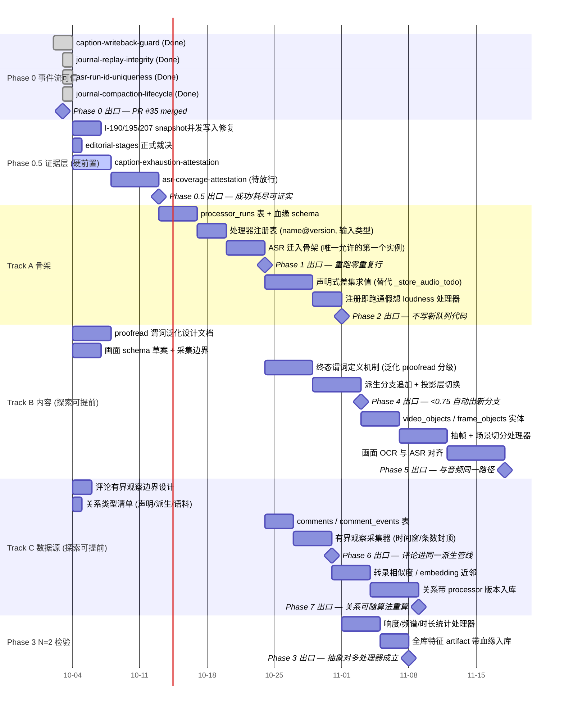

# Roadmap 甘特图

配套 [`roadmap.md`](roadmap.md)。时间为**相对估算**（以一人 + agent 计），
日历锚点以实际推进为准；W = 周。轨道结构与落地约束见 [roadmap.md](roadmap.md) §轨道结构。

> **状态快照 2026-10-04**：Phase 0 已全部收口（PR #35 合并，post-merge close 完成）。
> **Phase 0.5**（`iter-2026-10-asr-success-attestable`）为在飞迭代，是所有并发探索的硬前置。
> 三条轨道（骨架/内容/数据源）在 Phase 0.5 出口后并行启动，落地受 Track A 前置约束。

## 读图说明

- **Phase 0 四行是已收口的在飞 plan**（`iter-2026-10-ledger-integrity`，PR #35）：
  `caption-writeback-guard` → `2ad1726`、`journal-replay-integrity` → `1dc720b`、
  `asr-run-id-uniqueness` → `4357617`、`journal-compaction-lifecycle` → `ab9683a`/`ec9d3d2`；
  `m0` 已于 2026-10-03 达成（合并 `53c11a8`，close `ad165aa`）。
- **Phase 0.5 是所有并发探索的硬前置**。除两个 attestation leg 外，
  `I-000190`/`I-000195`/`I-000207`（snapshot 并发写入缺陷族）与 editorial-stages 裁决
  也在本阶段关闭——processor_runs 是公共表，写并发只会更常见。
- **`p4design` / `p5design` / `p6design` / `p7design` 从 2026-10-04 开始**，
  与 Phase 0.5 并行——这些是纯设计/草案工作，不产生 schema 落地，不受 Track A 阻塞。
  这是"并发探索"的准确含义。
- **落地依赖（硬约束）**：
  `p4a`/`p6a` 等所有 Track B/C 落地任务都锚在 `m1`（Phase 1 出口）之后；
  即使设计提前完成，新表/新处理器注册/新 source 接入也必须等骨架就位。
- **Track B/C 之间无硬依赖**——`p6a` 不依赖 `m4`，`p5a` 不依赖 `m6`；
  一人开发时仍建议串行（注意力成本），但结构上允许并行。
- **Phase 3（N=2 检验）独立于 Track B/C**——它在 Track A 之后立即开始，
  验证注册表对第二个处理器的真实承载力，不依赖画面或评论。
- **关键路径**：`p05a→p05b` → `p1a→p1b→p1c` → `p2a→p2b` → `p3a→p3b`。
  Track B/C 的探索并行不在这条路径上；落地并行可以，但每个 Track 的落地仍走自己的链。
- 竖红线为当前日期，落在 Phase 0.5 上，与在飞状态一致。

## 压缩空间

| 手段 | 压缩对象 | 代价 |
|---|---|---|
| Phase 0.5 两条 leg 并行（`asr-coverage-attestation` 与 `caption-exhaustion-attestation` 无代码依赖） | 总时长 ~5d | 两线都动取证路径，须错峰改 `subtitle_ingest`/`asr` 观测面；需操作者放行 D12 |
| Track B/C 探索与 Phase 0.5 全并行 | 设计阶段 ~5d | 已体现在图中；无额外代价 |
| Phase 3 用现成 loudness 库而非自研 | p3a 2d | 血缘字段照记，依赖外部库版本 |
| Track B/C 落地并行（一人多上下文） | m2→m6 总时长 | 注意力切换成本；不建议在一人模式下做 |
