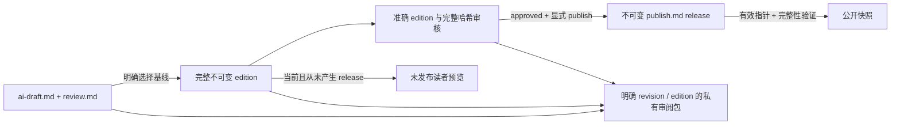

# AI 双稿、完整版本审核与发布架构

当前输入/内容/模板和导出协议的版本矩阵见 [契约治理](contract-governance.md#支持矩阵与历史身份)。导出入口使用安装包内 Schema 做结构检查，再验证内容身份与文件关系；七文件普通审阅包、十文件迁移正文审阅包以及两种 AI 模板分别有明确布局。以下图文是其注明的历史基线。

日期：2026-10-09（Asia/Hong_Kong）。基线 `5d7a57e201564a10dec7a360b2ef8f7874dc51a7`（本次架构修复的源码提交）。
交互式架构图：[打开 HTML](ai-proofreading-architecture.html)，[可编辑图稿](ai-proofreading-architecture.json)。
入口见 [使用说明](ai-proofreading.md)；当前模块边界与跨域关系见
[架构文字说明](architecture.md)和已刷新到同一基线的[全景图](architecture.html)。
完整条件、事务与恢复过程见[时序图总索引](architecture-sequences.md)，其中校对、渲染、出版、导出分别为 09–12。

## 目标与主链路

校对把口述字幕整理为语句、逻辑通顺的阅读稿。允许清理无意义口头语、重复和半句重启，
合并跨字幕句子、调整局部语序；保留观点、论据、例子、因果和转折，不摘要、不扩写。

1. 字幕采集与音频下载独立执行；ASR 只依赖音频，不依赖字幕存在或成功。
2. 两路转录分别保存来源明确的不可变版本。原始归档发布独立进行，不等待校对。
3. 校对默认以 ASR 为基础，将当时可用的 CC / AI 字幕作为可选参考；固定实际版本、内容、视频元数据、提示词和配置。
4. 纯输入准备模块按时间交集关联字幕，按上下文和输出预算尽量使用大块；邻块上下文只读。
5. DeepSeek Flash 开启 high 思考，top_p=0.95，生成带连续来源 ID 的完整阅读段落和单独疑点。
6. 校验来源恰好覆盖一次且顺序不变、引用有效、正文结构正确；取得任务所有权写锁后保存块检查点，全部成功后受保护地提交完整修订。
7. 独立渲染任务生成纯正文 `ai-draft.md` 与原文对照 `review.md`，同 revision、同 `ai-draft-v1`。重渲染不调用模型。
8. 明确创建完整 edition，冻结标题、正文、摘要、标签、来源、整理归属和编辑说明；任何读者可见变化产生新 edition。
9. 审核指定 edition、完整 SHA-256、预期状态和操作者；批准仍不公开，显式 publish 才生成 release 并切换公开指针。
10. 公开导出只读有效 release；未发布预览选择当前且从未产生任何 release 的 edition；私有导出明确选定 revision / edition，包含固定基线、完整版本、双差异和审核记录。

## 模块边界

| 模块 | 输入 | 输出与责任 |
| --- | --- | --- |
| 工作流控制 | 范围、策略、配置、持久化结果 | 计划、依赖、认领、租约、尝试与重试 |
| 字幕 / 音频 / ASR handler | 视频部分 ID、配置 | 独立来源的音频或转录；不调用校对 handler |
| 固定输入与分块 | 数据库转录版本、可选字幕、配置 | 不可变快照、稳定块 ID、参考引用、只读上下文；不依赖原始归档文件 |
| DeepSeek 适配器 | 块、冻结提示词和参数 | JSON 段落候选；不写文档或调度任务 |
| 校验与提交 | 候选、固定基础片段 | 阅读段落、程序取得的原文与时间、来源列表、疑点、独立修订 |
| Markdown 渲染 | 已保存修订、模板 | ai-draft.md / review.md；纯排版、字节稳定 |

无状态指业务进度、输入选择和结果不依赖进程内存。客户端实例可以短期存在，重启后仍从 SQLite 恢复。
控制、原始转录、派生结果是同一数据库的逻辑分区，不是独立部署服务。

## 输入与修订契约

冻结主转录、可选参考、元数据、模型、规则、提示词和参数。重试不得重新选择最新版本。
默认 1M 上下文，输入预算 480,000，输出 262,144，安全预留 16,384。
UTF-8 字节数用于保守预算，输出估计包含思考、全文段落、ID 和疑点；实际用量保存 API usage。
每个基础片段恰好归属一个块；每个阅读段落关联连续的一组片段，段落整体按来源顺序排列。
跨段切开的“平 / 台”在合并段落中恢复为“平台”，不再保留字幕边界。

JSON 字段为 chunk_id、paragraphs；段落字段为 segment_ids、text、issues。
校验拒绝漏段、重复、乱序、未知来源、只读来源混入、无关证据和非纯段落正文。
结构覆盖只是来源追溯，不能证明模型保留了全部语义。数字、专名、否定、立场和引述归属不能猜改，
未确认疑点列入校对记录；疑点不回退整段，周围表达仍需通顺。

当前规则 `readable-prose-v2`、AI 模板 `ai-draft-v1`、发布模板 `publish-v1`。旧稿件 schema、文件名、模板、CLI 和 manifest 拒绝，不迁移。
相同快照和配置命中同一输入；参数或提示词改变生成新输入及任务。保存模型实际响应与最终修订，
已保存结果可确定性渲染，重新推理不能承诺文字一致。

## 数据模型与文档

| 表 | 持久化内容 |
| --- | --- |
| workflow_jobs / workflow_attempts | 依赖、租约、尝试、结果与终态；复用现有调度器 |
| editorial_inputs / editorial_job_inputs | 不可变输入、分块、来源、配置、提示词及任务绑定 |
| editorial_model_calls | 所属尝试、请求、实际响应（含思考返回）、用量、时间与错误；不存密钥 |
| editorial_chunk_results | 每块验证后的段落、source IDs、原文、时间与疑点 JSON |
| editorial_revisions | 完整派生修订、内容标识、ai-unreviewed / needs-review 状态 |
| document_artifacts | 修订、模板、路径和 SHA-256 |
| publication_editions | 完整不可变读者内容、父版、AI 来源及完整内容哈希 |
| publication_edition_reviews | 每个 edition 的当前准确内容哈希审核状态、审核人、意见和时间；历次变更追加到 events |
| publication_releases | 获批固定 publish.md、批准记录、内容 / 字节哈希、发布状态 |
| publication_heads | 分 P 的当前 edition 和当前有效 release 两个独立指针 |
| publication_events | 编辑、审核、批准、发布、替换和撤回的追加事实 |

阅读站不会直接连接数据库。`publication export` 以只读模式读取有效 release，验证精确批准关系、完整内容、
来源和文件哈希，输出 catalog version 2 envelope、发布文章、配对的原始 `review.md` 和独立 manifest。
`publication export-drafts` 为当前且从未发布的 edition 输出同样配对的未发布快照。
校验参照公开每段原文、AI 整理稿、来源与时间、疑点、模型和采样参数；它针对 AI 初稿，不代表人工批准。
审核事件、操作者、请求配置、差异文件和完整审阅包仍另行私有导出。
损坏有效 release 或配对 AI 参照稿使整个导出失败。`editorial export` 明确选择 revision / edition，生成私有审阅包。
完整内容差异覆盖正文、标题、标签和说明；见 [契约说明](contracts/README.md)。

原始字幕和 ASR 不被覆写。通过来源 ID 追溯，不额外建立第二套调度或稀疏编辑表。
旧工作流类型约束不自动迁移，不删除现有数据库；需要支持新类型的归档库。
块结果立即保存，失败重试复用完成块。租约与尝试编号防止失效工作器提交。
供应商收到请求但本地未保存时退出，重试可能再次计费，不承诺外部调用恰好一次。

产物位于 documents/part-<ID>/<修订ID>/ai-draft-v1/。
ai-draft.md 仅含正文段落；无标题、目录、时间戳、脚注、链接或审核说明。
review.md 保存每段原文和整理稿、全部来源 ID、时间与回看链接、疑点、模型参数和版本，注明未经人工复核。
每份文件原子安装，相同修订与模板重新渲染字节一致。文本生成、完整双稿身份预检、
`stage_artifact` 临时文件写入与文件 fsync 在锁外；最终不可变安装、POSIX 目录 fsync 和双稿 artifact 登记共享租约保护写事务。
两文件不构成文件系统事务，失败可能保留第一份已写字节；读取方仍验证完整登记与固定内容。

`manuscript_templates.py` 固定 `AI_RENDERERS` 与 `PUBLISH_RENDERERS`。读取历史 artifact 按记录版本
重渲染并验证，不拿后来的 active writer 算法解释旧文件；未知版本拒绝，排版变化需要新模板、路径与身份。
当前已注册 `ai-draft-v1` / `publish-v1`，不据此宣称已有 v2 writer。

`publication create` 从当前原始 `video_tags` 冻结 edition 标签；后续抓取不修改既有版本。
`publication sync-source-tags` 要求成功标签观察（包含成功空集合），以精确父版 CAS 创建新的 pending-review edition；
原有效 release 保持。标签 unavailable 保留旧原始集合，但不能视为本次刷新成功。

发布稿位于 `publications/part-<ID>/<releaseID>/publish-v1/publish.md`，渲染完整获批内容。
A 发布后创建、请求修改、拒绝或批准 B 都保持 A；显式发布 B 才切换有效 release。
撤回清空公开指针，再次公开导出时移除旧文章，内部历史保留。OS 独占锁、完整 staging、恢复日志和目录切换
保证成功快照不混合版本；输出可能短暂不可用。输出与输入不重叠，链接、junction 和手工文件拒绝。
只部署输出目录，其父目录为私有恢复空间；已部署副本和缓存需与撤回同步刷新。

## 当前代码证据与验证

- [src/bili_asr/storage/editorial.py:39–45](../src/bili_asr/storage/editorial.py#L39)：`EditorialRepository.latest_sources`。
- [src/bili_asr/storage/editorial.py:93–116](../src/bili_asr/storage/editorial.py#L93)：`EditorialRepository.freeze_job_input`。
- [src/bili_asr/editorial.py:133–195](../src/bili_asr/editorial.py#L133)：`prepare_input`。
- [src/bili_asr/storage/workflow.py:405–410](../src/bili_asr/storage/workflow.py#L405)：`WorkflowRepository._editorial_jobs`。
- [src/bili_asr/storage/workflow.py:283–291](../src/bili_asr/storage/workflow.py#L283)：`WorkflowRepository.owned_transaction`。
- [src/bili_asr/deepseek.py:38–58](../src/bili_asr/deepseek.py#L38)：`DeepSeekClient.complete`。
- [src/bili_asr/editorial_runtime.py:36–61](../src/bili_asr/editorial_runtime.py#L36)：`EditorialWorkflowHandlers.proofread`。
- [src/bili_asr/editorial.py:215–262](../src/bili_asr/editorial.py#L215)：`validate_revision`。
- [src/bili_asr/storage/editorial.py:146–149](../src/bili_asr/storage/editorial.py#L146)：`EditorialRepository.save_chunk`。
- [src/bili_asr/storage/editorial.py:151–167](../src/bili_asr/storage/editorial.py#L151)：`EditorialRepository.commit_revision`。
- [src/bili_asr/manuscript_templates.py:82–86](../src/bili_asr/manuscript_templates.py#L82)：`renderer_for`。
- [src/bili_asr/editorial_runtime.py:63–97](../src/bili_asr/editorial_runtime.py#L63)：`EditorialWorkflowHandlers.render`。
- [src/bili_asr/publication.py:44–67](../src/bili_asr/publication.py#L44)：`get_ai_artifacts`。
- [src/bili_asr/cli/publication.py:137–185](../src/bili_asr/cli/publication.py#L137)：`add_publication_parser`。
- [src/bili_asr/publication.py:134–174](../src/bili_asr/publication.py#L134)：`publish_edition`。
- [src/bili_asr/publication_tags.py:25–41](../src/bili_asr/publication_tags.py#L25)：`sync_source_tags`。
- [src/bili_asr/storage/publication.py:22–233](../src/bili_asr/storage/publication.py#L22)：`PublicationRepository`。
- [src/bili_asr/publication_export.py:61–105](../src/bili_asr/publication_export.py#L61)：`export_publications`。
- [src/bili_asr/publication_export.py:108–181](../src/bili_asr/publication_export.py#L108)：`export_publication_drafts`。
- [src/bili_asr/publication_export.py:193–271](../src/bili_asr/publication_export.py#L193)：`export_editorial`。
- [src/bili_asr/export_snapshot.py:367–444](../src/bili_asr/export_snapshot.py#L367)：`replace_snapshot`。

完整业务、安装与图表验收见 [验证记录](architecture-validation.md)。

## 本次边界修复

CLI 经 WorkflowApplication 编排；显式校对的固定 input 与两个任务同一事务提交。自动校对先纯准备，再将 input 与 job binding 放入租约保护事务。双稿先在事务外编码、暂存、fsync，事务内仅安装、复验和登记。失败后已安装的不可变文件可作为未登记字节安全重试；数据库事务不能回滚文件。出版内容、来源身份、canonical JSON 使用独立纯契约模块，存储与快照不会反向调用出版用例。
