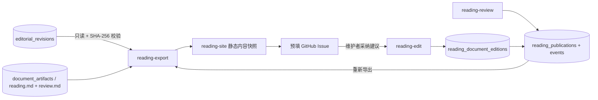

# AI 校对与可阅读正文架构

日期：2026-10-08。工作流、AI 校对与阅读站发布的当前实现。
交互式架构图：[打开 HTML](ai-proofreading-architecture.html)，[可编辑图稿](ai-proofreading-architecture.json)。
入口见 [使用说明](ai-proofreading.md)；模块边界和跨域关系以
[当前总架构图](architecture.html) 为准。

## 目标与主链路

校对把口述字幕整理为语句、逻辑通顺的阅读稿。允许清理无意义口头语、重复和半句重启，
合并跨字幕句子、调整局部语序；保留观点、论据、例子、因果和转折，不摘要、不扩写。

1. 字幕采集与音频下载独立执行；ASR 只依赖音频，不依赖字幕存在或成功。
2. 两路转录分别保存来源明确的不可变版本。原始归档发布独立进行，不等待校对。
3. 校对默认以 ASR 为基础，将当时可用的 CC / AI 字幕作为可选参考；固定实际版本、内容、视频元数据、提示词和配置。
4. 纯输入准备模块按时间交集关联字幕，按上下文和输出预算尽量使用大块；邻块上下文只读。
5. DeepSeek Flash 开启 high 思考，top_p=0.95，生成带连续来源 ID 的完整阅读段落和单独疑点。
6. 校验来源恰好覆盖一次且顺序不变、引用有效、正文结构正确；逐块保存检查点，全部成功后提交完整修订。
7. 独立渲染任务生成纯正文 reading.md 与带原文对照的 review.md。重渲染读取保存结果，不调用模型。

## 模块边界

| 模块 | 输入 | 输出与责任 |
| --- | --- | --- |
| 工作流控制 | 范围、策略、配置、持久化结果 | 计划、依赖、认领、租约、尝试与重试 |
| 字幕 / 音频 / ASR handler | 视频部分 ID、配置 | 独立来源的音频或转录；不调用校对 handler |
| 固定输入与分块 | 数据库转录版本、可选字幕、配置 | 不可变快照、稳定块 ID、参考引用、只读上下文；不依赖原始归档文件 |
| DeepSeek 适配器 | 块、冻结提示词和参数 | JSON 段落候选；不写文档或调度任务 |
| 校验与提交 | 候选、固定基础片段 | 阅读段落、程序取得的原文与时间、来源列表、疑点、独立修订 |
| Markdown 渲染 | 已保存修订、模板 | reading.md / review.md；纯排版、字节稳定 |

无状态指业务进度、输入选择和结果不依赖进程内存。客户端实例可以短期存在，重启后仍从 SQLite 恢复。
控制、原始转录、派生结果是同一数据库的逻辑分区，不是独立部署服务。

## 输入与修订契约

冻结主转录、可选参考、元数据、模型、规则、提示词和参数。重试不得重新选择最新版本。
默认 1M 上下文，输入预算 480,000，输出 262,144，安全预留 16,384。
UTF-8 字节数用于保守预算，输出估计包含思考、全文段落、ID 和疑点；实际用量保存 API usage。
每个基础片段恰好归属一个块；每个阅读段落关联连续的一组片段，段落整体按来源顺序排列。
跨段切开的“平 / 台”在合并段落中恢复为“平台”，不再保留字幕边界。

JSON 字段为 chunk_id、paragraphs；段落字段为 segment_ids、text、issues。
校验拒绝漏段、重复、乱序、未知来源、只读来源混入、无关证据和非纯段落正文。
结构覆盖只是来源追溯，不能证明模型保留了全部语义。数字、专名、否定、立场和引述归属不能猜改，
未确认疑点列入校对记录；疑点不回退整段，周围表达仍需通顺。

当前规则 readable-prose-v2、模板 reading-v2。与旧稀疏标点编辑规则不兼容，不迁移旧结果。
相同快照和配置命中同一输入；参数或提示词改变生成新输入及任务。保存模型实际响应与最终修订，
已保存结果可确定性渲染，重新推理不能承诺文字一致。

## 数据模型与文档

| 表 | 持久化内容 |
| --- | --- |
| workflow_jobs / workflow_attempts | 依赖、租约、尝试、结果与终态；复用现有调度器 |
| editorial_inputs / editorial_job_inputs | 不可变输入、分块、来源、配置、提示词及任务绑定 |
| editorial_model_calls | 所属尝试、请求、实际响应（含思考返回）、用量、时间与错误；不存密钥 |
| editorial_chunk_results | 每块验证后的段落、source IDs、原文、时间与疑点 JSON |
| editorial_revisions | 完整派生修订、内容标识、ai-unreviewed / needs-review 状态 |
| document_artifacts | 修订、模板、路径和 SHA-256 |
| reading_publications | 独立于质量状态的 Issue 审核与发布状态、当前人工版本 |
| reading_document_editions | 从 Issue 建议采纳的 Markdown 人工版本、父版本与内容哈希 |
| reading_publication_events | 每次状态变化对应的修订、人工版本、Issue、备注和时间 |

阅读站不会直接连接数据库。`reading-export` 以 SQLite 只读模式选择
`reading.md` 与 `review.md`，按归档根与配置的 artifact root 查找文件，并验证数据库登记的哈希；
模型请求和原始转录不会导出。导出的待审核稿会在静态站明确标注，
所以部署到公开托管时，待审正文也会公开。

原始字幕和 ASR 不被覆写。通过来源 ID 追溯，不额外建立第二套调度或稀疏编辑表。
旧工作流类型约束不自动迁移。不兼容数据库在修改前被拒绝，需要操作者删除并重新采集；
数据库事实会丢失，恢复流程见 [metadata-storage.md](metadata-storage.md#6-schema-不兼容时重建)。
块结果立即保存，失败重试复用完成块。租约与尝试编号防止失效工作器提交。
供应商收到请求但本地未保存时退出，重试可能再次计费，不承诺外部调用恰好一次。

产物位于 write base 的 documents/part-<ID>/<修订ID>/reading-v2/。
write base 默认是 archive root，可由 workflow run 的 `--artifact-root` 或
`BILI_ARTIFACT_ROOT` 配置；document artifact 保存相对路径和哈希，读取使用同一配置。
reading.md 仅含正文段落；无标题、目录、时间戳、脚注、链接或审核说明。
review.md 保存每段原文和整理稿、全部来源 ID、时间与回看链接、疑点、模型参数和版本，注明未经人工复核。
文件原子写入，相同修订与模板重新渲染字节一致。

## 当前代码证据与验证

- src/bili_asr/editorial.py：冻结输入、大块预算、段落来源校验与纯正文渲染。
- src/bili_asr/deepseek.py：官方 JSON 模式、high 思考及 top_p 请求。
- src/bili_asr/editorial_runtime.py、storage/editorial.py：调用审计、检查点、完整修订及文档。
- src/bili_asr/reading_publication.py、cli/reading.py：只读站点导入、状态转换、Issue 关联和人工版本审计。
- src/bili_asr/storage/workflow.py：独立依赖、认领、租约、尝试与渲染模板版本。
- tests/test_ai_editorial.py：正文、来源、恢复、接口参数、租约和重渲染契约。

离线测试与真实 API 运行验证链路和格式；人工回听、逐句语义保真和准确率评估另需执行。
