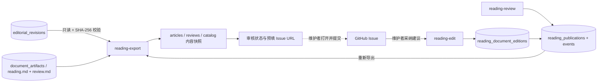

# AI 校对与可阅读正文架构

日期：2026-10-08。工作流、AI 校对与阅读内容快照导出的当前实现。
交互式架构图：[打开 HTML](ai-proofreading-architecture.html)，[可编辑图稿](ai-proofreading-architecture.json)。
入口见 [使用说明](ai-proofreading.md)；模块边界和跨域关系以
[当前总架构图](architecture.html) 为准。

## 目标与主链路

校对把口述字幕整理为语句、逻辑通顺的阅读稿。允许清理无意义口头语、重复和半句重启，
合并跨字幕句子、调整局部语序；保留观点、论据、例子、因果和转折，不摘要、不扩写。

1. 字幕采集与音频下载独立执行；ASR 只依赖音频，不依赖字幕存在或成功。
2. 两路转录分别保存来源明确的不可变版本。原始归档发布独立进行，不等待校对。
3. 校对默认以 ASR 为基础，将当时可用的 CC / AI 字幕作为可选参考；固定实际版本、内容、视频元数据、提示词和配置。
4. 纯输入准备模块按时间交集关联字幕，按上下文和输出预算尽量使用大块；邻块上下文只读。
5. DeepSeek Flash 开启 high 思考，top_p=0.95，生成带连续来源 ID 的完整阅读段落和单独疑点。
6. 校验来源恰好覆盖一次且顺序不变、引用有效、正文结构正确；取得任务所有权写锁后保存块检查点，全部成功后受保护地提交完整修订。
7. 独立渲染任务生成 reading.md 与 review.md 的临时文件，再在所有权事务内替换两份最终文件并登记摘要。重渲染读取保存结果，不调用模型。

## 模块边界

| 模块 | 输入 | 输出与责任 |
| --- | --- | --- |
| 工作流控制 | 范围、策略、配置、持久化结果 | 计划、依赖、认领、租约、尝试、失败重试与协作式取消 |
| 字幕 / 音频 / ASR handler | 视频部分 ID、配置 | 独立来源的音频或转录；不调用校对 handler |
| 固定输入与分块 | 数据库转录版本、可选字幕、配置 | 不可变快照、稳定块 ID、参考引用、只读上下文；不依赖原始归档文件 |
| DeepSeek 适配器 | 块、冻结提示词和参数 | JSON 段落候选；不写文档或调度任务 |
| 校验与提交 | 候选、固定基础片段 | 阅读段落、原文与时间、来源及疑点；在任务拥有的事务内接受块和完整修订 |
| Markdown 渲染 | 已保存修订、模板 | reading.md / review.md；纯排版、字节稳定；受保护的最终替换和摘要登记 |

无状态指业务进度、输入选择和结果不依赖进程内存。客户端实例可以短期存在，重启后仍从 SQLite 恢复。
控制、原始转录、派生结果是同一数据库的逻辑分区，不是独立部署服务。

## 输入与修订契约

冻结主转录、可选参考、元数据、模型、规则、提示词和参数。重试不得重新选择最新版本。
默认 1M 上下文，输入预算 480,000，输出 262,144，安全预留 16,384。
UTF-8 字节数用于保守预算，输出估计包含思考、全文段落、ID 和疑点；实际用量保存 API usage。
每个基础片段恰好归属一个块；每个阅读段落关联连续的一组片段，段落整体按来源顺序排列。
跨段切开的“平 / 台”在合并段落中恢复为“平台”，不再保留字幕边界。

JSON 字段为 chunk_id、paragraphs；段落字段为 segment_ids、text、issues。
校验拒绝漏段、重复、乱序、未知来源、只读来源混入、无关证据和非纯段落正文。
结构覆盖只是来源追溯，不能证明模型保留了全部语义。数字、专名、否定、立场和引述归属不能猜改，
未确认疑点列入校对记录；疑点不回退整段，周围表达仍需通顺。

当前规则 readable-prose-v2、模板 reading-v2。与旧稀疏标点编辑规则不兼容，不迁移旧结果。
相同快照和配置命中同一输入；参数或提示词改变生成新输入及任务。保存模型实际响应与最终修订，
已保存结果可确定性渲染，重新推理不能承诺文字一致。

## 数据模型与文档

| 表 | 持久化内容 |
| --- | --- |
| workflow_jobs / workflow_attempts | 依赖、租约、尝试、结果与包括 cancelled 的终态；复用现有调度器 |
| editorial_inputs / editorial_job_inputs | 不可变输入、分块、来源、配置、提示词及任务绑定 |
| editorial_model_calls | 所属尝试、请求、实际响应（含思考返回）、用量、时间与错误；不存密钥 |
| editorial_chunk_results | 每块验证后的段落、source IDs、原文、时间与疑点 JSON |
| editorial_revisions | 完整派生修订、内容标识、ai-unreviewed / needs-review 状态 |
| document_artifacts | 修订、模板、路径和 SHA-256 |
| reading_publications | 独立于质量状态的 Issue 审核与发布状态、当前人工版本 |
| reading_document_editions | 从 Issue 建议采纳的 Markdown 人工版本、父版本与内容哈希 |
| reading_publication_events | 每次状态变化对应的修订、人工版本、Issue、备注和时间 |

`reading-export` 以 SQLite 只读模式选择已渲染且未拒绝或撤回的修订，
优先从配置的 artifact root 读取 `reading.md` / `review.md`，再回退归档根，
并验证数据库登记的哈希；人工修订正文使用数据库保存的内容与摘要。
它生成 `articles/`、`reviews/`、`catalog.json` 和受管理文件 manifest，
catalog 包含质量状态、审核状态及 Issue URL。review.md 包含原文对照与疑点；完整模型调用审计不随快照导出。

这是阅读内容快照，当前仓库没有阅读站前端代码。命令不会生成页面、部署网站或自动提交 Issue；
快照中的状态与链接供后续展示层消费，不能据此断言页面会明确标注待审核稿。
若维护者将这些文件公开托管，导出的待审正文和审阅文档也会公开。

原始字幕和 ASR 不被覆写。通过来源 ID 追溯，不额外建立第二套调度或稀疏编辑表。
旧工作流类型约束及 attempt outcome / 终态 CHECK 不自动迁移；
不支持当前 cancelled 契约的数据库会在写入控制入口被拒绝，需要先备份并重建兼容库。
重新安装程序不会修改旧 CHECK，程序不自动删除或重建原库。
块结果在受保护事务内保存，失败重试复用完成块。租约与尝试编号防止失效工作器提交。
供应商收到请求但本地未保存时退出，重试可能再次计费，不承诺外部调用恰好一次。

产物位于 write base 的 documents/part-<ID>/<修订ID>/reading-v2/。
write base 默认是 archive root，可由 workflow run 的 `--artifact-root` 或
`BILI_ARTIFACT_ROOT` 配置；document artifact 保存相对路径和哈希，读取使用同一配置。
reading.md 仅含正文段落；无标题、目录、时间戳、脚注、链接或审核说明。
review.md 保存每段原文和整理稿、全部来源 ID、时间与回看链接、疑点、模型参数和版本，注明未经人工复核。
两份文件先编码、同步并计算摘要，再在同一所有权事务内最终替换与登记。
相同修订与模板重新渲染字节一致；文件系统与 SQLite 不构成跨介质原子事务，异常后仍须核对摘要。

## 取消与提交顺序

取消选择明确 job ID，不级联依赖。queued / running 转为 cancelled，已成功、失败或取消的任务保持原态并返回 noop。
校对取消后，下游 render 仍为 queued，status 可报告直接或间接的 `blocked_by_cancelled`。
失败 retry、相同输入的重复 proofread 以及相同修订/模板的重复 render 不恢复已取消任务。

校对在块前后检查 lease，保存块与完整 revision 时通过 `owned_transaction` 先取得 SQLite 写锁，再验证当前所有权。
渲染的文件准备在锁外完成，所有最终替换与 artifacts 登记在锁内进行。
取消先提交时，旧 worker 无法接受新的块、revision 或最终文档；结果事务先取得锁时，取消等待其结束。
已经提交的检查点和文档保留，取消不回滚历史事实。结果提交后、job finish 前仍可能接受取消，须分别看任务终态与已提交结果。

协作式取消不立即终止供应商请求，不撤销计费。晚到的模型响应和错误仍可作为调用审计保留，不能当作成功校对结果。
API 请求、推理和文档编码不占有最终结果写锁。操作及旧库策略见 [工作流取消指南](workflow-cancellation.md)。

## 当前代码证据与验证

- src/bili_asr/editorial.py：冻结输入、大块预算、段落来源校验与纯正文渲染。
- src/bili_asr/deepseek.py：官方 JSON 模式、high 思考及 top_p 请求。
- src/bili_asr/editorial_runtime.py、storage/editorial.py：调用审计、检查点、完整修订及文档。
- src/bili_asr/reading_publication.py、cli/reading.py：只读内容快照导出、状态转换、Issue URL 关联和人工版本审计。
- src/bili_asr/storage/workflow.py：独立依赖、认领、租约、尝试、受保护提交、取消与渲染模板版本。
- tests/test_ai_editorial.py：正文、来源、恢复、接口参数、租约和重渲染契约。
- tests/test_workflow_cancellation.py：独立连接下的取消竞争、模型晚到、渲染暂存后的提交拒绝、取消任务不复活及旧 attempt 契约拒绝。
- tests/test_reading_publication.py：只读导出、摘要校验、审核状态、人工版本及受管理快照文件。

当前验证依据为合成转录、模拟模型和拦截 HTTP 的离线测试，不证明已执行真实 API 调用或阅读前端页面验证。
人工回听、逐句语义保真和准确率评估另需执行。
