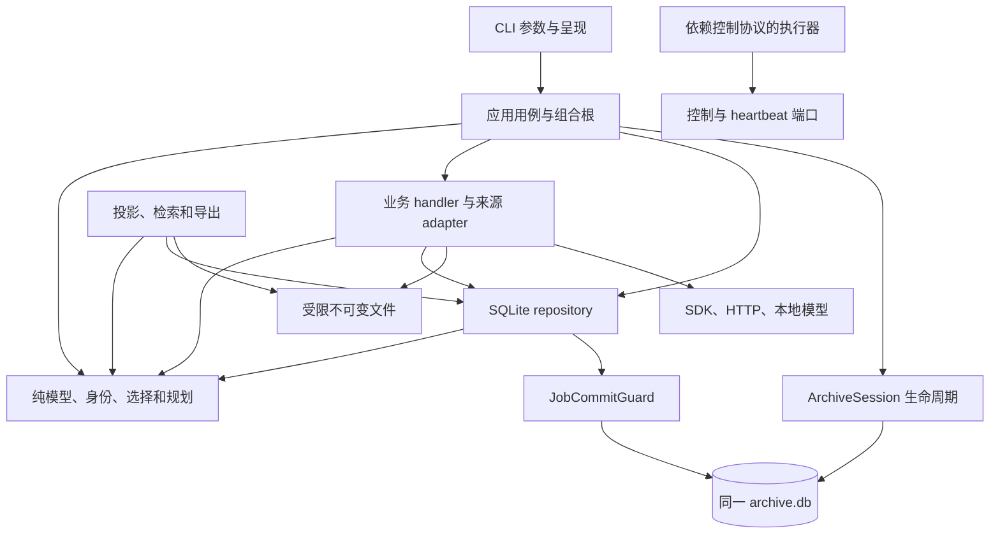

# 架构边界修复与验收

本次从 main `6544eb85ea3e95e5b9571930fefaf35bde6b7dc1` 创建独立工作树，按来源适配、归档访问、工作流、投影/索引拆分实现和交叉审查。源码固定身份见 [架构总览](architecture.md)，完整结果见 [验证记录](architecture-validation.md)。原归档数据库和不可变内容身份继续兼容；运行路径中的责任与依赖发生下表所列变化。

## 问题到实现的对应关系

| 原问题 | 修复后的责任和行为 | 证据与验收 |
| --- | --- | --- |
| CLI 同时解析参数、选择事实、保存配置、生成任务和组装运行器 | `WorkflowApplication` 负责完整用例；CLI 负责参数和呈现；`workflow_planning` 从冻结事实生成纯 `JobSpec` DAG | [03 计划](sequences/03-workflow-plan.md)；无效配置、批次后段失败全部回滚 |
| 工作流执行、模型和 SQLite 仓库互相依赖 | 共享契约移至 `workflow_models`，执行器依赖控制协议；具体 repository 保留兼容导出；runtime factories 有明确类型端口 | [04 控制](sequences/04-lease-cancel-retry.md)、[07 ASR](sequences/07-asr-runtime.md)；新进程导入和 AST 边界回归 |
| 各 handler 和 repository 重复 lease/attempt 提交规则 | `JobCommitGuard` 在同连接的 `BEGIN IMMEDIATE` 后及提交前验证精确 owner、attempt、expiry；实际字幕/ASR、音频、发布、AI 修订和稿件登记复用受保护上下文 | [04](sequences/04-lease-cancel-retry.md)、[05](sequences/05-subtitle-ingest.md)、[08](sequences/08-transcript-bundle.md)、[09](sequences/09-ai-proofread.md)；到期、取消及陈旧 worker 的当前保护事务不提交权威成功结果；已提交检查点及失败 run/API 响应审计可保留 |
| 配置、固定 input 与完整任务图可能分别提交 | profile/config/jobs/dependencies、校对 input/proofread/render、批量重发布请求分别作为完整用例原子提交 | [03](sequences/03-workflow-plan.md)、[09](sequences/09-ai-proofread.md)；注入晚期失败验证无部分状态 |
| 稿件编码、写入和 fsync 长时间占用 SQLite 写锁 | `stage_artifact` 在事务外准备文件，保护事务内安装不可变字节和登记；完全相同的重试无需创建临时文件 | [10 双稿](sequences/10-document-render.md)；暂存写入与文件 fsync 在事务外，安装后的目录 fsync 在短事务内；失败后的字节可验证重试 |
| 查询连接初始化 schema、刷新视图或创建缺失库 | `ArchiveSession` 显式声明 READ/WRITE/BOOTSTRAP/MAINTENANCE；READ 与既有库 WRITE 的打开及运行 schema 检查不执行 DDL；只有明确初始化才建库，显式索引构建可创建派生 FTS/TEMP 表 | [01 启动](sequences/01-cli-bootstrap.md)；安装包查询前后 DB/sidecar 字节不变、缺库无目录或 DB |
| SQLite 连接、产物根和维护锁由调用者分别管理 | Session 持有连接和访问 lease 至关闭；多连接任意关闭顺序仍保护 archive；数据库模式与 artifact policy 分别登记 | [01](sequences/01-cli-bootstrap.md)、[15 快照](sequences/15-archive-snapshot.md)、[17 预检](sequences/17-migration-preflight.md)；并发维护与失败释放回归 |
| 来源身份、访问凭据和具体 SDK 向业务与存储泄漏 | 纯 `ContentRef` 与采集 Protocol 描述工作单元；真实 Bilibili adapter 解析 cid、保存访问观察；runtime 接受明确 factory | [采集端口](source-adapters.md)、[02](sequences/02-metadata-tags.md)、[05](sequences/05-subtitle-ingest.md)、[06](sequences/06-audio-download.md)；真实 adapter 调用、错误凭据和返回路径边界 |
| ASR facade 用 module proxy 隐式同步状态，provenance 与 runner eager 循环 | 普通导出函数与显式 runner factory；默认公开包 runner 替换仍进入实际调用；provenance 无 eager runner 反向导入 | [07](sequences/07-asr-runtime.md)；首次导入、CPU 复用/关闭及 GPU timeout 端口回归 |
| 存储/快照反向导入出版编排，快照与迁移互用私有 helper | 内容、canonical JSON、release 身份及 Bilibili codec 提取为纯契约；共享公开流式 inventory；storage 提供公开读取/验证接口 | [11 出版](sequences/11-publication-lifecycle.md)、[12 导出](sequences/12-reader-private-export.md)、[15](sequences/15-archive-snapshot.md)、[17](sequences/17-migration-preflight.md)；历史 hash、快照、预检与导入顺序回归 |
| producer、planner、reader 重复转录择优规则 | `transcript_selection` 定义来源、语言、同语言版本的统一总排序，各消费者复用 | [03](sequences/03-workflow-plan.md)、[08](sequences/08-transcript-bundle.md)、[13](sequences/13-projection-verify.md)；同语言/跨语言及新旧版本一致性回归 |
| 新偏好覆盖实际发布身份，同秒重发布或坏关联产生错误正文 | preferred/published 分列；消费实际最新声明；part 内发布时间严格单调；悬空/错 part 关联明确缺陷且不返回其他正文 | [08](sequences/08-transcript-bundle.md)、[13](sequences/13-projection-verify.md)；真实 A→B→A 同秒发布与关系破坏回归 |
| 投影逐 part 查询、索引扫描全量 segments/keys | 投影在一致读快照中每批 256 part 集合查询；FTS 固定上界 keyset 分页；legacy keys 存 TEMP 主键表、分页恢复前缀与间隙 | [13](sequences/13-projection-verify.md)、[14 索引](sequences/14-search-index.md)；分页 SQL、失败恢复、旧索引和消费者回归 |
| workflow payload 无明确版本和统一解码边界 | 新载荷 `schema_version=1`；历史未标版本按 v1 验证；写入、认领及副作用前验证 payload 类型、part/profile 一致性与引用格式，引用存在性及归属由使用方另行验证 | [03](sequences/03-workflow-plan.md)、[04](sequences/04-lease-cancel-retry.md)；未知版本、bool/string ID 与错 part/profile 不认领、不递增 attempt |
| service 直接导入 CLI 组装子进程 | `publication_worker` 是独立组合根，supervisor 只负责进程与阶段协议；历史模块执行入口局部保留 | [16 工具边界](sequences/16-library-and-operations.md)；真实子进程入口回归 |

## 依赖和状态所有者

SQLite 是事实、任务和进度的权威所有者。文件 marker、摘要与登记联合证明产物完成；进程内缓存不承担恢复状态。纯模型不导入 storage、services、sources 或 CLI；storage 不导入 CLI 或应用/runtime 编排；普通 service 不依赖 CLI。独立组合根允许组装实现，历史 `__main__` 桥接局限于入口。架构回归明确检查这些规则，并不把兼容导出或组合根组装描述成全仓库完全无环。

## 兼容性与真实边界

`ContentRef` 不改变持久化字段，也不意味着其他平台已经能直接落库；当前 adapter、schema、artifact stem 和命令仍对应 Bilibili。纯 codec 保存旧来源对象，canonical JSON、内容 hash、profile digest 和 dedupe 算法保持历史身份。

既有不兼容库的 READ/WRITE 会拒绝，避免普通查询顺带迁移；固定迁移源契约仍独立于运行 schema。旧索引由专用契约校验，显式构建可以只新增 FTS，读取不能升级归档。初始化入口必须声明 BOOTSTRAP。

SQLite 事务不能回滚文件安装。稿件登记失败后可能保留未登记的不可变字节，重试重新验证内容并登记；bundle 失败先使完成 marker 失效，消费者只接受完成且身份一致的产物。取消是协作式，已经在途的外部调用仍可能结束，提交端的精确 fence 阻止陈旧结果成为事实。

publication 的 `published_at` 在每个 part 内采用 `max(wall_clock_seconds, previous+1)`。同秒连续发布可领先墙钟秒，这是为保存真实提交顺序采用的明确行为。投影的内部查询有界，返回完整 dict 的现有公共 API 仍按结果规模占用内存。

GPU timeout 通过既有 spawn/watchdog 端口测试；CPU 同步推理没有同等硬中断能力。线上凭据采集、真实 GPU 推理和付费 AI 调用应使用部署环境的专项验收；本次离线 WSL 测试不替代这些行为。

## 验证与维护

本轮按正确性、可读性、架构、安全和性能五轴交叉审查。测试覆盖事务内租约到期、取消/陈旧 worker、批次原子回滚、稿件重试、路径逃逸、读库字节不变、历史 hash、真实发布与消费者一致性、keyset 分页和崩溃恢复。只读访问、平台身份和提交期限等受控条件变异，以及恢复旧控制实现的对照，均使对应测试失败，并在恢复原字节后继续验证。

完整 WSL 套件、coverage 门禁、独立 wheel 安装及 19 张交互图的最终数字和证据见 [验证记录](architecture-validation.md)。新增模块和全部表/视图见 [源码清单](architecture-sources.md)；流程变化应按 [维护指南](architecture-maintenance.md)更新文字、JSON 和生成 HTML。
