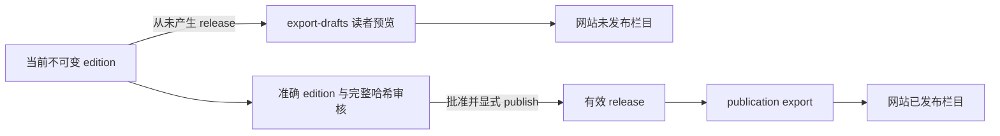

# 当前架构

交互式组件图：[architecture.html](architecture.html)，可编辑规格：[architecture.json](architecture.json)。
本文说明本分支的当前行为。交互式主图保留上游 `5c3cc606abc36c1632bc7c0bd9b06372136c88a8`
的历史源码快照，其旧 `reading-*` 入口不代表 #258 合并后的出版契约。
2026-10-09 核对 `9edc4eba3c4ff2de69603a441318d29d14baa364` 的全量候选已更新当前出版契约
及 P0 迁移预检分支，但仍未通过连线与标签布局验证；未生成新浏览器证据，因此保留历史 HTML。
P0 的当前行为以本页、[预检指南](archive-migration-preflight.md)及代码为准。
出版与审核的数据流以 [专题架构图](ai-proofreading-architecture.md)、本页和出版指南为准；
专题图保留已通过视觉检查的 `fc66c1d` 实现快照。
图的证据维护与生成检查见[架构图维护](architecture-maintenance.md)。

## 执行模型

本项目是 Python CLI 和本地 SQLite 工作流系统。CLI 组装配置与 handler；
`WorkflowRepository` 拥有计划、依赖、领取、租约、attempt、重试、取消与终态；
`WorkflowExecutor` 在事务外执行耗时操作，再校验精确的
`job_id + lease_owner + attempt_count + 未过期租约` 提交结果。
多个 worker 可以连接同一归档库；当前执行器每次处理一个 job。

SQLite 保存视频与分 P、采集证据、不可变转录、调度状态、AI 修订、完整 edition、准确审核、release 和追加事件。
音频、转录 bundle、阅读 Markdown 是文件产物；FTS 和阅读内容快照是可重建的消费产物。
JSON 文件和完成标记不能替代 SQLite 调度器。

```text
fetch-meta -> Bilibili gateway -> metadata / parts / crawl evidence
                                      |
workflow plan -> validated selection -> jobs / dependencies / profiles
                                      |
workflow run -> claim + heartbeat -----+
                 |                    |
                 +-> subtitle -> immutable transcript
                 +-> audio -> ASR -> immutable transcript
                 +-> proofread -> immutable revision -> render_document
                 +-> publish -> five-file transcript bundle
                                      |
             status / coverage / verify / export / search

publication commands -> immutable edition -> exact content review
                                            |
                                            v
                                     frozen release -> public export
AI baseline + explicit edition -> private editorial export
```

`workflow plan` 可以选择显式 part ID，或多个 BVID 的全部/指定零基分 P。
所有目标、策略与配置先验证，再建立 profile 与 job；无效批次不留下部分计划。
ASR 只依赖音频任务成功，字幕失败不会阻断独立 ASR。`below-threshold` 使用已存质量评估
与 `--quality-threshold` 决定各选中分 P 是否需要 ASR；当前 plan 没有时长筛选参数。
同一逻辑任务重复规划会复用 job，配置 digest 固定 ASR profile，取消终态保持不变。
选择规则见[BVID 与分 P 选择](workflow-selection.md)。

## 状态、租约与取消

| 状态 | 进入条件 | 后续行为 |
| --- | --- | --- |
| `queued` | 规划、允许的重试、重新发布或租约回收 | 依赖成功后可领取；可取消 |
| `running` | worker 领取并建立 lease / attempt | heartbeat 续租；可成功、失败或取消 |
| `succeeded` | 当前 attempt 提交成功 | 满足下游依赖；显式重新发布可重新排队 publish |
| `failed` | handler 失败 | 允许显式 retry；保留 attempt 证据 |
| `cancelled` | 显式取消 queued/running | 清除 lease；不会被 retry、plan 或 publish 恢复 |

取消是协作式操作。取消事务先验证所有 job ID，再一次性更新状态；running attempt 同时记录
`cancelled` 终态与错误码。网络请求、模型调用和 GPU 推理可以继续到下一个检查点，
不能承诺立即停机或撤回已发出的外部请求。检查点与短写事务阻止取消后提交权威结果。
取消前已提交的转录、块、修订和文件保留；取消不级联删除依赖任务。
`workflow status --jobs` 展示因取消依赖而阻塞的 queued job，这种阻塞是派生信息。

heartbeat 使用独立 file-backed SQLite 连接续租；续租、结果和终态都校验精确 attempt。
claim 回收过期 lease，将旧 attempt 记为失败，再领取新 attempt；旧 worker 无法覆盖新结果。
CUDA/ROCm 强制对齐有可终止的子进程 watchdog，超时记录 `inference_timeout`。
这与手动取消的协作语义不同。完整规则见[任务取消](workflow-cancellation.md)。

## 采集与转录

`fetch-meta` 经 `BilibiliApiGateway` 分页采集用户、视频、分 P、标签和抓取证据，
每页事务保存实体与游标。空页、失败页、重试和跳过都有独立证据；恢复以持久游标为准。
`metadata` 保存外部观察，`workflow` 保存执行状态，两者没有第二套互相覆盖的阶段状态机。
数据库表、采集恢复与只读边界见[元数据与存储](metadata-storage.md)。

subtitle handler 获取轨道与正文，保存来源明确的 CC / AI 转录和 acquisition 证据。
一次不可见轨道不证明字幕永久缺失。取消或处理失败可以留下 failed acquisition 收尾，
但不得提交新的成功转录。转录版本与 segments 追加保存，源记录不会被校对改写。

audio handler 先检查 confined `audio/` 中可复用的非空对象；需要下载时，在该目录下创建
独立暂存空间，并保留下载器要求的 `audio/` 子目录。下载、探测和哈希在事务外完成，
最终文件替换和 `audio_objects` / `part_audio_objects` 登记在同一个租约保护事务内完成。
无 ffmpeg 时保留真实 FLAC 后缀，不将其冒充 M4A；失败暂存自动清理。
ASR 读取精确的成功 audio prerequisite，运行解码、对齐、分块和 coverage/provenance，
在取消检查后追加持久转录。

规划时冻结完整 ASR profile，包括模型与 aligner 各自的 revision、分块、语言、离线、超时、热词和生成预算；执行从数据库重建配置，不读取新的 ASR 环境变量。识别与对齐 processor 直接接收已解码的 16 kHz float32 波形。GPU 推理有可终止子进程与硬超时，CPU runner 可复用但没有同等硬超时。

成功转录与本次 `transcript_asr_evidence` 在同一受租约 / 取消保护的事务内保存。内容去重复用旧 transcript 时仍保留新运行诊断，包括逐遍逐块文本、生成预算与 EOS、对齐区间和阶段耗时。`workflow asr-evidence` 用于查询；质量标记不等于准确率，也不自动阻止发布。失败或取消的全部中间块诊断尚未持久化。参数合同见 [ASR 参数与诊断](asr-configuration.md)。

[公开样本测试](asr-public-samples.md) 已完成 30 次真实 CPU 推理。当前证据支持继续使用现有模型、中文任务显式 Chinese、180 秒分块与现有生成预算，尚未证明为最优。热词默认空，不列入常规调优；后续优先处理静音误识别与语音覆盖告警。

`workflow run --artifact-root` / `BILI_ARTIFACT_ROOT` 可指定独立产物写根，数据库仍位于
archive root。音频、转录包和阅读文档写入产物根；读取先探测产物根，再回退到 archive root。
当前 workflow 不提供 `--keep-audio`、`--max-audio-gb` 或成功后的自动音频回收。
路径和现有策略入口见[产物根目录](artifact-root.md)、[音频保留与预算](audio-retention-policy.md)。

## 发布与提交边界

publish handler 按来源优先级选择持久转录，以字幕优先于 ASR，并在目录
`transcripts/<stem>/` 发布 `bundle.srt`、`bundle.vtt`、`bundle.txt`、`bundle.md`、
`bundle.raw.json`。原始 JSON 保存来源、segments 和可用的 ASR 证据。
所有编码、哈希、暂存和暂存文件 fsync 在写锁外完成；最终五个文件替换、目录同步、
`archive-bundle-v2` 完成标记和 `workflow_publications` 登记共享一个 SQLite 写锁与 lease guard。
发布开始后的失败在释放写锁前使标记失效，防止旧 attempt 清理新 worker 的有效标记。

完成标记校验文件集合、相对路径与各文件摘要。缺文件、摘要不符或旧四文件 marker
不能视为当前完整 bundle。`workflow publish --part-id ...` 可以从已存转录重新排队发布，
随后用 `workflow run` 执行；publish 本身只读取已有转录，run 仍可能执行队列中其他就绪任务。
命令和时间轴/文本规则见[WebVTT 与 bundle](webvtt.md)。

SQLite 与文件系统不构成跨介质原子事务。进程崩溃、磁盘错误或 commit 失败可能留下
文件/登记不一致；完成 marker、摘要检查与 verify 负责识别异常，显式重新发布负责恢复。
这里的写锁解决合作 worker 的取消、抢占和失败清理竞态，不意味着掉电恢复恰好一次。

## 校对与阅读内容

可选 proofread 分支冻结主转录、参考字幕、元数据、配置、提示词和分块。
`DeepSeekClient` 在事务外发起 HTTPS JSON 请求；请求前后和每块提交均检查 lease，
通过结构校验的块与完整修订分别在保护事务内保存。
已完成块用于失败恢复，取消后不能继续提交新的块或完整修订；调用审计证据允许留存。
来源恰好覆盖一次只证明追溯结构，不证明语义保真。

render_document 读取已保存 revision，确定性生成 `ai-draft.md` 与 `review.md`。
文本生成和暂存在锁外，最终文件替换与 document artifact 登记共享租约保护事务；
重新渲染不调用模型。配置、数据和验证说明见[AI 校对使用](ai-proofreading.md)、
[AI 校对架构](ai-proofreading-architecture.md)。

AI 渲染只生成 `ai-draft.md` / `review.md`；后者是原文对照和疑点，不能视为批准。
`publication create` 明确选择固定 AI 基线，冻结完整读者内容；任何正文、标题、摘要、标签、
来源、整理归属或编辑说明变更均保存新不可变 edition，并共同计算完整 SHA-256。
`publication review` 指定准确 edition、哈希、预期状态和操作者；批准不会自动公开。

draft head 与 release head 独立。A 发布后，创建或批准 B 仍保持 A 公开；显式 publish B
验证准确批准关系、写入固定 `publish.md`、记录不可变 release 并切换有效指针。
重复发布返回同一历史 release，不隐式恢复替换或撤回版本。withdraw 清空有效指针，保留历史。
事务 CAS 阻止并发静默覆盖；固定路径、来源、内容与字节哈希验证阻止损坏内容进入公开出口。

`publication export` 以只读连接选择有效 release，校验完整 provenance，输出 catalog v2、
文章、对应 AI revision 的原始 `review.md` 与独立 manifest。有效 release 或配对参照稿损坏使整次导出失败。`editorial export` 明确选择
revision / edition，单独输出 AI 双稿、完整版、相对 AI 与父版的全内容差异及审核证据。
受管理目录锁、staging、恢复日志与目录切换保证完整快照，未知文件、链接和源目标重叠拒绝。
阅读站属于独立仓库，消费公开 release 与显式未发布预览两个独立快照。完整操作见 [出版与审核](publication.md)，
JSON 契约见 [contracts/README.md](contracts/README.md)。

网站还可消费显式的 `publication export-drafts` 读者预览。该独立投影选择当前且从未产生 release
的 edition，验证固定内容与 AI 基线，输出正文、对应 AI revision 的原始 `review.md`、读者元数据、准确身份和审核状态。
它不生成批准或 release，不改变正式发布 A；被替换或撤回的旧 release 不通过预览恢复公开。
已发布和未发布两个栏目分别读取、校验、路由与搜索。正文页和校验参照页互相链接，
参照稿独立记录 `reviewFile` 与 `reviewArtifactSha256`，包含原文、AI 整理稿、疑点、依据和回看链接。
它针对 AI 初稿，不是人工审核记录；人工编辑后的正文可能与它不同。完整审阅包、审核事件和请求配置始终另行导出。
专题交互图仍是 fc66c1d 的发布实现快照，新增预览链路由以下图和当前代码说明：



## 查询与数据所有权

| 事实或产物 | 所有者 | 消费者 |
| --- | --- | --- |
| 视频、分 P、标签、分页证据 | `storage.metadata` | selector、status、metadata search、export |
| acquisition、转录版本与 segments | `storage.transcripts` | publisher、ASR reference、editorial、projection |
| job、dependency、lease、attempt、profile | `storage.workflow` | executor、handlers、status、retry、cancel |
| 音频身份与文件 key | 音频表组 + confined `audio/` | ASR、verify、保留/预算工具 |
| bundle 发布身份与完整性 | `workflow_publications` + marker + 五文件 | projection、coverage、export、verify、FTS |
| 输入、模型调用、块、修订、双稿 | editorial 表组 + 固定 Markdown | render、create、private export；公开出口读取配对 review.md |
| 完整 edition、准确审核、release、双 head、事件 | publication 表组 | show、public/private export |
| 转录搜索索引 | `search_index.store` 的派生 FTS5 表 | transcripts/all 搜索 |
| 有效公开内容与 AI 校验参照快照 | `publication export` | 独立阅读站 |
| 未发布内容与 AI 校验参照快照 | `publication export-drafts` | 独立阅读站 |
| 私有指定版审阅包 | `editorial export` | 审核者 |

`coverage`、`export`、`verify` 通过 `workflow_projection` 合并数据库事实与产物证据。
verify/coverage 保留已声明 publication，才能报告坏 bundle，不能将发布缺陷静默变成待处理任务。
`dedup` 计算音频与跨分片文本哈希，不选择 canonical 或改写来源。

search 默认 `transcripts`，沿用 FTS 查询；`metadata` 直接只读查询当前 SQLite 标题、简介、标签，
使用字面子串匹配，不要求 FTS 或产物文件。`all` 先返回元数据，再返回转录命中，共用 limit。
日期过滤使用 UTC 日边界；元数据采用当前 pubdate，转录采用建索引时的快照。
索引损坏明确报错；all 在索引缺失时可返回元数据并向 stderr 提示。
JSON stdout 始终是数组。详见[元数据搜索](metadata-search.md)。

## 运维与验证范围

`archive migration-preflight` 使用固定的旧 Bilibili 契约只读盘点停止写入并 checkpoint 的源归档。
它记录保留 rowid 的逐表摘要、双根文件清单与全部历史稿件绑定，拒绝不支持的结构和不完整产物；
不创建目标、不恢复源任务、不修改现有 schema。命令边界见[迁移预检](archive-migration-preflight.md)。
多平台身份、adapter 与显式转换仍是[架构实施方案](multi-platform-architecture-plan.md)，尚未实现。

旧 schema 的 CHECK 约束不会被 `CREATE IF NOT EXISTS` 自动迁移。
缺少新 workflow 类型或 cancelled attempt outcome 的库需要按当前 schema 重建，
程序不会自动删除现有数据库。纯投影、搜索与两类稿件导出 使用只读连接；
部分 status/runs 命令打开现有库时仍经过 schema 初始化，不能将其一概声明为无写入。

当前离线测试覆盖选择、取消、真实下载器的暂存接口、发布和独立连接竞态、
WebVTT、索引/元数据搜索、转录投影、租约、校对与读取契约。
外网 B 站、真实 GPU 与付费模型调用另需运行环境验证。
历史测试中的部分旧模块名通过测试兼容装配运行；合并后的回归结果与执行边界见 [WSL 验证记录](asr-wsl-validation.md)。
图示和文档解释当前契约，不能替代行为测试或真实材料的人工准确率评估。

架构图的源码证据与视觉检查绑定各自固定版本；自动检查通过不能替代行为回归或真实材料审核。
AI 出版专题图在 fc66c1d 的实现上通过 9/9 showcase、严格来源及浅/深色浏览器检查，
保留两处自动分离交叉；完整业务状态与当前行为以本页、出版指南和测试为准。

归档快照保存数据库和产物，包括 AI 双稿及全部历史 `publication_releases` 的固定文件；
它是私有的完整档案迁移包，不是公开阅读快照。创建、校验与恢复见 [归档快照指南](archive-snapshots.md)。
旧稿件 schema 在任何初始化写入前拒绝，不进行自动迁移或删除。
