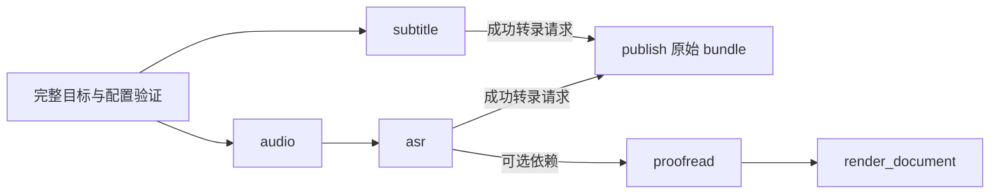

# 当前架构

本页、[全景架构图](architecture.html)、[AI 与出版专题图](ai-proofreading-architecture.html)和 [17 个完整时序流程](architecture-sequences.md)描述 main 的代码快照 `48b31843510e5b1d78ee4f1448cec6dee7ab2296`，核对日期为 2026-10-09（Asia/Hong_Kong）。本次以远端 main 的固定提交为核对基线。全部命令、源码模块、SQL 表/视图见 [源码与覆盖清单](architecture-sources.md)，图的源码证据、自动检查与文件身份见 [验证记录](architecture-validation.md)。

图中 SQLite 节点表示同一个 archive.db 内的逻辑表组。后续 main 变化需按 [维护指南](architecture-maintenance.md)重新核对；固定提交身份不自动代表未来版本。多平台规划和未合并分支不属于这份运行架构。

## 系统边界与模块责任

项目是 Python 3.12+ CLI，安装入口为 `bili-asr = bili_asr.cli:main`。SQLite 保存来源事实、不可变转录、任务/尝试、AI 修订、完整出版版本与事件；音频、bundle 和稿件保存为受限文件。没有 HTTP 应用服务、Redis、外部消息队列或另一套 JSON 调度器。

CLI 组装配置与 handler；repository 拥有持久身份和状态转换；service/handler 执行网络、推理与文件操作。WorkflowExecutor 每次顺序处理一个 job，多 worker 可连接同一数据库。短期客户端和 CPU 模型缓存可以留在进程内，恢复进度始终来自 SQLite。

| 层 | 代码入口 | 责任 |
| --- | --- | --- |
| 命令与组合根 | cli/parser.py、registry.py、main.py、命令模块 | 参数、产物访问策略、维护锁、分派、输出和退出码 |
| 外部访问 | sources/、bili_client.py、deepseek.py | SDK/HTTP、凭据、pacing、CDN 下载、有界错误 |
| 采集服务 | services/metadata_ingest.py、video_tags.py、subtitle_ingest.py | 分页、详情、parts、标签、轨道选择和获取证据 |
| 工作流控制 | storage/workflow.py、workflow_selection.py、workflow.py | 选择、配置、幂等 job、依赖、claim、lease/heartbeat、attempt、cancel/retry |
| 原始生产 | workflow_runtime.py、asr/、archive.py | 音频、ASR、不可变转录、择优 bundle 与 lease 保护提交 |
| AI 派生 | editorial.py、editorial_runtime.py、storage/editorial.py | 冻结输入、分块、调用审计、校验、检查点、revision、双稿 |
| 人工出版 | publication.py、publication_tags.py、storage/publication.py | 完整 edition、精确审核、双 head CAS、release、替换/撤回 |
| 消费与检索 | workflow_projection.py、search_index/、publication_export.py | 只读投影、派生 FTS、公开/预览/私有快照 |
| 维护迁移 | archive_maintenance.py、archive_snapshot.py、migration_preflight.py、storage/snapshots.py、migration_source.py、migration_artifacts.py | 维护协调、ZIP 保存/恢复、固定旧源预检 |

外部依赖是 Bilibili SDK/API/CDN、可选 DeepSeek HTTPS API，以及本机 Qwen3-ASR/ForcedAligner 权重和 CPU/CUDA/ROCm。阅读站属于独立仓库，本仓库提供静态内容契约；页面、路由、远端部署和缓存刷新不由本仓库执行。

## 命令、启动、schema 与访问锁

当前注册 16 个顶层命令：fetch-meta、fetch-tags、workflow、snapshot、archive、status、runs、coverage、verify、search、search-index、check-asr-env、export、publication、editorial、dedup。子命令和对应流程见 [命令覆盖](architecture-sources.md#命令覆盖)。旧 docstring 中的 reading-*、独立 proofread、publish-transcripts 名字不能当作当前 CLI。

ArtifactPolicy.NONE/READ/WRITE 描述文件访问，不等于数据库是否写入；子命令可覆盖策略。metadata search 跳过产物根探测。status/runs 在已有库上仍经过 open_database，可能刷新派生视图；workflow status/explain 也可初始化新库。结构性只读的投影、搜索和稿件导出使用 mode=ro。

采集、workflow、publication 写命令、FTS build 及会初始化的查询持有共享 archive_access OS 锁；writer 可以并发，snapshot 使用独占锁。维护锁位于 archive root 旁，目录恢复不搬动锁身份；SQLite 决定事务写入顺序。BUSY/LOCKED 超时给出诊断，数据保留以便重试。合作协议不能约束绕开它的外部写入。

initialize_schema 在 DDL 前检查 manuscript 和持久表契约，设置 foreign_keys/busy timeout，再初始化和刷新已交付视图。旧表/CHECK 不自动 ALTER 或删除。明确例外是新增 video_tag_observations 可以补建，不改写 tags/稿件；不兼容旧库须另建兼容 archive。见 [01 启动](sequences/01-cli-bootstrap.md)。

## 元数据、游标与原始标签

fetch-meta 获取用户视频页、必要详情、零基分 P 和 tags。页内按 BVID 去重请求，页事务保存 users/videos/parts/details、成功标签及观察、page/discoveries 和 cursor。显式 start-page 是一基页号，可回退；resume 必须已有游标。空页完成，页上限 limited；失败/风控/空页各自有证据。

页面传输/限流最多 5 次重试，退避 30/60/120/240/300 秒；不代表所有 API 调用统一重试。skip-failed-page 仅推进未来游标，本 run 仍失败，risk_interrupted 不跳过。可选 tags unavailable 不丢失其他成功元数据。

标签观察区分 success_nonempty、success_empty、unavailable：非空成功替换，成功空清空，不可用保留旧集合并记录失败。每个 run 重新观察，有界 LRU 只减少本次重复请求；fetch-tags 先验证完整已存 BVID 选择再刷新。

publication create 从当前原始集合冻结 edition tags；sync-source-tags 要求观察覆盖完整，显式生成新的 pending-review edition。抓取更新不修改既有 edition/release。见 [02](sequences/02-metadata-tags.md)、[11](sequences/11-publication-lifecycle.md)。

## 规划、依赖、状态与恢复

workflow plan 支持 part ID，或多个 BVID 全部/指定零基 page-index。CLI 在写 profile 前验证目标、策略、editorial 与 ASR 配置；无效选择不留下部分 job。BVID 全量选择报告排除 gone，显式 unknown/gone 拒绝。profile 和 job plan 是不同提交，不承诺跨并发条件的整体原子操作。

每个 part 建 subtitle；策略为 all/selected/below-threshold；selected 与 all 在已选 part 上同样规划，需要 ASR 时建 audio，ASR 只依赖 audio succeeded，与 subtitle 无依赖。below-threshold 读取已存 workflow_quality_assessments 和用户阈值，不即时测量准确率。当前没有按时长/直播过滤的 plan 参数。

逻辑 key 去重；ASR key 含 profile digest，冻结 model/aligner 各自 revision、device、language、chunk、timeout、hotwords、生成预算/cache/offline 参数。执行从数据库重建，不读取后来的 ASR 环境配置。index kind 在 schema/enum 允许，但当前 planner/handler 没有注册；FTS 由 search-index 执行。见 [03](sequences/03-workflow-plan.md)。

| job 状态 | 条件 | 后续 |
| --- | --- | --- |
| queued | 新计划、failed retry、lease 回收、publish 新请求 | available_at 到期且依赖全部 succeeded 才可 claim |
| running | 写锁下建立 lease、attempt_count+1 和新 attempt | 独立 file-backed 连接 heartbeat；检查精确 attempt |
| succeeded | 结果后再次校验 owner/attempt/未过期 lease | 满足依赖；publish 在途新请求可使成功 attempt 后 job 回 queued |
| failed | handler/no_handler/超时失败，或旧 attempt lease_expired | 显式 retry 仅重排 failed，保留历史证据 |
| cancelled | 全集验证后取消 queued/running；running attempt 同步 cancelled | plan/retry/publish 不复活；保留已提交事实，不级联删除 |

claim 先收尾过期 attempt，再回收 job；旧 worker 即使重用 worker ID，也不能越过 attempt_count 校验。取消依赖导致 queued 下游 blocked 是 status/explain 的派生事实。耗时网络/推理在锁外，owned_transaction 先 BEGIN IMMEDIATE，再校验 job/owner/attempt/有效 lease，提交新权威结果。业务结果与 executor 终态是独立事务，崩溃后可能需幂等再执行。手动取消是协作式，不立即撤销在途外部调用。见 [04](sequences/04-lease-cancel-retry.md)。

## 字幕、音频与 ASR

subtitle handler 精确选 part，列轨道、按来源/语言选轨、获取正文。cookie 存在不等于认证成功；认证、not_found、未认证空清单区别保存。已列轨道正文消失是失败，不能变成永久无字幕证据。来源/语言/content/version 不可变，转录/segments 和 stored/unchanged attempt 同保护事务保存，run 异常仍收尾。见 [05](sequences/05-subtitle-ingest.md)。

audio handler 在受限 audio/ 下按配置根再旧 archive 根探测非空 M4A/FLAC。下载使用本次 .workflow-audio-* 内的 audio/ 子目录，网络、ffprobe（30 秒）、duration 与 SHA-256 在事务外；无 ffmpeg 的真实 FLAC 保留后缀。最终替换和 audio_objects/part_audio_objects 登记共享 lease 保护锁，清理本次暂存。复用仍 probe/hash；成功后不自动回收。见 [06](sequences/06-audio-download.md)。

ASR 读取精确成功 audio prerequisite storage key、冻结 profile/reference ID。soundfile 优先解码，容器由 ffmpeg RF64 回退；mono 16 kHz float32，经 soxr 重采样，完整分块，processor 接收数组。每块真实 ForcedAligner 对同一波形/文本取得字符时间，校验后回全局时间轴，不插值。第一遍证据筛选热词，保留候选才第二遍新调用，不共享跨遍 prefix KV cache。

CPU runner 按 profile 复用；CUDA/ROCm 使用 spawn 子进程，父进程先持续排空队列，硬超时 terminate/kill，报告 inference_timeout；CPU 无同等硬超时。成功非空转录、segments、coverage、transcript_asr_evidence 同保护事务保存；内容去重复用旧 transcript 时仍保存本次配置、音频、参考、每遍每块诊断/EOS/对齐/耗时。workflow asr-evidence 查询证据；失败/取消全部中间块尚未持久化，质量 flags 不是 CER，不自动阻止发布。见 [07](sequences/07-asr-runtime.md)、[ASR 参数](asr-configuration.md)。

## 原始 bundle 与保护提交

成功 subtitle/ASR 请求同 part 唯一 publish job；运行时重新择优当前版本，CC > AI 字幕 > ASR，再按语言 family zh/en/其余、语言代码、version 排序，不盲用 requested ID。workflow publish 只请求，workflow run 可同时执行其他就绪任务。

输出 transcripts/<stem>/bundle.srt、bundle.vtt、bundle.txt、bundle.md、bundle.raw.json 及 archive-bundle-v2 marker。编码/hash/暂存/fsync 在 SQLite 锁外；旧 marker 失效、五文件替换、目录同步、新 marker、workflow_publications 登记共享 lease 写锁。失败回调在释放锁前失效 marker，避免旧 attempt 清理新 owner 结果。

当前 workflow publish 仅传 ASR 模型名称/revision provenance 子集，未读取并传入全部 transcript_asr_evidence、coverage 或 characters；writer 支持字段不等于当前调用已携带它们，完整逐次证据以 DB 为准。marker 校验精确五文件集合、受限路径和 hash，旧四文件/缺失/不符不算完整。SQLite 与文件系统无跨介质原子事务；掉电/磁盘/commit 故障由 verify、marker 和显式重新发布识别恢复。见 [08](sequences/08-transcript-bundle.md)、[WebVTT](webvtt.md)。

## AI 冻结、检查点、双稿与模板

显式 proofread 在请求时固定 base/reference；自动链首次执行读取精确 ASR prerequisite result，并固定当时同语言参考。input digest 含转录、元数据、完整配置、提示词和块；retry 不读最新 ASR/文件。输入保存与 job 绑定不同提交，可留下未绑定不可变 input。

未完成块先续 lease、记绑定准确 attempt 的请求，锁外调用 DeepSeek；无隐式 HTTP retry。实际 envelope/usage/model/返回思考先审计，再检查 lease 和严格结构：连续有序、来源恰好一次、无未知/只读引用。块/revision 分别受保护提交，完成块重试复用。外部请求可能重复计费；结构覆盖不证明语义保真。见 [09](sequences/09-ai-proofread.md)。

render_document 锁外确定性生成双稿，预检完整 path/hash/role 及既有字节。**当前 atomic_write_artifact 的文件暂存、fsync、replace 在租约保护事务内执行**，随后登记 artifacts；不能称全部文件准备在锁外。两文件不构成 FS 事务，第二份失败可留第一份，消费仍验证完整登记和字节。

固定 AI_RENDERERS/PUBLISH_RENDERERS 按记录版本校验历史产物，当前 writer 为 ai-draft-v1/publish-v1；未知 renderer 拒绝，排版变化需要新版本/路径/身份。ai-draft.md 纯正文；review.md 为 AI 原文、整理稿、来源/时间/回看、疑点和模型参数参照，非人工批准。重渲染不调用模型。见 [10](sequences/10-document-render.md)、[AI 专题](ai-proofreading-architecture.md)。

## 完整 edition、审核、release 与三类导出

create 验证明确 AI 基线，冻结 title/markdown/summary/tags/source/attribution/editorNote，全对象 SHA-256；edit/tags sync 按精确父版与 draft head CAS 生成新 edition/new pending-review。旧内容不修改。

review 指定 edition/hash/expected status/actor：pending-review → in-review → approved/changes-requested/rejected，changes-requested → in-review。approved/rejected 终态，改内容新建版。publication_edition_reviews 保存当前状态行，publication_events 追加变更；不是每次审核插新 review。

draft/release head 独立，新建/审核/批准 B 保持公开 A；显式 publish B 才验证批准/expected release，锁外写 publish.md，再写事务重验 hash/批准/安装字节/CAS，登记 release，旧 A superseded，新有效 head。重复 publish 返回该 edition 历史 release，不恢复 withdrawn/superseded；withdraw 清有效 head、保留历史。文件先于 DB 登记，失败可留未登记字节。见 [11](sequences/11-publication-lifecycle.md)。

| 出口 | 精确选择 | 产物 |
| --- | --- | --- |
| publication export | 有效 current_release_id，准确批准/来源/模板/事件/字节 | catalog v2、publish.md、对应 AI 原始 review.md、manifest |
| publication export-drafts | 当前 edition 且从未产生任何状态 release | draft catalog、preview.md、原始 review.md、状态与 manifest |
| editorial export | 明确配对 revision/edition | 双稿、edition.md/json、review.json、AI/父版全内容 patches、events/配置 |

先读 head 再验证，坏关系不得被 JOIN 隐藏成空结果；有效 release 或配对 AI 稿损坏整次失败。公开/预览 reviewFile 与 reviewArtifactSha256 独立；参照针对 AI 初稿，人工正文可不同，actor/events/请求配置和私有差异另行导出。

export_snapshot 使用输出独占锁、旧目录归属校验、完整 staging/manifest、恢复日志和目录切换，拒绝 unknown 文件、链接/junction、源目标重叠。成功快照完整，切换可短暂不可用；父目录是私有恢复空间，只部署输出目录。withdraw 不自动刷新已导出/部署副本。见 [12](sequences/12-reader-private-export.md)、[出版](publication.md)、[JSON 契约](contracts/README.md)。

## 投影、覆盖、完整性、去重与检索

workflow_records 只读合并 active parts、转录和对应 bundle 声明；meta_ok/subtitle_done/asr_done/archived 是投影状态，非 job 状态。verify/coverage 保留 declared publication 后再查字节，避免坏 bundle 静默降级 backlog。operational projection 中文优先/newest 启发式与 writer family 总排序不同。

IntegrityVerifier 当前检查 projected bundle 完整性及相关缺陷，不等于自动验证全部音频/AI/release；稿件和快照各有专门验证。coverage strict 将 diagnostics 变成非零；verify 区分 backlog/defect；export 输出普通 JSON/CSV，可按 status/with-text；dedup 仅报告精确音频及跨 segment 文本复用，不选 canonical/改来源。见 [13](sequences/13-projection-verify.md)。

FTS 在 archive.db 内，search-index/--rebuild 显式写。transcript_segments 为主，FTS 与 transcript/ordinal 水位分批共同提交；兼容无持久 segments 的 MD 可补充，已有行不默认重写。脱敏与 CJK bigram/tokenizer 支持检索。

search 默认 transcripts；metadata 只读当前 title/description/source tags 字面子串，无需文件/FTS。all 元数据在前，共用总 limit；填满 limit 仍校验转录源健康。missing index 正常 backlog，all 缺 FTS 可保留元数据；损坏明确失败。UTC 日期 [from,to+1day)，metadata 当前 pubdate、FTS 构建快照；JSON stdout 为数组，诊断分离。见 [14](sequences/14-search-index.md)。

## 私有归档快照与恢复

snapshot save 独占维护，拒绝有效 running lease；检查 schema/FK 后 SQLite backup，busy 等待有界。产物根优先旧根回退，排除 staging，检查可移植路径和文件读前后身份；ZIP64 流式 size/hash/manifest，不覆盖目标。包括音频、bundle/marker、AI 双稿和全部历史 release（含 superseded/withdrawn），验证 DB references，是完整私有包。

check 流式校验所有成员/hash/marker/DB contract/FK/references，仅落临时 DB；restore 目标必须不存在/空，独占锁下完整解压校验后收尾 running attempts/runs/model calls，running job 回 queued 清 lease，记录 snapshot_restored，cancelled 保留。再次校验/fsync/rename 完整安装。过期 running 可随 save 保留供 restore 恢复，当前有效 lease 不可保存。见 [15](sequences/15-archive-snapshot.md)、[快照指南](archive-snapshots.md)。

## 数据所有权、布局与保留库能力

| 事实/产物 | 所有者 | 消费 |
| --- | --- | --- |
| archive.db 元数据、转录、控制、AI、出版表组 | 各 storage repository | planner/worker/投影/导出/快照 |
| audio/<stem>.m4a 或 .flac | audio handler 与音频表 | 精确 ASR prerequisite、快照、显式 inventory |
| transcripts/<stem>/bundle.* 与 marker | archive writer + workflow_publications | 验证、投影、普通导出、兼容检索 |
| documents/part-ID/revision/ai-draft-v1/ | render + document_artifacts | edition 基线、配对 review、私有包/快照 |
| publications/part-ID/release/publish-v1/publish.md | publication service + release/head/events | 公开出口、全部历史快照 |
| archive.db FTS | search-index | transcripts/all search |
| 三类静态目录 | publication_export + export_snapshot | 外部阅读站/审核者 |
| 完整 ZIP | archive_snapshot + storage.snapshots | check/restore |

artifact root 可由 flag/BILI_ARTIFACT_ROOT 与 archive root 分离，写 write_base，读配置根优先旧根回退，DB 始终 archive root。ZIP restore 可把产物合并进新根；受限音频路径、固定稿件路径和 portable key 共同限制访问。

库中保留 audio_budget/audio_reclaim/long_live/audio_inventory、旧双路人工 proofread、publication_supervisor、bundle_verification、concurrency_gate、persistence/run-ledger 等。显式调用的路径/预算/超时能力存在，当前注册 CLI/workflow 不自动启用成功回收、旧 merge 或发布进程监督。scripts/production.py 解析受限 env-file 并调用已安装 CLI；评测/验证脚本是工程支持。见 [16](sequences/16-library-and-operations.md)和 [101 模块清单](architecture-sources.md)。

## 固定旧源迁移预检

`archive migration-preflight` 是当前 main 已交付的离线运维入口。CLI 不打开当前运行库，由 `services/migration_preflight.py` 持有源归档维护独占锁，交给 `storage/migration_source.py` 按冻结的 Bilibili v1 契约读取停止写入且已 checkpoint 的旧库；不调用当前 initializer，不创建目标、不恢复任务、不转换 schema。

逐表指纹保留 SQLite 类型、精确值和 rowid；文件扫描按显式产物根优先、归档根回退，记录遮蔽文件及排除项。`storage/migration_artifacts.py` 独立核对全部冻结输入/revision 身份、已登记 AI 双稿、完整审核事件链、独立 draft/release head 和全部历史 release；无产物 revision 可以保留，但冻结身份仍须有效。非空 WAL/journal、有效或缺失 lease 的 running job、不支持的结构、缺失或损坏产物及扫描期间变化均拒绝。更多操作边界见 [预检指南](archive-migration-preflight.md)。

预检覆盖全部 38 张权威表和五类受管理产物目录；已知完整 FTS 缓存标为可重建派生数据。显式产物根优先、旧根回退，遮蔽副本也计算哈希并检测变化；根目录未知条目、暂存文件、链接/junction、不可移植路径和不允许的根重叠均失败。凭据、模型、日志、缓存等仅记录排除名称，不递归读取。

完整性包括所有冻结 input/revision（含未登记产物 revision）的身份、job/input/part 关系；已登记双稿必须完整并按固定 ai-draft-v1 渲染复算。edition 内容、父版、准确审核历史链及终态、独立 draft/release head、全部历史 release（含 superseded/withdrawn）和固定 publish-v1 字节必须相符。成功音频 attempt、bundle 五文件和 marker、AI 双稿、历史 release 引用均须存在且满足大小/哈希。

扫描后再次核对文件集合、全部物理文件身份、DB 身份与 sidecar、排除项。通过后输出表行数/摘要、文件摘要、源 fingerprint、遮蔽与排除项，以及过期 running/未完成 run/调用的恢复候选计数；候选只报告。JSON/text 成功退出 0，受控诊断失败退出 1；仅锁协调可能写入根旁的稳定锁文件。报告包含私有路径，应按私有归档信息处理。文件哈希流式执行，清单与部分内容校验仍在内存中，预检不提供全链路内存上限。完整时序见 [17](sequences/17-migration-preflight.md)。

本套清单已覆盖新增四个 Python 模块与 archive 命令，共 101 模块、16 顶层命令、35 命令路径及 17 份时序图，持久 schema 不变。多平台身份、adapter 和实际转换属于已合并的 [实施方案](multi-platform-architecture-plan.md)，仍是后续实现计划。

## 验证边界

本次只改文档、JSON 和生成 HTML；当前 16 顶层命令、101 Python 产品模块、4 SQL schema 和全部表/视图逐项核对。未将历史命令、未来计划、其他分支当成事实。

Archify 的 validate/deliver/strict check/browser-check 绑定 commit 与 specification/artifact SHA-256；截图和实际目视检查分别记录。图表检查不能替代行为回归、真实 B站访问、GPU/付费模型或逐句语义审核。本次验收结果见 [验证记录](architecture-validation.md)。
