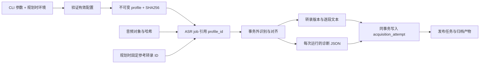

# ASR 参数快照与运行诊断

本页描述 `codex/asr-quality-foundation` 分支已实现的第一批改动。设计依据与后续实验见 [ASR 设计评审](asr-design-review.md)。本批建立可测量、可追溯的基础，尚未用真实音频证明某组参数优于当前默认。

## 1. 数据与执行关系



任务执行从已存储 profile 重建配置，不再读取当时的 ASR 环境变量。相同 profile key 与完整配置复用同一 profile；修改分块、超时、热词、对齐版本或生成预算等参数会产生不同配置哈希。不同 profile 的任务可以独立规划。

文本版本仍按现有内容规则去重。因此新配置产生新的任务和运行证据，但输出逐段文本完全相同，可能复用既有 transcript。诊断以 `run_id + video_part_id` 保存，避免内容去重吞掉实验记录。

## 2. 参数入口与默认值

规划命令中显式提供的参数优先于环境变量；未提供的参数取规划时环境或默认值。已有任务保持自己的快照。

| CLI 参数 | 环境入口 | 默认或语义 |
|---|---|---|
| `--model` | `BILI_ASR_MODEL` | Qwen/Qwen3-ASR-1.7B-hf |
| `--model-revision` | `BILI_ASR_MODEL_REVISION` | 未固定；建议可复核实验固定 commit |
| `--aligner` | `BILI_ASR_ALIGNER_MODEL` | Qwen/Qwen3-ForcedAligner-0.6B-hf |
| `--aligner-revision` | `BILI_ASR_ALIGNER_REVISION` | 独立版本，不继承新的 ASR revision |
| `--device` | `BILI_ASR_DEVICE` | cuda |
| `--language` | `BILI_ASR_LANGUAGE` | 自动识别 |
| `--chunk-seconds` | `BILI_ASR_CHUNK_SECONDS` | 180 秒目标分块长度 |
| `--inference-timeout` | `BILI_ASR_INFERENCE_TIMEOUT_SECONDS` | 1800 秒 GPU 子进程硬时限 |
| `--hotword`，可重复 | `BILI_ASR_HOTWORDS` | 空；CLI 列表替换环境列表，仍经过证据守卫 |
| `--model-id` | `BILI_ASR_MODEL_ID` | 本地 checkpoint 的声明身份 |
| `--offline / --no-offline` | 无 | 离线为 true |
| `--tokens-per-second` | 无 | 8 |
| `--min-new-tokens` | 无 | 256 |
| `--second-pass-cache / --no-second-pass-cache` | 无 | 第二遍关闭生成内 KV cache |

识别与对齐模型及各自 processor 都接收自己的 revision 和 `local_files_only`。本地目录必须预先准备好文件；设置 offline 时，缺失文件会失败。允许联网加载时，应显式使用 `--no-offline`。

BF16、16 kHz 重采样与当前分块算法保持为实现常量。分块器在目标附近寻找低能量边界，因此目标秒数不是严格的最大输入长度。当前没有新增对齐器时长上限守卫；实验应遵守 checkpoint 的实际输入约束。

音频在项目内完成解码、转单声道和重采样后，以 16 kHz float32 波形数组直接传给识别与对齐 processor。短尾仍按原规则填充。这样避免 processor 再按文件路径调用可选解码后端，也省去逐块临时 WAV 写入与 PCM16 量化；不能承诺与此前经过量化的输入产生逐字相同结果。

生成预算由有效 mel 帧估计音频秒数，再取 `max(min_new_tokens, int(tokens_per_second × 秒数))`。它是输出上限，不是字数目标。达到上限且未确认 EOS 的块会标记截断风险，不自动缩短块或重识别。

热词二遍使用独立的生成调用；没有把第一遍 KV cache 传给第二遍。第二遍关闭 cache 是保留的基线，可通过新参数开展对照实验。空候选不会触发第二遍。

CPU runner 在同一 workflow handler 中可复用模型；CUDA / ROCm 仍按任务启动受时限监督的子进程。CPU 没有同等的硬超时终止边界。

## 3. 规划与查询

```powershell
bili-asr workflow plan --part-id 42 --profile-key chunk-60 --chunk-seconds 60 --device cuda
bili-asr workflow run --limit 20
bili-asr workflow asr-evidence --run-id RUN_ID --part-id 42
```

`RUN_ID` 是 ASR acquisition run 的 ID。它位于成功 ASR job 的 `result_json.run_id`，不是 workflow job_id 或 workflow attempt_id。可以通过 SQLite 查找：

```sql
SELECT job_id, video_part_id,
       json_extract(result_json, '$.run_id') AS acquisition_run_id,
       json_extract(result_json, '$.quality.status') AS quality_status
FROM workflow_jobs
WHERE kind = 'asr' AND status = 'succeeded';
```

`asr-evidence` 输出 JSON，找不到对应记录返回退出码 1。该命令与其他 workflow 命令使用相同的数据库打开和 schema 初始化路径。

## 4. 诊断内容与解释

每次成功保存转录时，诊断与转录、attempt 在同一事务提交。记录包括 profile ID、配置哈希、固定参考转录 ID、音频依赖结果、provenance 以及实际执行的每一遍：

- 运行环境：Python、平台、相关包版本、CUDA / HIP 构建信息、实际模型 dtype、可取得的模型 commit hash。
- 阶段耗时：模型加载、音频准备、分块、解码、对齐与本遍总耗时。两遍运行合计包含第一遍成本；阶段值之间存在包含关系，不应再与 total 相加。
- 逐块证据：原音频开始和结束时间、原始识别文字、检测语言、生成 token 数与上限、EOS 观察、对齐时间区间并集、最大未对齐间隔及非法时间单位计数。

对齐区间取 raw aligner units，早于字幕 cue 合并，重叠区间只计一次。合法区间有 50 ms 末端容差并裁到输入长度；短尾块的对齐输入可能包含填充，其长度用于边界检查。无对齐间隔可能是正常静音；并集不是“语音识别完整率”。旧 coverage 表保留首尾跨度指标语义。

| quality.status | 含义 |
|---|---|
| `not-evaluable` | 没有足够的已完成诊断或未解码有效音频 |
| `needs-review` | 最终一遍出现已知风险标记 |
| `no-known-risk` | 最终一遍未触发现有规则；没有人工正确率保证 |

现有风险标记为 `empty-output`、`empty-alignment`、`invalid-alignment`、`token-limit-reached` 与 `span-coverage-short`。中间块为空，即使首尾跨度看起来完整，也会触发复核。没有可观察 EOS 时字段保持 null；不伪造完成证据。所有状态都保留 `human_reviewed=false`。

质量状态目前供查询与实验使用，尚不自动阻止发布或改变转录选择策略。第一遍记录供分析，最终质量判断使用最后一遍。

## 5. 存储兼容与边界

新增 `workflow_asr_profile_configs` 保存 schema version 2 的完整配置；新增 `transcript_asr_evidence` 保存 schema version 1 的运行证据。打开满足现有 SQLite 合同的数据库时，通过建表语句增量补充；不重写旧 profile 或历史转录，不转换已不兼容的旧式数据库。

旧 profile 没有扩展快照时，核对旧配置哈希，保留曾经共用 ASR / aligner revision 的执行语义，并使用旧默认分块、热词和超时。新快照哈希不符或扩展快照被删除时拒绝执行，避免静默回退到默认值。

目前诊断 JSON 绑定于成功转录。模型异常、空整体输出、硬超时及 lease 丢失仍走现有失败记录；尚未持久化其全部中间块诊断。没有 VAD、人工基准 CER、峰值显存采集、按块检查点或常驻 GPU worker。

本批测试使用模型替身验证配置、参数传递、诊断、内容去重和事务回滚，并在 WSL 中用真实的识别与对齐 checkpoint 完成一条 CPU BF16 样本推理。环境、结果与适用范围见 [WSL 验证记录](asr-wsl-validation.md)。真实 GPU 准确率、速度与显存结论需下一批固定音频实验验证。

## 6. 后续实验

先固定音频哈希、checkpoint commit、人工转写和规范化规则，对照 60 / 120 / 180 秒分块、自动语言 / Chinese、第二遍 cache 与默认空热词。记录 CER、边界漏字与重复、异常空块、冷启动和模型复用 RTF、峰值显存及关键术语人工检查结果。

确认测量结果后再决定默认值；随后推进最终文字单次对齐、VAD 辅助复核、分块检查点及受监督的常驻 GPU worker。具体取舍与官方资料见 [设计评审](asr-design-review.md)。
