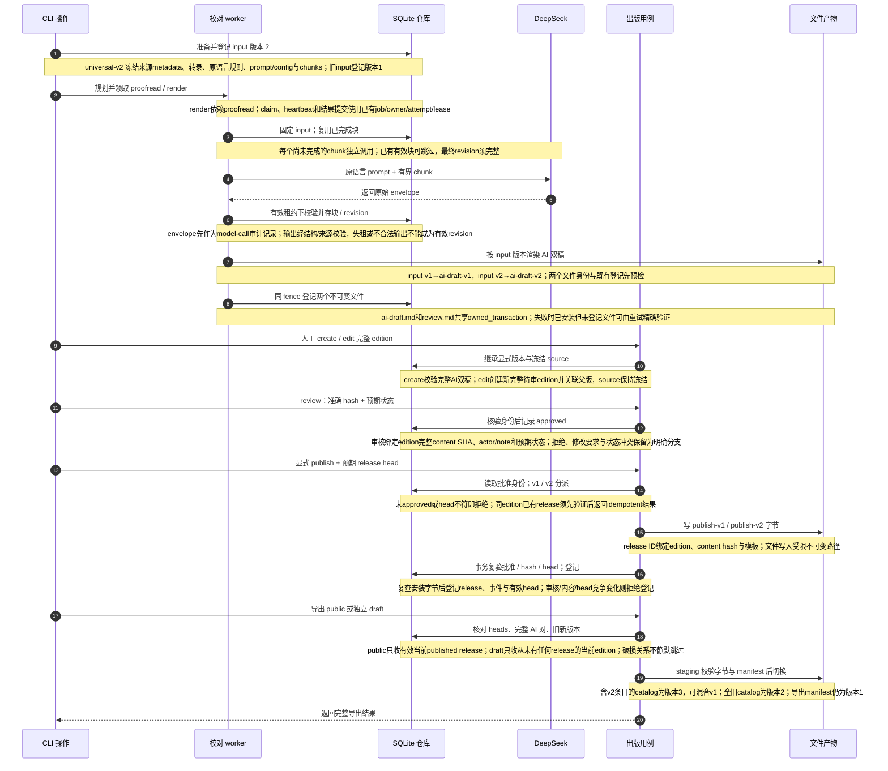

# 冻结来源版本、人工审核与混合稿件出口

源码基线固定于提交 `857906d3b3c54b31fd9bc0ba94b84618f68cd6f3`。

[交互时序图](issues-publication-sequence.html) · [完整 Archify 规格](issues-publication-sequence.json) · [本轮实现与边界](issues-implementation.md) · [出版操作说明](publication.md)

该链从 SQLite 中已经存在的转录准备 editorial input，经过 AI 校对、双稿产物、人工完整 edition、明确审核与 release，最后导出公开或独立草稿快照。图中的 20 条消息全部对应下面的编号操作；新 universal 内容使用版本 2，迁移进来的旧内容明确保留版本 1。

版本属于持久数据事实。`editorial_input_versions` 与 `publication_content_versions` 明确登记版本，读取和渲染根据该版本分派 codec 和模板。历史 input/content 在迁移目标中保持版本 1；新 universal 输入冻结 `SourceMetadataSnapshot`、完整转录身份、原语言规则、prompt/config 和完整 chunks，再登记版本 2。刷新当前来源标题、发布时间或 tags 不会重写既有 input、edition、审核哈希或 release 文件。

AI 输出是待验证的外部输入。worker 在每次请求前核对租约，保留原始响应 envelope 的 model-call 审计，再校验结构与 chunk 来源关系；保存有效块和最终 revision 受到相同 attempt 围栏保护。重试可复用已完成块，完整 revision 和成对文档仍须通过身份验证。`ai-draft.md` 与 `review.md` 各有角色、路径和精确 SHA；半套或跨版本组合不能用于创建 edition，也不能进入有效公开/草稿出口。

人工编辑产生新完整 edition，并重新审核。来源身份和冻结 metadata 继承自原 input，人工编辑字段归 edition 所有。审核必须提供完整内容 SHA 与预期状态；publish 再提供预期有效 release head，并在文件写入后的事务中重查批准关系、内容、head 和安装字节。SQLite 无法回滚已写文件：未登记的不可变文件可能留作重试验证，但它不会成为当前 release。既有 release 的幂等返回也必须验证身份与产物，不会以“已存在”绕过校验。

公开导出与草稿导出有明确资格。公开出口只包含有效当前 published release；草稿出口只包含从未拥有任何 release 的当前 edition，因此撤回或被替换的历史 release 不会混入草稿。导出在读取快照内验证 heads、edition、release、AI 双稿及精确文件字节，再写完整 staging 和 manifest 并切换输出目录。破损 head、缺失文件或摘要不符使整个导出失败，避免生成貌似成功的缺项目录。

包含新内容的 catalog 使用 `schemaVersion: 3`，每个 v2 条目携带 `contentVersion: 2`、真实平台身份和冻结 source metadata，可与旧 v1 条目共存；全旧内容仍使用 catalog 版本 2。导出 manifest 继续为版本 1。外部阅读站需要独立支持 catalog 版本 3；本仓库离线链路回归不代表阅读站已经部署或真实 DeepSeek 账号已经完成在线验收。这里的 edition/release 也独立于可变转录 bundle，后者由另一条 `workflow publish` 链维护。

| 责任 | 固定提交证据 |
| --- | --- |
| 冻结输入及版本登记 | [storage/editorial.py:60–103](https://github.com/SuperCatQR/bilibili-asr-archive/blob/857906d3b3c54b31fd9bc0ba94b84618f68cd6f3/src/bili_asr/storage/editorial.py#L60-L103) |
| 原语言输入、完整有界chunks及v2内容 | [publication_content_v2.py:67–138](https://github.com/SuperCatQR/bilibili-asr-archive/blob/857906d3b3c54b31fd9bc0ba94b84618f68cd6f3/src/bili_asr/publication_content_v2.py#L67-L138) |
| 校对、envelope审计、输出校验及文档成对提交 | [editorial_runtime.py:38–100](https://github.com/SuperCatQR/bilibili-asr-archive/blob/857906d3b3c54b31fd9bc0ba94b84618f68cd6f3/src/bili_asr/editorial_runtime.py#L38-L100) |
| 完整AI双稿身份、create/edit/review与publish | [publication.py:46–189](https://github.com/SuperCatQR/bilibili-asr-archive/blob/857906d3b3c54b31fd9bc0ba94b84618f68cd6f3/src/bili_asr/publication.py#L46-L189) |
| 审核状态、release登记、head及事件 | [storage/publication.py:128–215](https://github.com/SuperCatQR/bilibili-asr-archive/blob/857906d3b3c54b31fd9bc0ba94b84618f68cd6f3/src/bili_asr/storage/publication.py#L128-L215) |
| 公开及独立草稿资格、混合catalog出口 | [publication_export.py:74–193](https://github.com/SuperCatQR/bilibili-asr-archive/blob/857906d3b3c54b31fd9bc0ba94b84618f68cd6f3/src/bili_asr/publication_export.py#L74-L193) |
| CLI的显式人工操作与预期状态参数 | [cli/publication.py:83–171](https://github.com/SuperCatQR/bilibili-asr-archive/blob/857906d3b3c54b31fd9bc0ba94b84618f68cd6f3/src/bili_asr/cli/publication.py#L83-L171) |

图表的自动化质量、严格产物及浏览器检查见 [本轮图表验证凭据](issue-diagram-validation/README.md)；这些检查与截图或人工视觉审阅分开记录。
