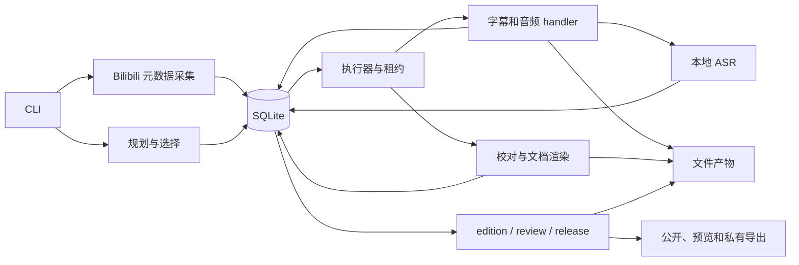
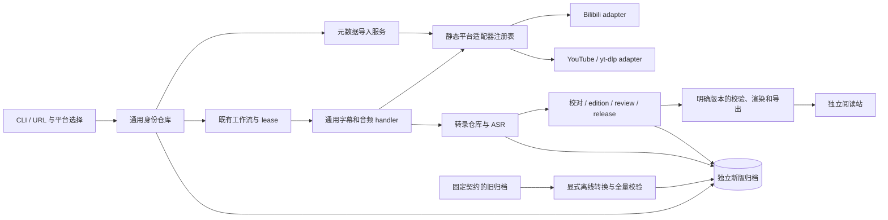

# 多平台接入与旧归档保真迁移架构方案

关联：GitHub issue #278。日期：2026-10-09。
核对基线：`9b289570494b5e8f7cc564a7eaa5b2eb2c28c3ad`。
状态：P0 已实现固定源契约、代表性保真样本和只读 `archive migration-preflight`。
真实完整旧归档尚未离线盘点；本文描述的通用接口、新 schema、转换器与 YouTube 接入仍待实施。

## 1. 已确认的当前架构

项目是 Python CLI、应用服务、SQLite 仓库和文件产物组成的本地系统。
CLI 负责装配依赖；SQLite 保存业务事实和工作流，文件保存音频、转录包和稿件。
工作流以内部 `video_part_id` 调度，领取、heartbeat、精确 attempt 检查和终态写入由既有控制面负责。
调度状态不以下载器缓存、JSON manifest 或模型进程的内存状态为准。



以下事实直接来自代码，而不是根据功能名称推测：

| 边界 | 当前实现 | 架构含义 |
| --- | --- | --- |
| 核心身份 | `storage/schema.sql` 的 videos 以 bvid 为主键，video_parts 必须有 cid | YouTube 无法直接写入当前核心模型 |
| 平台协议 | `sources/models.py:BilibiliGateway` 使用 mid、bvid、cid 和 Bilibili 登录验证 | 需要平台接口，不能让 YouTube 伪造 Bilibili 字段 |
| 执行入口 | `workflow_runtime.py:ArchiveWorkflowHandlers` 直接创建 Bilibili gateway/client | 在装配与采集 handler 处选择平台适配器 |
| 调度核心 | `workflow.py` 和 `storage/workflow.py` 使用 part ID、profile、job、dependency、attempt | 保留调度模型，改输入解析和 handler 依赖 |
| 无字幕资格 | `schema-transcripts.sql:v_missing_audio` 区分已验证登录空清单与已验证 not_found | 此判定是平台策略，不能直接推广到匿名 YouTube |
| 文件身份 | `page_identity.py` 从 bvid/page_index 派生 work_id 和 artifact_stem | 保留旧 key，为新平台建立独立路径策略 |
| 校对冻结 | `storage/editorial.py:metadata` 冻结 bvid、page_index、title，输入摘要参与 input/revision 身份 | 通用身份不能直接加入旧 prepared_json |
| 出版冻结 | `publication.py:normalize_content` 限定 Bilibili source；数据库、导出及 catalog 限定现有版本 | 新内容需要明确新契约，旧内容原样读取 |
| 快照与恢复 | `storage/snapshots.py` 校验当前构建契约，backup、枚举历史产物、恢复中断记录 | 可复用机制，但不是现成跨 schema 迁移器 |

已有公开和预览 catalog 的 `schemaVersion` 是 2，manifest 是 1。
它们与 `publish-v1` / `ai-draft-v1` 模板版本、数据库契约是不同维度；新版本号应分别确定。

## 2. 目标边界

保留 CLI、SQLite 调度、ASR、转录仓库、校对与人工审核的主链路。
新增通用身份与平台采集接口，在平台数据进入应用服务前完成响应规范化。
静态注册表选择 Bilibili 或 YouTube adapter；不引入第二个调度器或通用插件框架。



### 通用身份与数据表

建议核心保留 videos/video_parts 的业务概念，但重设平台身份字段：

```text
creators
  creator_id PK
  platform + external_creator_id UNIQUE
  display_name / timestamps

videos
  video_id PK
  platform + external_video_id UNIQUE
  creator_id FK / title / pubdate / timestamps

video_parts
  video_part_id PK（迁入旧 part ID 原值保留）
  video_id FK + part_index UNIQUE
  title / duration_ms / processing_status / timestamps

Bilibili 专属扩展与采集历史
  mid -> creator_id
  bvid / aid -> video_id
  cid -> video_part_id
  原标签 ID、分类、标签观察、作者身份及页码/发现证据
```

应用内部用 `video_part_id`，外部身份用 `(platform, external_video_id)`。
YouTube 单视频只有 part_index=0；章节和播放列表不作为 Bilibili 分 P。
导入使用事务和唯一约束保证同一平台视频/part 不重复创建。

对原 ingestion 表、视频标签和观察表，必须逐一声明如何保留原 Bilibili 外键：
可将其引用转向带唯一 bvid/mid 的平台扩展表。不能仅修改 videos/video_parts，留下失效的旧连接。
通用标签读取投影为文本；平台标签 ID 保存在平台扩展中。
`video_tag_observations` 的未尝试、成功空、成功非空、不可用语义也需要保留。

需要纠正需求里的一个现状表述：当前 gateway 用 detail staff 验证合拍参与者，
并在 DTO 中携带 collaborator_mids；已保存数据库记录实际 uploader，以及请求作者的采集/发现关联。
当前 schema 没有完整的独立协作者关系表，不能声称迁移会保留数据库中不存在的完整 staff 名单。
如新模型需要持久化该名单，应作为新的平台元数据观察另行采集，不能重写历史采集证据。

### 平台接口与装配

接口草案分为 MetadataSource、SubtitleSource、AudioSource：

- MetadataSource：解析视频引用、返回视频/处理单元元数据与可选元数据观察。
- SubtitleSource：返回轨道清单及观察证据、获取指定轨道的毫秒 segments。
- AudioSource：向 handler 指定的当前 job 暂存目录下载，返回真实文件与格式信息。

传入应用自有 ContentRef（platform、external_video_id、part_index），返回应用自有 DTO。
Bilibili adapter 通过平台扩展解析 cid/mid，并包装现有 gateway/client。
内部 cid 解析应集中在适配器与身份仓库边界，不让业务 handler 扩散平台分支。
有签名媒体 URL、cookies、原始第三方响应不能成为通用持久 DTO。

通用服务保留选轨、转录版本、事务入库；平台 adapter 保留认证、协议和响应规范化。
新增轨道信息应明确人工/自动、原语言、是否自动翻译、轨道身份和提取器版本。
字幕去重/滚动字幕处理规则需要带可追溯规范化版本，不能修改既有 transcript 字节。
语言与人工字幕优先级由选择策略确定；自动翻译默认不冒充原语言字幕。

音频 handler 保留下载后的探测、真实后缀、哈希、复用、取消/lease 检查和最终登记。
yt-dlp 不直接改 archive.db，不使用其 download archive 代替 workflow 状态。
建议将 yt-dlp 调用封装为可管理的子进程，使用结构化输出并设置超时、受控诊断和取消检查；
不解析面向人的 stdout，也不依赖私有 EJS API。
部署需要匹配的 yt-dlp/EJS、受支持 JS runtime，以及 ffmpeg/ffprobe。
ASR 和校对配置仍按任务冻结；YouTube 多语言输入不能统一套用中文任务的默认语言或提示词。

### 采集证据与资格策略

source_kind 继续描述 subtitle-cc、subtitle-ai、asr-local；platform 另行保存。
网络失败、认证失败、无可用轨道、视频明确不存在、正文为空分别留证。
新增通用观察证据需包含 platform、访问上下文、结果、策略版本及时间；不包含凭据值。

Bilibili 已有 credential_verified/absence_verified 历史字段原值保留，由 Bilibili 策略解释。
YouTube 在符合公共内容策略的成功轨道观察后，才可判定没有符合选轨要求的字幕。
一次错误不能生成可信空清单，不给 YouTube 伪造 credential_verified=true。
明确无所选语言轨道与完全无字幕的区别，以及该区别对 ASR 回退的影响。

需要改写 gap views、queue reader 与状态投影，让它们读取按平台解释的资格事实。
计划与执行仍沿用既有 ASR 策略；显式规划 ASR 与自动 gap 回退的条件分别保持清楚。
派生资格可以重建，原始 acquisition 证据必须保存。

### 文件身份

旧 Bilibili work_id、stem、相对路径、bundle marker 保持不变；新 Bilibili 也沿用该规则。
新 YouTube 逻辑 work_id 可以包含平台和外部 ID，但不能直接拿带冒号的 work_id 作文件名。
建议文件 stem 使用 `youtube.<外部ID的完整SHA256>.p0`，避免大小写不同 ID 在 Windows 上碰撞。
路径生成统一经过现有 confinement/portable path 检查；原 ID 存在数据库中用于展示。
源归档已存在的不可移植路径或大小写碰撞，preflight 应明确阻断并列出处理对象。

### 内容与导出契约

保留旧 prepared_json、content_json、payload、文件和摘要的原值，不添加 platform 后重新计算旧 ID。
新增独立的输入/内容契约元数据，旧记录的版本由固定源契约明确赋值。
校验、normalize、渲染和编辑派生按该元数据分派，不猜测 JSON 是否有 bvid。
新来源对象包含 platform、externalVideoId、partIndex、videoPartId、canonical URL。

新的来源结构意味着真实的新内容契约需求；这与 #271 中尚无需求的模板美化不同。
只实现多平台来源所需的版本，不扩展为任意模板编辑系统。
旧 v1 渲染器和旧哈希规则固定；对旧稿件的升级编辑创建新 edition，并重新审核。
历史 job 中的 template/prompt/profile 仍按被冻结版本执行；无对应实现时明确阻断，不改用当前默认值。

公开和预览 catalog 定义新的独立版本，投影旧 Bilibili source 与新通用 source。
消费投影的字段转换不得改变历史 contentSha256/artifactSha256 或被用作重算旧内容哈希的输入。
同步修改 publication_export、export_snapshot、JSON schemas 和独立阅读站的校验/路由/来源链接。
阅读站实现尚未在本次仓库核对范围内；在完成 P3 前必须核对其真实消费者代码。

## 3. 显式迁移架构

新增固定旧契约 SourceReader、逐表转换器、保真校验器和迁移报告。
普通 open_database 仅处理目标构建支持的 schema；旧库通过专门只读 reader 打开。
不能用新版 initialize_schema 推导、补写或猜测旧契约。

流程：停写与维护锁 -> preflight -> SQLite backup 一致副本 -> 目标暂存目录 -> 导入/复制 ->
限定中断恢复 -> 全量保真校验 -> 完成报告 -> 发布独立目标 -> 显式切换。
未知源契约、活动 lease、缺失必需文件或非空目标在目标可用前拒绝。
目标普通打开还需验证完成状态，不能接受正在导入的半成品。

已有 snapshot v1 是包格式，不代表它包含的每个数据库契约都受支持；两者都必须验证。
现有 backup、路径约束、文件流式复制/哈希、目录发布机制可复用。
`required_artifacts` 与 `recover_interrupted_jobs` 当前会校验当前构建 schema，必须按契约拆分后才能复用。
现有 recovery 会更改 running 记录，它不是纯复制；迁移调用前确认中断条件，所有差异写入报告。

验证范围至少包含：

- 原 part/transcript/audio/model/job/attempt/input/revision/edition/review/release/event ID 与关系。
- 原 segments、prepared/content/config/result JSON 字符串、摘要、相对路径和所有历史文件字节。
- 相同时间戳的历史排序：保留被查询消费的有效 rowid，或全面替换为经过验证的显式顺序键。
- source mid/bvid 到新增 creator/video ID 的完整一对一映射，以及目标新插入 ID 的分配边界。
- draft/release 双 head、approved/rejected、superseded/withdrawn、cancelled 与任务依赖。
- 源 artifact root 优先、archive root 回退的实际文件选择；不能只复制 archive root 内可见文件。
- 全量表摘要/转换字段校验、完整文件清单、integrity_check 与 foreign_key_check。

只把已确认中断记录收尾/重新排队，不执行下载、ASR、模型调用或出版。
缺少完整冻结执行配置的历史任务明确阻断，不使用新默认配置补齐旧 digest。
FTS、派生视图可以重建；原审核、转录和发布历史不能通过重采恢复。
旧库与旧文件始终保留；第一版不原地迁移、不合并两个已有库、不做反向同步或断点续传。

## 4. 修改落点与交付顺序

| 阶段 | 修改落点 | 退出条件 |
| --- | --- | --- |
| P0 源契约 | 新迁移模块、合成保真 fixture、实际归档只读盘点 | 固定支持的源结构和行/文件清单；发现不支持源则有明确报告 |
| P1 通用核心 | identity、sources 接口、metadata/schema、selection、handler 装配、内容契约分派 | Bilibili adapter 下现有主链路与旧版本读取回归通过 |
| P2 保真迁移 | SourceReader、转换、校验、CLI、snapshot/recovery 契约入口 | 临时源 -> 独立目标全量一致；故障/重跑不会覆盖源或发布半成品 |
| P3 消费兼容 | publication/export schemas、投影/搜索/verify、独立阅读站 | 实际 Bilibili 归档副本可只读使用、导出与快照往返；新旧 ID/哈希一致 |
| P4 YouTube 单视频 | yt-dlp adapter、轨道/访问证据、平台策略、音频格式、来源渲染 | 人工/自动字幕及无字幕 -> 音频 -> ASR -> 校对/审核/出版闭环 |
| P5 切换与批量 | 运维演练、明确配置切换、单独 discovery 接口 | 回滚演练通过后，再实现频道/播放列表及不透明游标 |

ASR 引擎、调度租约与审核状态机保留其行为；依赖身份的外围读取随新模型修改。
每步运行受影响测试，完整回归由 CI 覆盖；真实网络/GPU/模型调用与离线测试分开记录。
真实源归档路径、schema 版本、独立产物根、规模、活动进程、磁盘空间和阅读站版本尚未完成盘点。
本文确认的是代码架构与修改路径，不宣称已完成真实迁移验收。

## 5. 核对证据与外部资料

- 当前架构说明：`docs/architecture.md`；当前交互图仍是版本化实现快照，不能当作新方案已实现。
- 身份与调度：`page_identity.py`、`storage/workflow_selection.py`、`workflow.py`、`storage/workflow.py`。
- 采集：`sources/models.py`、`workflow_runtime.py`、`services/subtitle_ingest.py`、`storage/schema-transcripts.sql`。
- 冻结版本：`storage/editorial.py`、`publication.py`、`manuscript_templates.py`、`docs/contracts/`。
- 保真机制：`services/archive_snapshot.py`、`storage/snapshots.py`、`artifact_root.py`、`archive_maintenance.py`。
- 外部集成能力：[yt-dlp 官方仓库与嵌入说明](https://github.com/yt-dlp/yt-dlp)。
- YouTube 部署依赖：[yt-dlp 官方 EJS 指南](https://github.com/yt-dlp/yt-dlp/wiki/EJS)。

新增 Python/SQL 代码、迁移器、yt-dlp 锁定版本和部署环境需要在实施阶段单独审查和验证。
