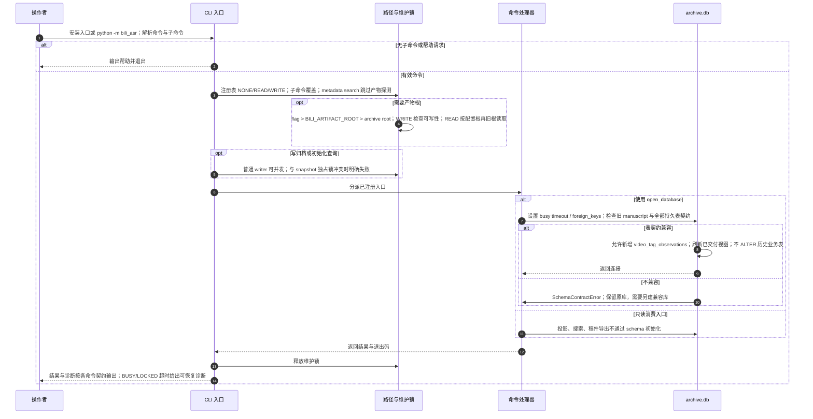

# CLI 启动、路径策略与数据库契约

源码基线：main `9b289570494b5e8f7cc564a7eaa5b2eb2c28c3ad`。

[交互时序图](01-cli-bootstrap.html) · [Archify 规格](01-cli-bootstrap.json) · [全部时序图](../architecture-sequences.md)

## 调用顺序与条件分支

## 边界与恢复

- status/runs 在库存在时仍使用初始化连接，并持有共享维护锁；workflow 查询也可初始化新库。
- 共享 OS 维护锁只协调合作写入者与快照；SQLite BEGIN IMMEDIATE 决定事务写入顺序。
- 注册表中共有 15 个顶层命令；旧版命令不能由源码中的历史 docstring 推断为当前入口。

## 源码证据

- [src/bili_asr/cli/parser.py:11–113](../../src/bili_asr/cli/parser.py#L11)：`build_parser`。
- [src/bili_asr/cli/main.py:41–106](../../src/bili_asr/cli/main.py#L41)：`_main`。
- [src/bili_asr/cli/registry.py:1–54](../../src/bili_asr/cli/registry.py#L1)：`模块入口`。
- [src/bili_asr/artifact_root.py:1–60](../../src/bili_asr/artifact_root.py#L1)：`模块入口`。
- [src/bili_asr/archive_maintenance.py:64–137](../../src/bili_asr/archive_maintenance.py#L64)：`archive_access`。
- [src/bili_asr/cli/workflow.py:147–353](../../src/bili_asr/cli/workflow.py#L147)：`_execute_workflow`。
- [src/bili_asr/cli/publication.py:74–135](../../src/bili_asr/cli/publication.py#L74)：`_cmd_publication`。
- [src/bili_asr/storage/database.py:508–532](../../src/bili_asr/storage/database.py#L508)：`initialize_schema`。
- [src/bili_asr/storage/database.py:549–567](../../src/bili_asr/storage/database.py#L549)：`open_database`。
