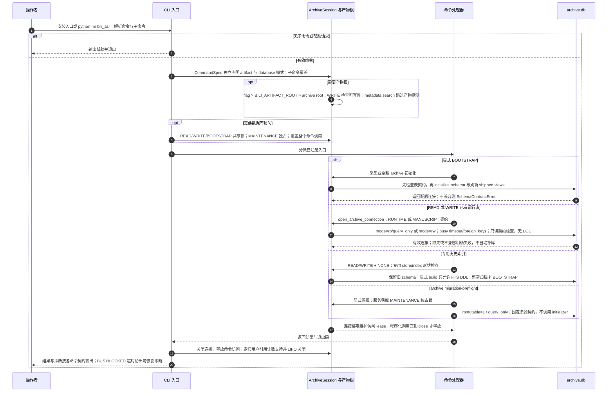

# CLI 启动、路径策略与数据库契约

源码基线：本次架构边界修复的固定代码提交 `5d7a57e201564a10dec7a360b2ef8f7874dc51a7`；这是从 main 开始的本地修复身份，不表示远端 main 已包含修复。

[交互时序图](01-cli-bootstrap.html) · [Archify 规格](01-cli-bootstrap.json) · [全部时序图](../architecture-sequences.md)

## 调用顺序与条件分支

## 边界与恢复

- status/runs、workflow status/explain 和常规消费者使用 READ；查询不会初始化新库或刷新视图。WRITE 同样不运行 initializer。
- BOOTSTRAP 是唯一 schema 初始化入口；NONE 留给历史索引/专用契约，不能作为业务库绕过校验的默认模式。
- open_archive_connection 返回的连接持有 session lease，close 才释放；失败契约检查也关闭连接并释放锁。
- 共享 OS 维护锁只协调合作写入者与快照/预检；SQLite BEGIN IMMEDIATE 决定事务写入顺序。
- 注册表中共有 16 个顶层命令；旧版命令不能由源码中的历史 docstring 推断为当前入口。

## 源码证据

- [src/bili_asr/cli/parser.py:11–115](../../src/bili_asr/cli/parser.py#L11)：`build_parser`。
- [src/bili_asr/cli/main.py:41–102](../../src/bili_asr/cli/main.py#L41)：`_main`。
- [src/bili_asr/cli/registry.py:20–40](../../src/bili_asr/cli/registry.py#L20)：`CommandSpec`。
- [src/bili_asr/cli/workflow.py:147–271](../../src/bili_asr/cli/workflow.py#L147)：`_execute_workflow`。
- [src/bili_asr/cli/publication.py:60–121](../../src/bili_asr/cli/publication.py#L60)：`_cmd_publication`。
- [src/bili_asr/archive_session.py:64–149](../../src/bili_asr/archive_session.py#L64)：`ArchiveSession`。
- [src/bili_asr/archive_maintenance.py:84–160](../../src/bili_asr/archive_maintenance.py#L84)：`archive_access`。
- [src/bili_asr/storage/database.py:87–111](../../src/bili_asr/storage/database.py#L87)：`connect_database`。
- [src/bili_asr/storage/database.py:525–537](../../src/bili_asr/storage/database.py#L525)：`initialize_schema`。
- [src/bili_asr/storage/database.py:540–561](../../src/bili_asr/storage/database.py#L540)：`require_archive_schema`。
