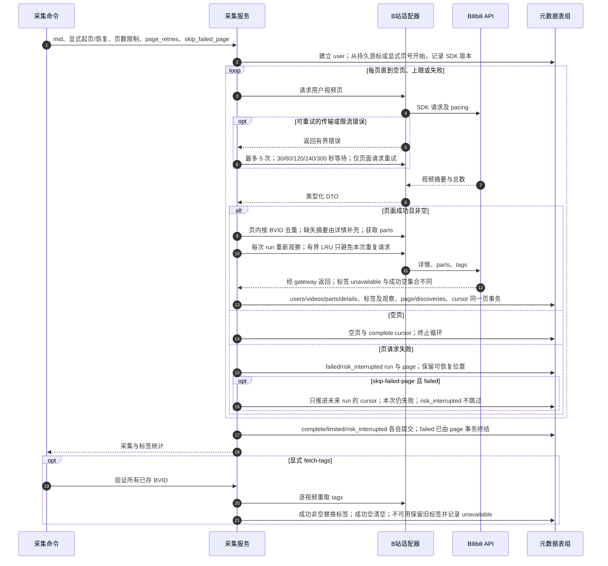

# 分页元数据采集、失败恢复与原始标签

源码基线：main `48b31843510e5b1d78ee4f1448cec6dee7ab2296`。

[交互时序图](02-metadata-tags.html) · [Archify 规格](02-metadata-tags.json) · [全部时序图](../architecture-sequences.md)

## 调用顺序与条件分支

## 边界与恢复

- SESSDATA 是否存在与凭据是否有效是不同事实；秘密和瞬时签名 URL 不作为长期归档内容。
- 原始标签只在 edition create 或显式 sync-source-tags 时冻结；抓取更新不改写既有 edition/release。
- page_retries 的退避由采集服务拥有；标签失败是可选数据失败，不把成功页变成失败页。

## 源码证据

- [src/bili_asr/cli/meta.py:13–80](../../src/bili_asr/cli/meta.py#L13)：`_cmd_fetch_meta`。
- [src/bili_asr/cli/meta.py:83–108](../../src/bili_asr/cli/meta.py#L83)：`_cmd_fetch_tags`。
- [src/bili_asr/services/metadata_ingest.py:303–535](../../src/bili_asr/services/metadata_ingest.py#L303)：`MetadataIngestor._collect`。
- [src/bili_asr/services/video_tags.py:20–56](../../src/bili_asr/services/video_tags.py#L20)：`refresh_video_tags`。
- [src/bili_asr/sources/bilibili_api_gateway.py:707–1259](../../src/bili_asr/sources/bilibili_api_gateway.py#L707)：`BilibiliApiGateway`。
- [src/bili_asr/sources/models.py:245–296](../../src/bili_asr/sources/models.py#L245)：`BilibiliGateway`。
- [src/bili_asr/storage/metadata.py:15–649](../../src/bili_asr/storage/metadata.py#L15)：`MetadataRepository`。
