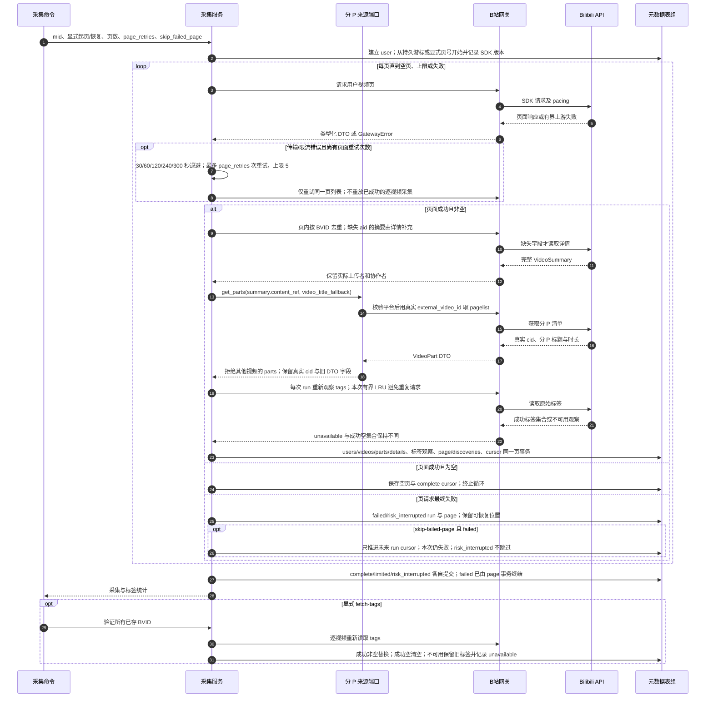

# 分页元数据采集、来源身份与原始标签

源码基线：`5d7a57e201564a10dec7a360b2ef8f7874dc51a7`（架构解耦修复后的代码提交；源码链接采用本地路径）。

[Archify 规格](02-metadata-tags.json) · [交互时序图](02-metadata-tags.html) · [全部时序图](../architecture-sequences.md)

## 调用顺序与条件分支

## 边界与恢复

- SESSDATA 是否存在与凭据是否有效是不同事实；秘密和瞬时签名 URL 不作为长期归档内容。
- VideoSummary.content_ref 是视频查找引用；BilibiliMetadataSource 返回每个真实分 P，保留 cid，ContentRef 不进入数据库或旧 JSON 字段。
- 创建者发现、页面恢复、摘要补充与原始标签仍属于 Bilibili gateway；通用 MetadataSource 端口当前只承担 parts 查询。
- page_retries 的退避由采集服务拥有；标签失败是可选数据失败，不把成功页变成失败页。
- 原始标签只在 edition create 或显式 sync-source-tags 时冻结；抓取更新不改写既有 edition/release。

## 源码证据

- [src/bili_asr/cli/meta.py:14–81](../../src/bili_asr/cli/meta.py#L14)：`_cmd_fetch_meta`。
- [src/bili_asr/cli/meta.py:84–108](../../src/bili_asr/cli/meta.py#L84)：`_cmd_fetch_tags`。
- [src/bili_asr/services/metadata_ingest.py:305–537](../../src/bili_asr/services/metadata_ingest.py#L305)：`MetadataIngestor._collect`。
- [src/bili_asr/services/video_tags.py:20–56](../../src/bili_asr/services/video_tags.py#L20)：`refresh_video_tags`。
- [src/bili_asr/sources/bilibili_source.py:36–45](../../src/bili_asr/sources/bilibili_source.py#L36)：`BilibiliMetadataSource.get_parts`。
- [src/bili_asr/platform_identity.py:17–48](../../src/bili_asr/platform_identity.py#L17)：`ContentRef`。
- [src/bili_asr/sources/bilibili_api_gateway.py:707–1259](../../src/bili_asr/sources/bilibili_api_gateway.py#L707)：`BilibiliApiGateway`。
- [src/bili_asr/sources/bilibili_api_gateway.py:784–861](../../src/bili_asr/sources/bilibili_api_gateway.py#L784)：`BilibiliApiGateway.get_user_video_page`。
- [src/bili_asr/sources/bilibili_api_gateway.py:863–875](../../src/bili_asr/sources/bilibili_api_gateway.py#L863)：`BilibiliApiGateway.get_video_parts`。
- [src/bili_asr/sources/bilibili_api_gateway.py:897–969](../../src/bili_asr/sources/bilibili_api_gateway.py#L897)：`BilibiliApiGateway.get_video_tags`。
- [src/bili_asr/storage/metadata.py:15–649](../../src/bili_asr/storage/metadata.py#L15)：`MetadataRepository`。
- [src/bili_asr/sources/protocols.py:49–59](../../src/bili_asr/sources/protocols.py#L49)：`MetadataSource`。
- [src/bili_asr/sources/models.py:65–128](../../src/bili_asr/sources/models.py#L65)：`VideoSummary`。
- [src/bili_asr/sources/models.py:132–152](../../src/bili_asr/sources/models.py#L132)：`VideoPart`。
- [src/bili_asr/error_codes.py:10–23](../../src/bili_asr/error_codes.py#L10)：`validate_error_code`。
