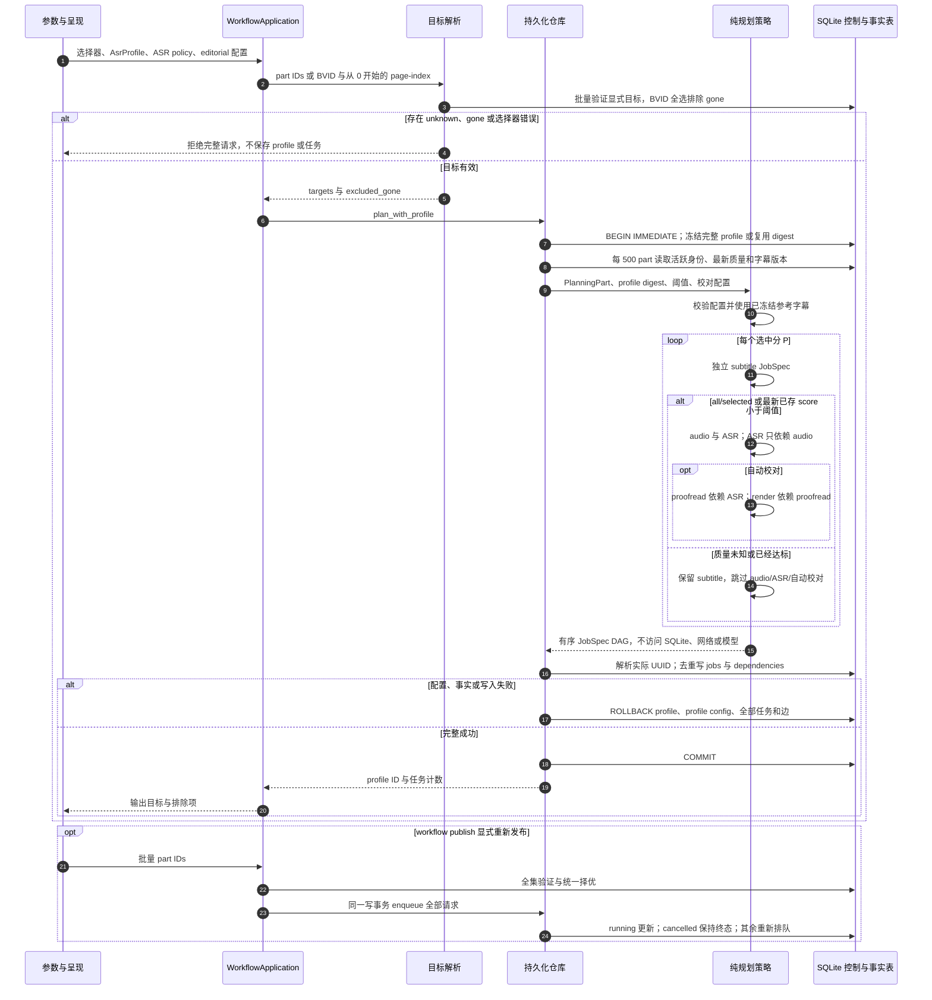

# 全集选择验证、配置冻结与依赖规划

源码基线：`5d7a57e201564a10dec7a360b2ef8f7874dc51a7`；起点为 main `6544eb85ea3e95e5b9571930fefaf35bde6b7dc1`。

[交互时序图](03-workflow-plan.html) · [Archify 规格](03-workflow-plan.json) · [全部时序图](../architecture-sequences.md)

## 调用顺序与条件分支

## 边界与恢复

- 共享模型位于 `workflow_models`，纯规则位于 `workflow_planning`；执行器依赖控制端口，SQLite 仓库读取事实、保存去重任务及依赖。
- CLI 负责参数和输出，`WorkflowApplication` 负责选择与用例。`plan_with_profile` 在一个 `BEGIN IMMEDIATE` 中保存 profile 与完整图；选择后并发 gone 变化再次检查，失败回滚两者。
- 原 dedupe、配置 SHA 和冻结输入身份保持原算法。新任务载荷标明 `schema_version=1`；未标版本的历史载荷按 v1 验证，错误版本、part/profile、字段类型不能认领或写产物。
- all/selected 均规划已选 part；below-threshold 使用已存最新质量。重放不会复活 cancelled job。校对输入与两个任务、显式批量 publish 的请求分别共同提交。
- index kind 保留在契约中，当前 CLI 与 handler 没有自动 index；FTS 由 search-index 执行。

## 源码证据

- [src/bili_asr/cli/workflow.py:147–271](../../src/bili_asr/cli/workflow.py#L147)：`_execute_workflow`。
- [src/bili_asr/services/workflow_application.py:33–41](../../src/bili_asr/services/workflow_application.py#L33)：`WorkflowApplication.plan`。
- [src/bili_asr/services/workflow_application.py:43–55](../../src/bili_asr/services/workflow_application.py#L43)：`WorkflowApplication.publish`。
- [src/bili_asr/storage/workflow_selection.py:47–136](../../src/bili_asr/storage/workflow_selection.py#L47)：`resolve_workflow_selection`。
- [src/bili_asr/storage/workflow.py:135–145](../../src/bili_asr/storage/workflow.py#L135)：`WorkflowRepository.plan_with_profile`。
- [src/bili_asr/storage/workflow.py:181–193](../../src/bili_asr/storage/workflow.py#L181)：`WorkflowRepository._enqueue_specs`。
- [src/bili_asr/workflow_planning.py:60–91](../../src/bili_asr/workflow_planning.py#L60)：`plan_producers`。
- [src/bili_asr/workflow_planning.py:34–44](../../src/bili_asr/workflow_planning.py#L34)：`JobSpec.materialize`。
- [src/bili_asr/storage/workflow.py:159–179](../../src/bili_asr/storage/workflow.py#L159)：`WorkflowRepository._planning_parts`。
- [src/bili_asr/storage/workflow.py:77–120](../../src/bili_asr/storage/workflow.py#L77)：`WorkflowRepository._register_profile`。
