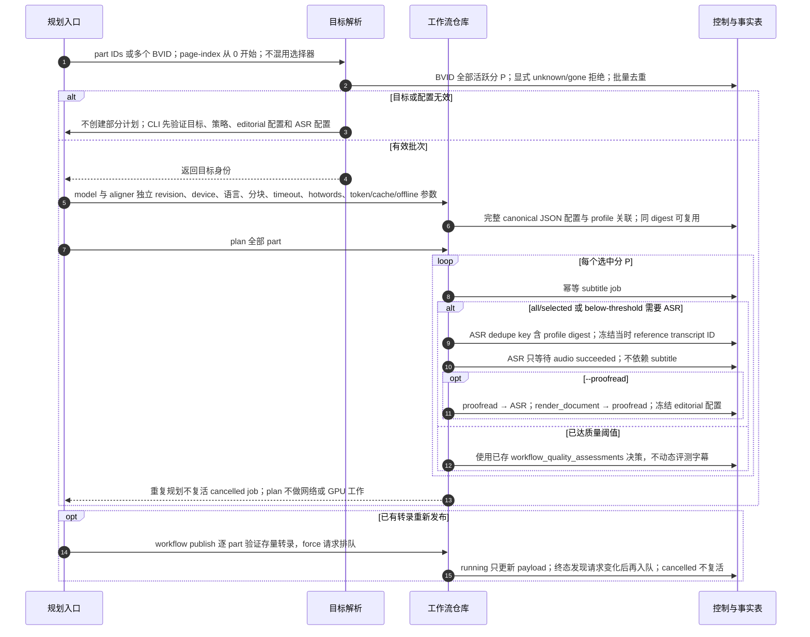

# 全集选择验证、配置冻结与依赖规划

源码基线：main `9b289570494b5e8f7cc564a7eaa5b2eb2c28c3ad`。

[交互时序图](03-workflow-plan.html) · [Archify 规格](03-workflow-plan.json) · [全部时序图](../architecture-sequences.md)

## 调用顺序与条件分支

## 边界与恢复

- 库中允许 index job kind，但当前 CLI 规划与 handler 注册没有 index；FTS 由 search-index 显式执行。
- 当前 asr-policy 为 all/selected/below-threshold；selected 与 all 都对已选 part 规划，below-threshold 增加质量门槛。
- profile 登记与 jobs 规划是不同提交；不将选择验证描述为所有并发条件下的跨步骤原子事务。

## 源码证据

- [src/bili_asr/cli/workflow.py:147–353](../../src/bili_asr/cli/workflow.py#L147)：`_execute_workflow`。
- [src/bili_asr/storage/workflow_selection.py:47–136](../../src/bili_asr/storage/workflow_selection.py#L47)：`resolve_workflow_selection`。
- [src/bili_asr/storage/workflow.py:212–304](../../src/bili_asr/storage/workflow.py#L212)：`WorkflowRepository.plan`。
- [src/bili_asr/storage/workflow.py:675–731](../../src/bili_asr/storage/workflow.py#L675)：`WorkflowRepository.request_publication`。
- [src/bili_asr/storage/workflow.py:166–210](../../src/bili_asr/storage/workflow.py#L166)：`WorkflowRepository.register_profile`。
- [src/bili_asr/storage/workflow.py:544–560](../../src/bili_asr/storage/workflow.py#L544)：`WorkflowRepository._editorial_jobs`。
