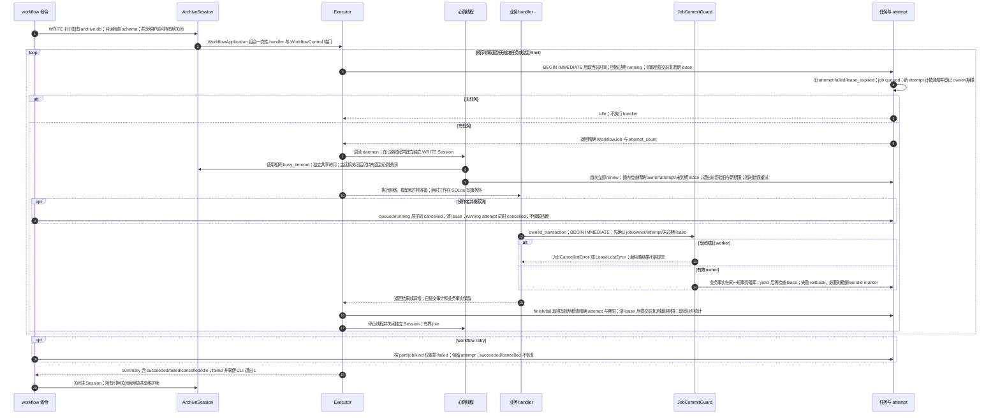

# 任务认领、共享提交保护、心跳与取消重试

源码基线：架构修复提交 `5d7a57e201564a10dec7a360b2ef8f7874dc51a7`。

[交互时序图](04-lease-cancel-retry.html) · [Archify 规格](04-lease-cancel-retry.json) · [全部时序图](../architecture-sequences.md)

## 调用顺序与条件分支

## 边界与恢复

- 维护锁排除快照/恢复，SQLite 写锁串行化取消和权威提交；两个锁职责独立。普通工作者共享维护访问，互不全局串行化。
- 网络、GPU、模型调用采用协作取消；当前 run 不保证立即终止所有在途请求。已完成真实响应审计允许保留。
- 结果事实和 executor 终态仍为独立事务；崩溃可能留下业务结果已存而 job running，依靠幂等事实与租约回收恢复。
- 连接引用计数支持独立连接任意关闭顺序；失败的跨线程 close 不释放仍存活连接的维护访问。心跳仍在 I/O 时保留自己的访问。

## 源码证据

- [src/bili_asr/cli/workflow.py:147–271](../../src/bili_asr/cli/workflow.py#L147)：`_execute_workflow`。
- [src/bili_asr/archive_session.py:106–132](../../src/bili_asr/archive_session.py#L106)：`ArchiveSession.open`。
- [src/bili_asr/archive_maintenance.py:84–160](../../src/bili_asr/archive_maintenance.py#L84)：`archive_access`。
- [src/bili_asr/workflow.py:70–114](../../src/bili_asr/workflow.py#L70)：`WorkflowExecutor.run`。
- [src/bili_asr/services/workflow_application.py:92–115](../../src/bili_asr/services/workflow_application.py#L92)：`WorkflowApplication.run`。
- [src/bili_asr/workflow.py:162–188](../../src/bili_asr/workflow.py#L162)：`_LeaseHeartbeat._run`。
- [src/bili_asr/storage/workflow.py:54–71](../../src/bili_asr/storage/workflow.py#L54)：`WorkflowRepository.open_lease_repository`。
- [src/bili_asr/workflow_runtime.py:318–418](../../src/bili_asr/workflow_runtime.py#L318)：`ArchiveWorkflowHandlers.publish`。
- [src/bili_asr/editorial_runtime.py:63–97](../../src/bili_asr/editorial_runtime.py#L63)：`EditorialWorkflowHandlers.render`。
- [src/bili_asr/storage/job_commit.py:13–62](../../src/bili_asr/storage/job_commit.py#L13)：`JobCommitGuard`。
- [src/bili_asr/storage/workflow.py:195–257](../../src/bili_asr/storage/workflow.py#L195)：`WorkflowRepository.claim`。
- [src/bili_asr/storage/workflow.py:305–353](../../src/bili_asr/storage/workflow.py#L305)：`WorkflowRepository.cancel`。
- [src/bili_asr/storage/workflow.py:675–734](../../src/bili_asr/storage/workflow.py#L675)：`WorkflowRepository._terminal`。
- [src/bili_asr/storage/workflow.py:507–534](../../src/bili_asr/storage/workflow.py#L507)：`WorkflowRepository.requeue_failed`。

## 提交期限补充

实际字幕/ASR repository 接受共享 JobCommitGuard 的完整事务上下文，正文、模型、coverage/evidence 与成功 attempt 在提交前再次校验 owner/attempt/expiry。事务内到期全部回滚；失败 run 的审计收尾仍允许保存。旧 callback API 也在事务退出时复验。认领在 BEGIN IMMEDIATE 返回后采样时间并在提交前检查新租约；续约拒绝精确到期，并在写入后复验旧截止和新截止两者较早值，不能靠慢写续活已经到期的旧租约；finish/fail 清空 lease 后以捕获的截止再作提交前检查。等待写锁不消耗随后发放的新租约，也不能靠旧时间复活到期任务。
