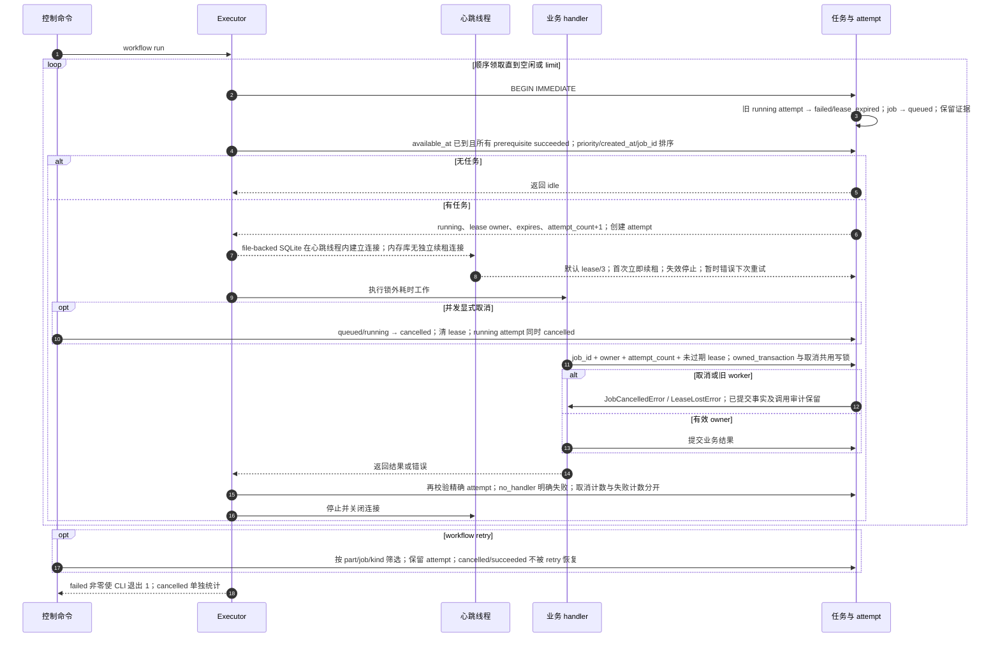

# 任务认领、心跳、取消、租约回收与重试

源码基线：main `48b31843510e5b1d78ee4f1448cec6dee7ab2296`。

[交互时序图](04-lease-cancel-retry.html) · [Archify 规格](04-lease-cancel-retry.json) · [全部时序图](../architecture-sequences.md)

## 调用顺序与条件分支

## 边界与恢复

- 网络、GPU 和模型调用是协作取消；当前 workflow run 不提供立即终止每个在途请求的保证。
- 取消不级联删除依赖；依赖 cancelled 的 queued job 由 status/explain 派生为 blocked。
- 结果提交与 executor 的终态提交是独立事务；崩溃后可出现已存结果但 job 仍 running，需要幂等恢复。

## 源码证据

- [src/bili_asr/cli/workflow.py:147–353](../../src/bili_asr/cli/workflow.py#L147)：`_execute_workflow`。
- [src/bili_asr/workflow.py:53–97](../../src/bili_asr/workflow.py#L53)：`WorkflowExecutor.run`。
- [src/bili_asr/workflow.py:145–171](../../src/bili_asr/workflow.py#L145)：`_LeaseHeartbeat._run`。
- [src/bili_asr/workflow_runtime.py:45–417](../../src/bili_asr/workflow_runtime.py#L45)：`ArchiveWorkflowHandlers`。
- [src/bili_asr/editorial_runtime.py:17–89](../../src/bili_asr/editorial_runtime.py#L17)：`EditorialWorkflowHandlers`。
- [src/bili_asr/storage/workflow.py:306–372](../../src/bili_asr/storage/workflow.py#L306)：`WorkflowRepository.claim`。
- [src/bili_asr/storage/workflow.py:450–498](../../src/bili_asr/storage/workflow.py#L450)：`WorkflowRepository.cancel`。
- [src/bili_asr/storage/workflow.py:829–892](../../src/bili_asr/storage/workflow.py#L829)：`WorkflowRepository._terminal`。
