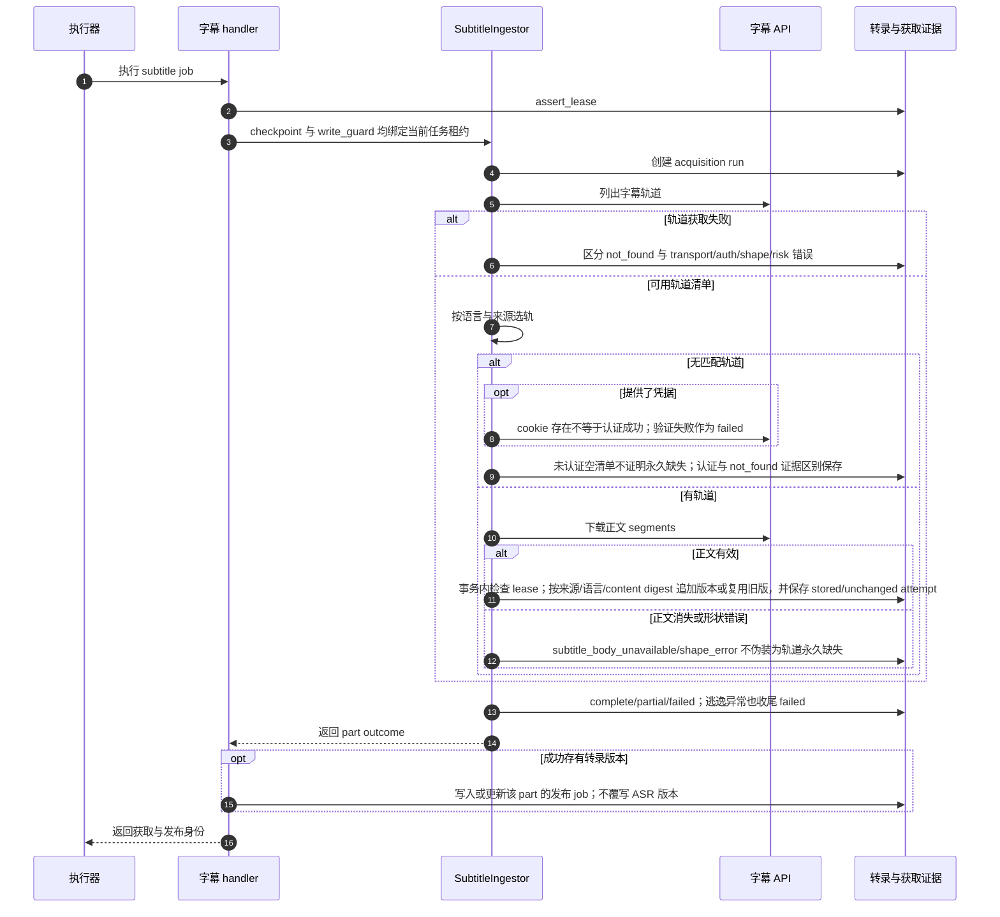

# 字幕轨道选择、缺失证据与不可变转录

源码基线：main `9b289570494b5e8f7cc564a7eaa5b2eb2c28c3ad`。

[交互时序图](05-subtitle-ingest.html) · [Archify 规格](05-subtitle-ingest.json) · [全部时序图](../architecture-sequences.md)

## 调用顺序与条件分支

## 边界与恢复

- 每个 job 对应当前选择的一个分 P；ASR 不等待这条路径的成功。
- 语言、来源、内容和 version 是转录身份；同内容复用不丢失本次获取证据。
- 取消可留下失败 run/attempt 收尾；新的成功转录与新 publish 请求仍受 lease 检查。

## 源码证据

- [src/bili_asr/workflow.py:53–97](../../src/bili_asr/workflow.py#L53)：`WorkflowExecutor.run`。
- [src/bili_asr/workflow_runtime.py:79–116](../../src/bili_asr/workflow_runtime.py#L79)：`ArchiveWorkflowHandlers.subtitle`。
- [src/bili_asr/services/subtitle_ingest.py:423–470](../../src/bili_asr/services/subtitle_ingest.py#L423)：`SubtitleIngestor._acquire_part`。
- [src/bili_asr/sources/bilibili_api_gateway.py:707–1259](../../src/bili_asr/sources/bilibili_api_gateway.py#L707)：`BilibiliApiGateway`。
- [src/bili_asr/storage/transcripts.py:189–312](../../src/bili_asr/storage/transcripts.py#L189)：`TranscriptRepository.record_acquired_transcript`。
- [src/bili_asr/storage/transcripts.py:520–583](../../src/bili_asr/storage/transcripts.py#L520)：`TranscriptRepository.record_subtitle_attempt`。
