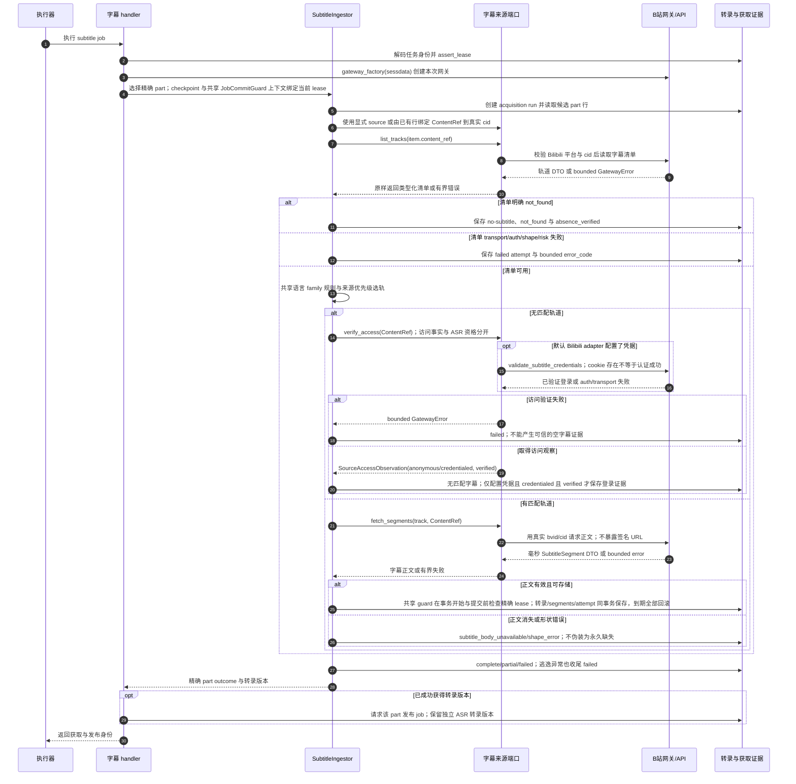

# 字幕来源端口、缺失证据与不可变转录

源码基线：`5d7a57e201564a10dec7a360b2ef8f7874dc51a7`（架构解耦修复后的代码提交；源码链接采用本地路径）。

[Archify 规格](05-subtitle-ingest.json) · [交互时序图](05-subtitle-ingest.html) · [全部时序图](../architecture-sequences.md)

## 调用顺序与条件分支

## 边界与恢复

- 每个 subtitle job 处理一个既有分 P；显式 source 注入不新增 schema，不伪造 bvid/cid，也不为每个网络调用增加 SQL。
- probe 不创建 run、attempt、transcript 或文件；probe 清单 not_found 报 failed，harvest 将明确 not_found 保存为 no-subtitle 观察。
- 已验证的匿名访问仍是匿名；配置 cookie 而登录验证失败不能产生 credential_verified 或可信空字幕证据。
- 语言、来源、内容和 version 构成转录身份；同内容复用仍保存本次获取证据，正文失效与清单缺失有不同语义。
- ASR 不等待字幕路径成功。取消可留下失败 run/attempt 收尾，新的成功转录和 publish 请求仍受 lease 检查。

## 源码证据

- [src/bili_asr/workflow.py:70–114](../../src/bili_asr/workflow.py#L70)：`WorkflowExecutor.run`。
- [src/bili_asr/workflow_runtime.py:95–133](../../src/bili_asr/workflow_runtime.py#L95)：`ArchiveWorkflowHandlers.subtitle`。
- [src/bili_asr/workflow_runtime_ports.py:15–16](../../src/bili_asr/workflow_runtime_ports.py#L15)：`GatewayFactory`。
- [src/bili_asr/services/subtitle_ingest.py:456–505](../../src/bili_asr/services/subtitle_ingest.py#L456)：`SubtitleIngestor._acquire_part`。
- [src/bili_asr/services/subtitle_ingest.py:305–320](../../src/bili_asr/services/subtitle_ingest.py#L305)：`SubtitleIngestor._source_for`。
- [src/bili_asr/sources/bilibili_source.py:48–87](../../src/bili_asr/sources/bilibili_source.py#L48)：`BilibiliSubtitleSource`。
- [src/bili_asr/sources/protocols.py:62–76](../../src/bili_asr/sources/protocols.py#L62)：`SubtitleSource`。
- [src/bili_asr/sources/protocols.py:32–46](../../src/bili_asr/sources/protocols.py#L32)：`SourceAccessObservation`。
- [src/bili_asr/sources/bilibili_api_gateway.py:971–988](../../src/bili_asr/sources/bilibili_api_gateway.py#L971)：`BilibiliApiGateway.get_subtitle_tracks`。
- [src/bili_asr/sources/bilibili_api_gateway.py:990–998](../../src/bili_asr/sources/bilibili_api_gateway.py#L990)：`BilibiliApiGateway.validate_subtitle_credentials`。
- [src/bili_asr/sources/bilibili_api_gateway.py:1014–1054](../../src/bili_asr/sources/bilibili_api_gateway.py#L1014)：`BilibiliApiGateway.fetch_subtitle_segments`。
- [src/bili_asr/storage/transcripts.py:206–329](../../src/bili_asr/storage/transcripts.py#L206)：`TranscriptRepository.record_acquired_transcript`。
- [src/bili_asr/storage/transcripts.py:537–600](../../src/bili_asr/storage/transcripts.py#L537)：`TranscriptRepository.record_subtitle_attempt`。
- [src/bili_asr/transcript_selection.py:15–21](../../src/bili_asr/transcript_selection.py#L15)：`language_family`。
- [src/bili_asr/services/subtitle_ingest.py:104–143](../../src/bili_asr/services/subtitle_ingest.py#L104)：`select_subtitle_track`。
- [src/bili_asr/platform_identity.py:17–48](../../src/bili_asr/platform_identity.py#L17)：`ContentRef`。

## 提交期限补充

实际字幕/ASR repository 接受共享 JobCommitGuard 的完整事务上下文，正文、模型、coverage/evidence 与成功 attempt 在提交前再次校验 owner/attempt/expiry。事务内到期全部回滚；失败 run 的审计收尾仍允许保存。旧 callback API 也在事务退出时复验。认领在 BEGIN IMMEDIATE 返回后采样时间并在提交前检查新租约；续约拒绝精确到期并复验新截止；finish/fail 清空 lease 后以捕获的截止再作提交前检查。等待写锁不消耗随后发放的新租约，也不能靠旧时间复活到期任务。
