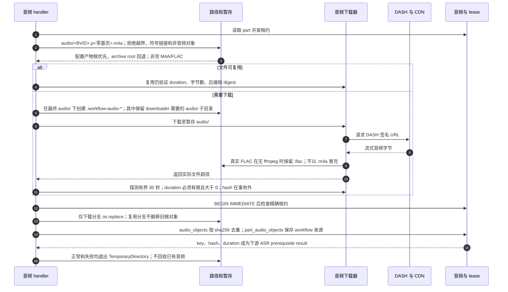

# 音频复用、隔离下载与受保护登记

源码基线：main `9b289570494b5e8f7cc564a7eaa5b2eb2c28c3ad`。

[交互时序图](06-audio-download.html) · [Archify 规格](06-audio-download.json) · [全部时序图](../architecture-sequences.md)

## 调用顺序与条件分支

## 边界与恢复

- 当前 workflow 无成功后的自动音频删除、keep-audio 或 max-audio-gb 命令参数。
- 下载、探测、hash 不占 SQLite 写事务；最终替换和登记共享租约保护写锁。
- SQLite rollback 无法回滚已替换的文件；inventory/verify/快照校验是独立核对机制。

## 源码证据

- [src/bili_asr/workflow_runtime.py:118–141](../../src/bili_asr/workflow_runtime.py#L118)：`ArchiveWorkflowHandlers.audio`。
- [src/bili_asr/workflow_runtime.py:150–184](../../src/bili_asr/workflow_runtime.py#L150)：`ArchiveWorkflowHandlers._store_audio`。
- [src/bili_asr/artifact_root.py:1–60](../../src/bili_asr/artifact_root.py#L1)：`模块入口`。
- [src/bili_asr/path_policy.py:1–60](../../src/bili_asr/path_policy.py#L1)：`模块入口`。
- [src/bili_asr/audio.py:1–60](../../src/bili_asr/audio.py#L1)：`模块入口`。
- [src/bili_asr/bili_client.py:219–657](../../src/bili_asr/bili_client.py#L219)：`BiliClient`。
- [src/bili_asr/storage/workflow.py:413–422](../../src/bili_asr/storage/workflow.py#L413)：`WorkflowRepository.owned_transaction`。
