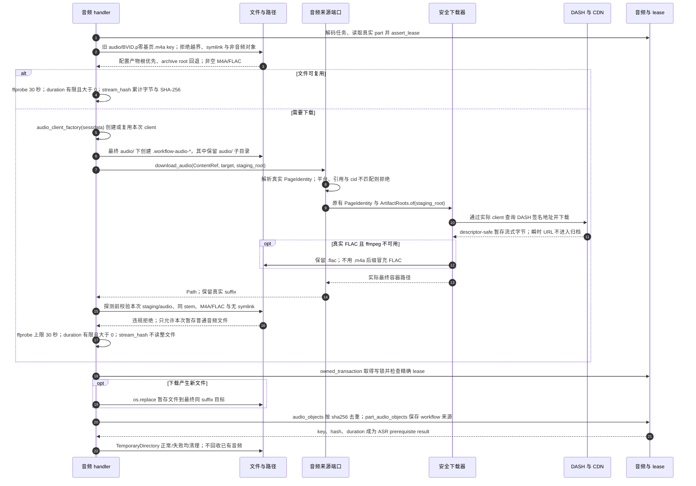

# 音频来源、流式摘要与受保护登记

源码基线：`5d7a57e201564a10dec7a360b2ef8f7874dc51a7`（架构解耦修复后的代码提交；源码链接采用本地路径）。

[Archify 规格](06-audio-download.json) · [交互时序图](06-audio-download.html) · [全部时序图](../architecture-sequences.md)

## 调用顺序与条件分支

## 边界与恢复

- ContentRef 只作为运行时来源输入；BilibiliAudioSource 通过真实 PageIdentity 调用现有安全下载器，旧 stem/key 保持原样。
- 探测前拒绝暂存目录外路径、错误后缀、其他分 P stem 和符号链接；真实 FLAC 返回值继续使用 .flac。
- ffprobe、下载和固定块 stream_hash 在 SQLite 写事务外执行；最终文件替换与登记共享租约保护写锁。
- 当前 workflow 无成功后的自动音频删除、keep-audio 或 max-audio-gb 命令参数。复用分支不搬移旧根音频。
- SQLite rollback 无法回滚已替换的文件；inventory/verify/快照校验仍是独立核对机制。

## 源码证据

- [src/bili_asr/workflow_runtime.py:135–159](../../src/bili_asr/workflow_runtime.py#L135)：`ArchiveWorkflowHandlers.audio`。
- [src/bili_asr/workflow_runtime.py:161–172](../../src/bili_asr/workflow_runtime.py#L161)：`ArchiveWorkflowHandlers._download_audio`。
- [src/bili_asr/workflow_runtime.py:174–209](../../src/bili_asr/workflow_runtime.py#L174)：`ArchiveWorkflowHandlers._store_audio`。
- [src/bili_asr/artifact_root.py:369–388](../../src/bili_asr/artifact_root.py#L369)：`usable_audio_path`。
- [src/bili_asr/path_policy.py:101–143](../../src/bili_asr/path_policy.py#L101)：`confined_audio_path`。
- [src/bili_asr/artifact_inventory.py:122–130](../../src/bili_asr/artifact_inventory.py#L122)：`stream_hash`。
- [src/bili_asr/sources/bilibili_source.py:90–118](../../src/bili_asr/sources/bilibili_source.py#L90)：`BilibiliAudioSource`。
- [src/bili_asr/sources/protocols.py:79–89](../../src/bili_asr/sources/protocols.py#L79)：`AudioSource`。
- [src/bili_asr/audio.py:222–337](../../src/bili_asr/audio.py#L222)：`download_audio`。
- [src/bili_asr/bili_client.py:602–630](../../src/bili_asr/bili_client.py#L602)：`BiliClient.fetch_playurl_audio`。
- [src/bili_asr/bili_client.py:632–657](../../src/bili_asr/bili_client.py#L632)：`BiliClient.download_audio_stream`。
- [src/bili_asr/storage/workflow.py:283–291](../../src/bili_asr/storage/workflow.py#L283)：`WorkflowRepository.owned_transaction`。
- [src/bili_asr/workflow_runtime_ports.py:19–20](../../src/bili_asr/workflow_runtime_ports.py#L19)：`AudioClientFactory`。
- [src/bili_asr/page_identity.py:19–30](../../src/bili_asr/page_identity.py#L19)：`PageIdentity`。
- [src/bili_asr/platform_identity.py:17–48](../../src/bili_asr/platform_identity.py#L17)：`ContentRef`。
