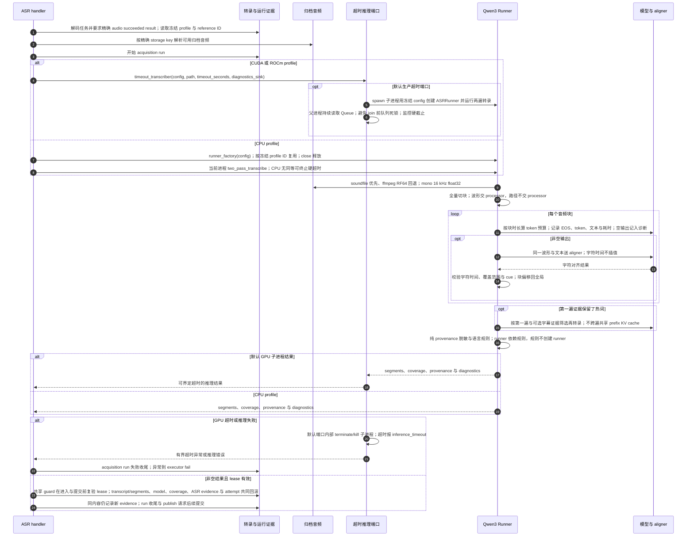

# ASR 工厂、GPU 超时端口与逐次证据

源码基线：`5d7a57e201564a10dec7a360b2ef8f7874dc51a7`（架构解耦修复后的代码提交；源码链接采用本地路径）。

[Archify 规格](07-asr-runtime.json) · [交互时序图](07-asr-runtime.html) · [全部时序图](../architecture-sequences.md)

## 调用顺序与条件分支

## 边界与恢复

- runner_factory 只构建当前进程 CPU runner；GPU 默认由 timeout_transcriber 启动受监督子进程，另一个注入端口提供受控推理边界。
- ASR 公开包和 runner/provenance 子模块使用普通 Python 模块。asr.provenance() 保持函数调用，显式 runner_factory 与公开 ASRRunner 替换进入真实调用，不跨模块写 class。
- provenance 只拥有语言、脱敏和证据规则；依赖方向为 runner -> provenance，已消除 provenance -> runner eager 循环。
- GPU 超时与手动取消是不同机制；取消在调用后的 checkpoint/提交事务阻断新写入。
- 失败或取消的全部中间块诊断尚未持久化；质量告警不等于 CER，也不自动禁止归档发布。
- workflow publish 没有把全部 transcript_asr_evidence/coverage/characters 交给 bundle writer；数据库证据不等于必然随包发布。

## 源码证据

- [src/bili_asr/workflow_runtime.py:211–316](../../src/bili_asr/workflow_runtime.py#L211)：`ArchiveWorkflowHandlers.local_asr`。
- [src/bili_asr/workflow_runtime.py:420–427](../../src/bili_asr/workflow_runtime.py#L420)：`ArchiveWorkflowHandlers._runner`。
- [src/bili_asr/workflow_runtime_ports.py:43–46](../../src/bili_asr/workflow_runtime_ports.py#L43)：`RunnerFactory`。
- [src/bili_asr/storage/transcripts.py:331–516](../../src/bili_asr/storage/transcripts.py#L331)：`TranscriptRepository.record_local_transcript`。
- [src/bili_asr/storage/workflow.py:365–383](../../src/bili_asr/storage/workflow.py#L365)：`WorkflowRepository.dependency_result`。
- [src/bili_asr/artifact_root.py:334–366](../../src/bili_asr/artifact_root.py#L334)：`resolve_audio_path`。
- [src/bili_asr/asr/audio.py:128–155](../../src/bili_asr/asr/audio.py#L128)：`_read_audio`。
- [src/bili_asr/workflow_runtime_ports.py:49–60](../../src/bili_asr/workflow_runtime_ports.py#L49)：`TimeoutTranscriber`。
- [src/bili_asr/asr/runner.py:57–132](../../src/bili_asr/asr/runner.py#L57)：`transcribe_with_timeout`。
- [src/bili_asr/asr/runner.py:32–54](../../src/bili_asr/asr/runner.py#L32)：`_isolated_transcribe_worker`。
- [src/bili_asr/asr/runner.py:203–697](../../src/bili_asr/asr/runner.py#L203)：`ASRRunner`。
- [src/bili_asr/asr/runner.py:700–726](../../src/bili_asr/asr/runner.py#L700)：`two_pass_transcribe`。
- [src/bili_asr/asr/provenance.py:32–35](../../src/bili_asr/asr/provenance.py#L32)：`_redact`。
- [src/bili_asr/asr/runner.py:163–200](../../src/bili_asr/asr/runner.py#L163)：`_load_qwen_models`。
- [src/bili_asr/asr/runner.py:326–361](../../src/bili_asr/asr/runner.py#L326)：`ASRRunner._transcribe_chunk`。
- [src/bili_asr/asr/runner.py:363–380](../../src/bili_asr/asr/runner.py#L363)：`ASRRunner._align_chunk`。
- [src/bili_asr/asr/__init__.py:48–57](../../src/bili_asr/asr/__init__.py#L48)：`transcribe`。
- [src/bili_asr/asr/__init__.py:60–66](../../src/bili_asr/asr/__init__.py#L60)：`provenance`。
- [src/bili_asr/asr/provenance.py:11–17](../../src/bili_asr/asr/provenance.py#L11)：`provenance_language`。

## 提交期限补充

实际字幕/ASR repository 接受共享 JobCommitGuard 的完整事务上下文，正文、模型、coverage/evidence 与成功 attempt 在提交前再次校验 owner/attempt/expiry。事务内到期全部回滚；失败 run 的审计收尾仍允许保存。旧 callback API 也在事务退出时复验。认领在 BEGIN IMMEDIATE 返回后采样时间并在提交前检查新租约；续约拒绝精确到期并复验新截止；finish/fail 清空 lease 后以捕获的截止再作提交前检查。等待写锁不消耗随后发放的新租约，也不能靠旧时间复活到期任务。
