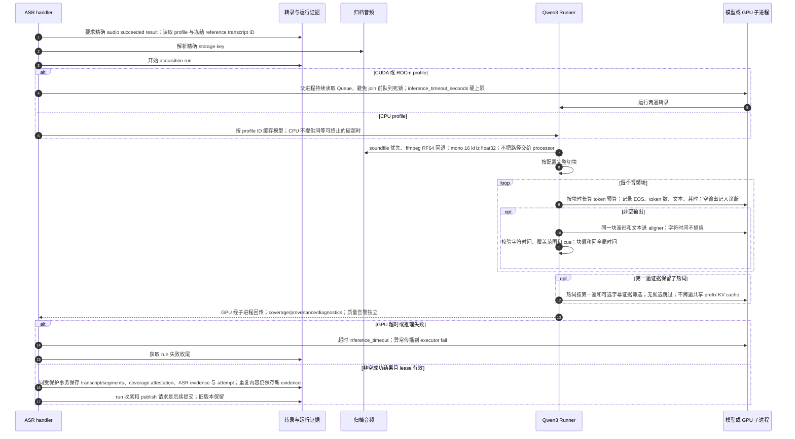

# ASR 配置重建、GPU 超时、分块与逐次证据

源码基线：main `48b31843510e5b1d78ee4f1448cec6dee7ab2296`。

[交互时序图](07-asr-runtime.html) · [Archify 规格](07-asr-runtime.json) · [全部时序图](../architecture-sequences.md)

## 调用顺序与条件分支

## 边界与恢复

- GPU 超时与手动取消是不同机制；取消在调用后的 checkpoint/提交事务阻断写入。
- 失败或取消的全部中间块诊断尚未持久化；质量告警不等于 CER，也不自动禁止归档发布。
- workflow publish 没有把全部 transcript_asr_evidence/coverage/characters 传给 bundle writer；不能把数据库证据误画成必然随包发布。

## 源码证据

- [src/bili_asr/workflow_runtime.py:186–290](../../src/bili_asr/workflow_runtime.py#L186)：`ArchiveWorkflowHandlers.local_asr`。
- [src/bili_asr/storage/transcripts.py:314–499](../../src/bili_asr/storage/transcripts.py#L314)：`TranscriptRepository.record_local_transcript`。
- [src/bili_asr/storage/workflow.py:510–528](../../src/bili_asr/storage/workflow.py#L510)：`WorkflowRepository.dependency_result`。
- [src/bili_asr/artifact_root.py:1–60](../../src/bili_asr/artifact_root.py#L1)：`模块入口`。
- [src/bili_asr/asr/audio.py:1–60](../../src/bili_asr/asr/audio.py#L1)：`模块入口`。
- [src/bili_asr/asr/runner.py:425–588](../../src/bili_asr/asr/runner.py#L425)：`ASRRunner.transcribe`。
- [src/bili_asr/asr/runner.py:707–733](../../src/bili_asr/asr/runner.py#L707)：`two_pass_transcribe`。
- [src/bili_asr/asr/runner.py:57–132](../../src/bili_asr/asr/runner.py#L57)：`transcribe_with_timeout`。
- [src/bili_asr/asr/runner.py:370–387](../../src/bili_asr/asr/runner.py#L370)：`ASRRunner._align_chunk`。
