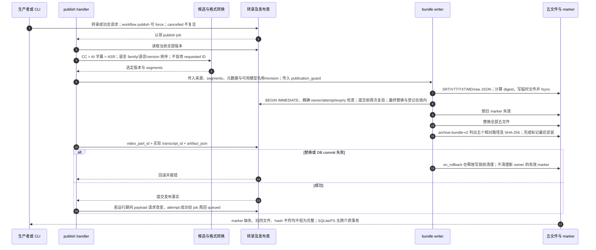

# 择优转录、五文件发布与完成标记

源码基线：`5d7a57e201564a10dec7a360b2ef8f7874dc51a7`（本次架构修复的源码提交）。

[交互时序图](08-transcript-bundle.html) · [Archify 规格](08-transcript-bundle.json) · [全部时序图](../architecture-sequences.md)

## 调用顺序与条件分支

## 边界与恢复

- 转录 bundle 与获人工批准的 publication release 是两个独立发布域。
- archive.write_archive 支持较丰富的 ASR 参数；当前 workflow.publish 只传已观察到的子集，数据库证据用 workflow asr-evidence 查看。
- 受保护写锁解决合作取消/抢占竞态；不能保证掉电后数据库与文件恰好一次一致。

## 源码证据

- [src/bili_asr/storage/workflow.py:536–553](../../src/bili_asr/storage/workflow.py#L536)：`WorkflowRepository.request_publication`。
- [src/bili_asr/workflow_runtime.py:318–418](../../src/bili_asr/workflow_runtime.py#L318)：`ArchiveWorkflowHandlers.publish`。
- [src/bili_asr/services/transcript_projection.py:106–147](../../src/bili_asr/services/transcript_projection.py#L106)：`ordered_candidates`。
- [src/bili_asr/services/transcript_projection.py:150–179](../../src/bili_asr/services/transcript_projection.py#L150)：`writer_segments`。
- [src/bili_asr/storage/workflow.py:675–734](../../src/bili_asr/storage/workflow.py#L675)：`WorkflowRepository._terminal`。
- [src/bili_asr/archive.py:843–882](../../src/bili_asr/archive.py#L843)：`write_archive`。
- [src/bili_asr/archive.py:366–503](../../src/bili_asr/archive.py#L366)：`_publish_bundle`。
- [src/bili_asr/archive.py:225–307](../../src/bili_asr/archive.py#L225)：`archive_bundle_complete`。

## 本次边界修复

生产和消费统一复用 `transcript_selection`。当前 preferred 与实际 published 分别展示，尚未发布的新偏好不会改写归档正文。发布事实的 published_at 是以墙钟秒为底的 part 内单调提交时间；同秒重发旧行也成为最新事实。短突发可能领先墙钟秒。共享 JobCommitGuard 在事务开始及提交前验证精确租约，失败时先使 marker 失效。
