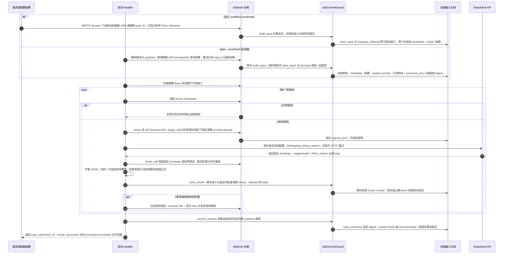

# 冻结 AI 输入、共享提交保护与逐块续跑

源码基线：架构修复提交 `5d7a57e201564a10dec7a360b2ef8f7874dc51a7`。

[交互时序图](09-ai-proofread.html) · [Archify 规格](09-ai-proofread.json) · [全部时序图](../architecture-sequences.md)

## 调用顺序与条件分支

## 边界与恢复

- build_input 在事务外构建冻结内容；显式请求的 store_input、两个任务和依赖边由应用层共事务保存，失败全部回滚。自动链的 store_input 与 job-input 绑定同样共用一次保护事务。
- Workflow 与 EditorialRepository 注入同一 JobCommitGuard；准确 attempt/owner/lease 在短写事务两端校验，不再各自实现租约保护逻辑。
- 来源覆盖证明结构追溯，不能证明模型语义保真；数字、专名、否定、立场仍需人工审核。供应商已收请求而本地未存时，retry 可能重复计费。
- canonical_json 是共享纯序列化契约；editorial.canonical/digest 保留兼容导出，持久 JSON、digest 和既有 schema 未改变。

## 源码证据

- [src/bili_asr/services/workflow_application.py:63–83](../../src/bili_asr/services/workflow_application.py#L63)：`WorkflowApplication.proofread`。
- [src/bili_asr/workflow_payloads.py:70–71](../../src/bili_asr/workflow_payloads.py#L70)：`decode_job_payload`。
- [src/bili_asr/editorial_runtime.py:36–61](../../src/bili_asr/editorial_runtime.py#L36)：`EditorialWorkflowHandlers.proofread`。
- [src/bili_asr/storage/editorial.py:93–116](../../src/bili_asr/storage/editorial.py#L93)：`EditorialRepository.freeze_job_input`。
- [src/bili_asr/storage/editorial.py:118–129](../../src/bili_asr/storage/editorial.py#L118)：`EditorialRepository.begin_call`。
- [src/bili_asr/storage/editorial.py:131–135](../../src/bili_asr/storage/editorial.py#L131)：`EditorialRepository.finish_call`。
- [src/bili_asr/storage/job_commit.py:13–62](../../src/bili_asr/storage/job_commit.py#L13)：`JobCommitGuard`。
- [src/bili_asr/storage/editorial.py:65–78](../../src/bili_asr/storage/editorial.py#L65)：`EditorialRepository.store_input`。
- [src/bili_asr/storage/editorial.py:146–149](../../src/bili_asr/storage/editorial.py#L146)：`EditorialRepository.save_chunk`。
- [src/bili_asr/storage/editorial.py:151–167](../../src/bili_asr/storage/editorial.py#L151)：`EditorialRepository.commit_revision`。
- [src/bili_asr/deepseek.py:38–58](../../src/bili_asr/deepseek.py#L38)：`DeepSeekClient.complete`。
- [src/bili_asr/deepseek.py:61–81](../../src/bili_asr/deepseek.py#L61)：`parse_response`。
- [src/bili_asr/canonical_json.py:1–17](../../src/bili_asr/canonical_json.py#L1)：`模块边界`。
- [src/bili_asr/storage/workflow.py:397–403](../../src/bili_asr/storage/workflow.py#L397)：`WorkflowRepository.enqueue_editorial`。
