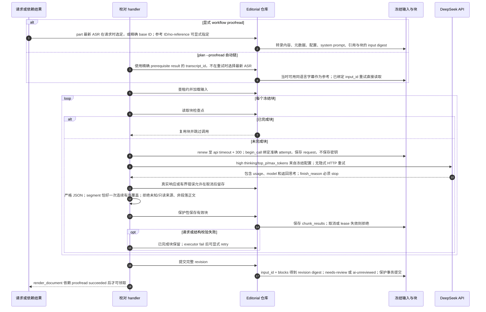

# AI 输入冻结、块恢复、调用审计与完整修订

源码基线：main `9b289570494b5e8f7cc564a7eaa5b2eb2c28c3ad`。

[交互时序图](09-ai-proofread.html) · [Archify 规格](09-ai-proofread.json) · [全部时序图](../architecture-sequences.md)

## 调用顺序与条件分支

## 边界与恢复

- prepare 保存内容寻址输入与绑定 job 是不同事务；取消时可留下未绑定输入，但不能提交新块或新修订。
- 来源覆盖证明结构追溯，不证明模型语义保真；数字、专名、否定、立场仍需人工审核。
- 供应商已收请求而本地未保存时，retry 可能重复计费；不保证外部调用恰好一次。

## 源码证据

- [src/bili_asr/cli/workflow.py:147–353](../../src/bili_asr/cli/workflow.py#L147)：`_execute_workflow`。
- [src/bili_asr/editorial_runtime.py:33–57](../../src/bili_asr/editorial_runtime.py#L33)：`EditorialWorkflowHandlers.proofread`。
- [src/bili_asr/storage/editorial.py:81–103](../../src/bili_asr/storage/editorial.py#L81)：`EditorialRepository.freeze_job_input`。
- [src/bili_asr/storage/editorial.py:138–154](../../src/bili_asr/storage/editorial.py#L138)：`EditorialRepository.commit_revision`。
- [src/bili_asr/storage/editorial.py:53–66](../../src/bili_asr/storage/editorial.py#L53)：`EditorialRepository.prepare`。
- [src/bili_asr/storage/editorial.py:133–136](../../src/bili_asr/storage/editorial.py#L133)：`EditorialRepository.save_chunk`。
- [src/bili_asr/deepseek.py:38–58](../../src/bili_asr/deepseek.py#L38)：`DeepSeekClient.complete`。
- [src/bili_asr/deepseek.py:61–81](../../src/bili_asr/deepseek.py#L61)：`parse_response`。
