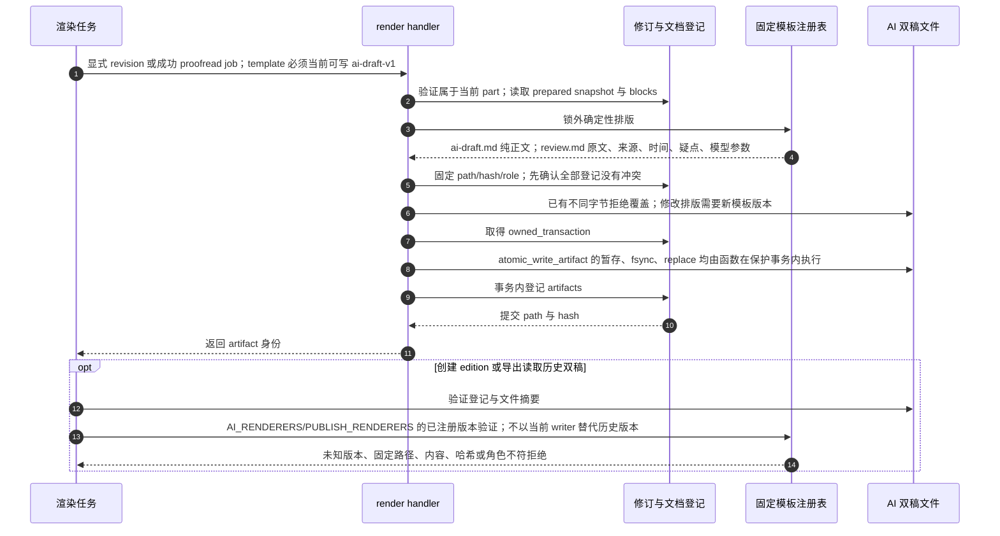

# 确定性 AI 双稿渲染与历史模板验证

源码基线：main `48b31843510e5b1d78ee4f1448cec6dee7ab2296`。

[交互时序图](10-document-render.html) · [Archify 规格](10-document-render.json) · [全部时序图](../architecture-sequences.md)

## 调用顺序与条件分支

## 边界与恢复

- 重新渲染不访问 DeepSeek；相同 revision 与模板的字节保持一致。
- 双稿不是文件系统事务；预检和租约写锁防止合作竞态，第二次文件写入失败仍可能留下第一份文件。
- 当前仅注册 v1 renderer；历史版本按 registry 验证的机制不等于已经存在 v2 writer。

## 源码证据

- [src/bili_asr/storage/workflow.py:562–577](../../src/bili_asr/storage/workflow.py#L562)：`WorkflowRepository.request_document`。
- [src/bili_asr/editorial_runtime.py:59–89](../../src/bili_asr/editorial_runtime.py#L59)：`EditorialWorkflowHandlers.render`。
- [src/bili_asr/storage/editorial.py:188–208](../../src/bili_asr/storage/editorial.py#L188)：`EditorialRepository.preflight_artifacts`。
- [src/bili_asr/storage/editorial.py:210–218](../../src/bili_asr/storage/editorial.py#L210)：`EditorialRepository.record_artifacts`。
- [src/bili_asr/manuscript_templates.py:82–86](../../src/bili_asr/manuscript_templates.py#L82)：`renderer_for`。
- [src/bili_asr/manuscript_templates.py:23–51](../../src/bili_asr/manuscript_templates.py#L23)：`render_ai_v1`。
- [src/bili_asr/manuscript_files.py:78–105](../../src/bili_asr/manuscript_files.py#L78)：`atomic_write_artifact`。
- [src/bili_asr/publication.py:142–165](../../src/bili_asr/publication.py#L142)：`get_ai_artifacts`。
