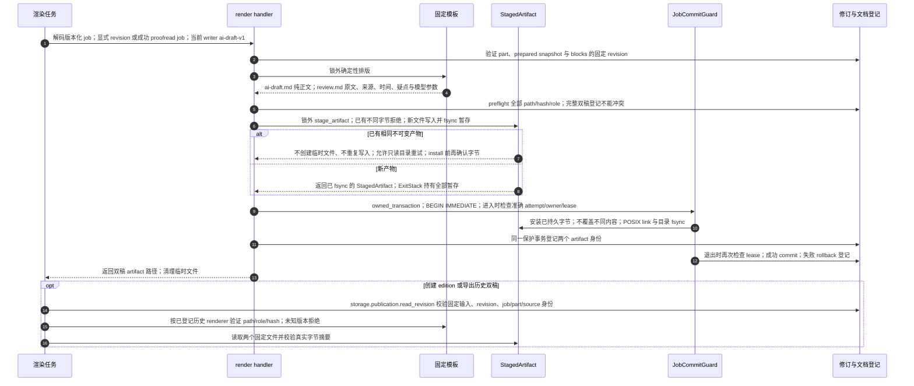

# 确定性 AI 双稿、锁外暂存与保护登记

源码基线：架构修复提交 `5d7a57e201564a10dec7a360b2ef8f7874dc51a7`。

[交互时序图](10-document-render.html) · [Archify 规格](10-document-render.json) · [全部时序图](../architecture-sequences.md)

## 调用顺序与条件分支

## 边界与恢复

- 重新渲染不调用 DeepSeek。新文件的写入与文件 fsync 在 SQLite 事务外；短保护事务只负责最终安装、登记和精确租约检查。
- SQLite 不能回滚文件系统。第二个安装失败或 commit 失败可能留下第一份不可变文件；登记会整体 rollback，重试先验证相同字节再登记完整双稿。
- 相同既有产物不再写入 staging 或 fsync；只读产物目录可安全重试。已有不同内容永远拒绝覆盖。修改字节算法需新模板版本。
- storage.publication 读取 revision/edition 并调用 publication_content/publication_identity 纯契约；快照和标签同步共用公开读 API，应用保留旧函数名兼容。

## 源码证据

- [src/bili_asr/storage/workflow.py:412–427](../../src/bili_asr/storage/workflow.py#L412)：`WorkflowRepository.request_document`。
- [src/bili_asr/editorial_runtime.py:63–97](../../src/bili_asr/editorial_runtime.py#L63)：`EditorialWorkflowHandlers.render`。
- [src/bili_asr/manuscript_templates.py:82–86](../../src/bili_asr/manuscript_templates.py#L82)：`renderer_for`。
- [src/bili_asr/manuscript_templates.py:23–51](../../src/bili_asr/manuscript_templates.py#L23)：`render_ai_v1`。
- [src/bili_asr/manuscript_files.py:110–126](../../src/bili_asr/manuscript_files.py#L110)：`stage_artifact`。
- [src/bili_asr/manuscript_files.py:88–106](../../src/bili_asr/manuscript_files.py#L88)：`StagedArtifact.install`。
- [src/bili_asr/publication.py:44–67](../../src/bili_asr/publication.py#L44)：`get_ai_artifacts`。
- [src/bili_asr/storage/job_commit.py:58–62](../../src/bili_asr/storage/job_commit.py#L58)：`JobCommitGuard.owned_transaction`。
- [src/bili_asr/storage/editorial.py:201–221](../../src/bili_asr/storage/editorial.py#L201)：`EditorialRepository.preflight_artifacts`。
- [src/bili_asr/storage/editorial.py:223–231](../../src/bili_asr/storage/editorial.py#L223)：`EditorialRepository.record_artifacts`。
- [src/bili_asr/storage/publication.py:239–282](../../src/bili_asr/storage/publication.py#L239)：`read_revision`。
