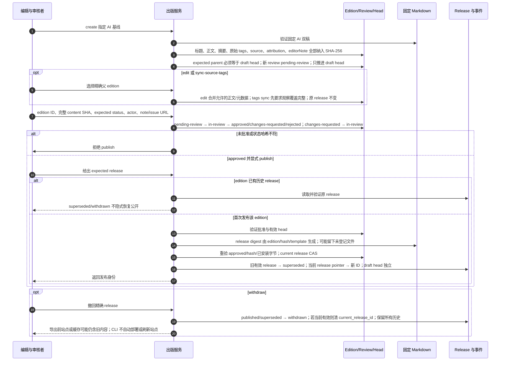

# 完整 edition、准确审核、release 替换与撤回

源码基线：main `9b289570494b5e8f7cc564a7eaa5b2eb2c28c3ad`。

[交互时序图](11-publication-lifecycle.html) · [Archify 规格](11-publication-lifecycle.json) · [全部时序图](../architecture-sequences.md)

## 调用顺序与条件分支

## 边界与恢复

- approved/rejected 是该 review 的终态；修改内容创建新 edition 和新的 pending-review。
- publication_edition_reviews 保存当前审核状态，publication_events 追加审核变化证据；不能称每次审核都是新 review 行。
- A 发布后创建/审核/批准 B 都保持 A；B 明确 publish 后才替换；预览出口也不会恢复旧 release。

## 源码证据

- [src/bili_asr/cli/publication.py:150–198](../../src/bili_asr/cli/publication.py#L150)：`add_publication_parser`。
- [src/bili_asr/publication.py:202–216](../../src/bili_asr/publication.py#L202)：`create_edition`。
- [src/bili_asr/publication.py:307–347](../../src/bili_asr/publication.py#L307)：`publish_edition`。
- [src/bili_asr/publication_tags.py:24–41](../../src/bili_asr/publication_tags.py#L24)：`sync_source_tags`。
- [src/bili_asr/storage/publication.py:123–155](../../src/bili_asr/storage/publication.py#L123)：`PublicationRepository.insert_edition`。
- [src/bili_asr/storage/publication.py:157–180](../../src/bili_asr/storage/publication.py#L157)：`PublicationRepository.set_review`。
- [src/bili_asr/publication.py:142–165](../../src/bili_asr/publication.py#L142)：`get_ai_artifacts`。
- [src/bili_asr/manuscript_files.py:78–105](../../src/bili_asr/manuscript_files.py#L78)：`atomic_write_artifact`。
- [src/bili_asr/storage/publication.py:182–209](../../src/bili_asr/storage/publication.py#L182)：`PublicationRepository.register_release`。
- [src/bili_asr/storage/publication.py:211–230](../../src/bili_asr/storage/publication.py#L211)：`PublicationRepository.withdraw`。
