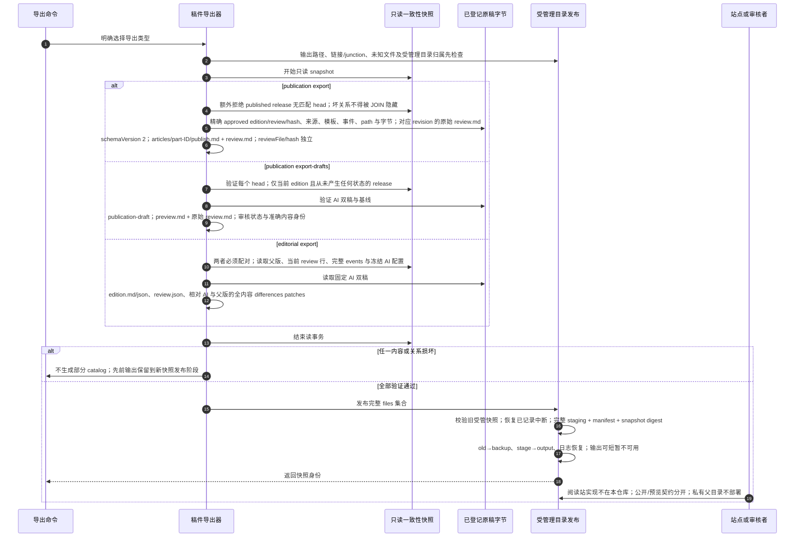

# 公开、未发布预览与私有审阅三种导出

源码基线：main `48b31843510e5b1d78ee4f1448cec6dee7ab2296`。

[交互时序图](12-reader-private-export.html) · [Archify 规格](12-reader-private-export.json) · [全部时序图](../architecture-sequences.md)

## 调用顺序与条件分支

## 边界与恢复

- 读者 review.md 是 AI 初稿的原文与疑点参照，不是人工审核记录；编辑后的正文可能与它不同。
- 公开/预览均不包含 actor、审核 events、请求配置与私有差异；私有包始终另行显式导出。
- withdraw 修改 DB head；已导出或已部署副本需要再次导出和刷新，本仓库不自动发布远端站点。

## 源码证据

- [src/bili_asr/cli/publication.py:74–135](../../src/bili_asr/cli/publication.py#L74)：`_cmd_publication`。
- [src/bili_asr/cli/editorial.py:14–27](../../src/bili_asr/cli/editorial.py#L14)：`_cmd_editorial`。
- [src/bili_asr/publication_export.py:61–105](../../src/bili_asr/publication_export.py#L61)：`export_publications`。
- [src/bili_asr/publication_export.py:108–181](../../src/bili_asr/publication_export.py#L108)：`export_publication_drafts`。
- [src/bili_asr/publication_export.py:193–271](../../src/bili_asr/publication_export.py#L193)：`export_editorial`。
- [src/bili_asr/publication_export.py:19–27](../../src/bili_asr/publication_export.py#L19)：`_read_snapshot`。
- [src/bili_asr/publication.py:298–304](../../src/bili_asr/publication.py#L298)：`verify_release`。
- [src/bili_asr/publication.py:142–165](../../src/bili_asr/publication.py#L142)：`get_ai_artifacts`。
- [src/bili_asr/export_snapshot.py:367–444](../../src/bili_asr/export_snapshot.py#L367)：`replace_snapshot`。
- [src/bili_asr/publication_export.py:1–60](../../src/bili_asr/publication_export.py#L1)：`模块入口`。
