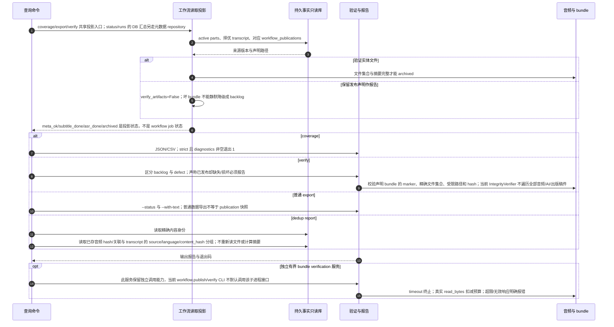

# 读取投影、覆盖、完整性、普通导出与去重

源码基线：main `9b289570494b5e8f7cc564a7eaa5b2eb2c28c3ad`。

[交互时序图](13-projection-verify.html) · [Archify 规格](13-projection-verify.json) · [全部时序图](../architecture-sequences.md)

## 调用顺序与条件分支

## 边界与恢复

- 缺失任务或尚未发布通常是 backlog；声明已发布但字节不符是 defect；不能由 absent marker 推断所有场景的同一退出码。
- writer 的语言 family 总排序与 operational projection 的中文优先启发式不同，文档不把两种实现写成完全相同。
- 有界验证与 publication supervisor 代码仍保留，但没有据此虚构当前 CLI 的隐式守护链。
- dedup report 仅报告数据库中已有的重复内容身份，不选择 canonical、不合并或改写来源，也不确认磁盘文件此刻的内容。

## 源码证据

- [src/bili_asr/cli/ops.py:135–163](../../src/bili_asr/cli/ops.py#L135)：`_cmd_verify`。
- [src/bili_asr/cli/status_cmd.py:59–73](../../src/bili_asr/cli/status_cmd.py#L59)：`_cmd_coverage`。
- [src/bili_asr/cli/dedup.py:26–43](../../src/bili_asr/cli/dedup.py#L26)：`_cmd_dedup`。
- [src/bili_asr/services/workflow_projection.py:55–158](../../src/bili_asr/services/workflow_projection.py#L55)：`workflow_records`。
- [src/bili_asr/integrity.py:52–83](../../src/bili_asr/integrity.py#L52)：`IntegrityVerifier`。
- [src/bili_asr/coverage_report.py:1–60](../../src/bili_asr/coverage_report.py#L1)：`模块入口`。
- [src/bili_asr/services/bundle_verification.py:72–160](../../src/bili_asr/services/bundle_verification.py#L72)：`verify_bundle`。
- [src/bili_asr/archive.py:254–336](../../src/bili_asr/archive.py#L254)：`archive_bundle_complete`。
- [src/bili_asr/dedup.py:1–60](../../src/bili_asr/dedup.py#L1)：`模块入口`。
