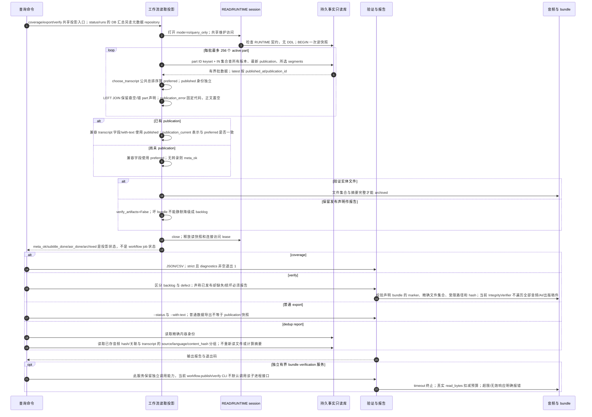

# 读取投影、覆盖、完整性、普通导出与去重

源码基线：本次架构边界修复的固定代码提交 `5d7a57e201564a10dec7a360b2ef8f7874dc51a7`；这是从 main 开始的本地修复身份，不表示远端 main 已包含修复。

[交互时序图](13-projection-verify.html) · [Archify 规格](13-projection-verify.json) · [全部时序图](../architecture-sequences.md)

## 调用顺序与条件分支

## 边界与恢复

- 缺失任务或尚未发布通常是 backlog；声明已发布但字节不符是 defect；不能由 absent marker 推断所有场景的同一退出码。
- writer 与 projection 复用 transcript_selection：CC > AI > ASR、family zh/en/其余、语言代码升序、同来源语言 version 降序。中文变体代码先于版本比较。
- preferred_* 与 published_* 分离；新版本尚未发布时，旧完好 publication 继续 archived/complete，导出保留已发布文本。
- artifact_json 必须有完整路径； malformed JSON/缺键不回退默认路径。最新 publication 的坏 bundle 不能由同 slot 的历史声明掩盖。
- producer 在保护事务中以 max(墙钟秒, part 已有 published_at 最大值 + 1) 写入单调提交时间，保证同秒重发布旧身份的 upsert 排在最新；突发值可短暂领先墙钟，排序语义不等于精确墙钟时间。
- LEFT JOIN 保留损坏的 publication 关系；published_transcript_missing/part_mismatch 是 bounded publication_error，with-text 保持空，不能取 preferred 或另一 part 的正文。coverage/IntegrityVerifier 按数据库关系 defect 报告，字节完整也不计 complete。
- 每批最多 256 part 的集合查询消除逐 part 的 N+1；返回 dict 恢复 pubdate 降序、BVID/page 顺序。with-text 也批量读取有效身份的 segments。
- 有界验证与 publication supervisor 代码仍保留，但没有据此虚构当前 CLI 的隐式守护链。
- dedup report 仅报告数据库中已有的重复内容身份，不选择 canonical、不合并或改写来源，也不确认磁盘文件此刻的内容。

## 源码证据

- [src/bili_asr/cli/ops.py:135–163](../../src/bili_asr/cli/ops.py#L135)：`_cmd_verify`。
- [src/bili_asr/export.py:396–451](../../src/bili_asr/export.py#L396)：`export_records`。
- [src/bili_asr/cli/dedup.py:19–36](../../src/bili_asr/cli/dedup.py#L19)：`_cmd_dedup`。
- [src/bili_asr/services/workflow_projection.py:117–224](../../src/bili_asr/services/workflow_projection.py#L117)：`workflow_records`。
- [src/bili_asr/transcript_selection.py:40–43](../../src/bili_asr/transcript_selection.py#L40)：`choose_transcript`。
- [src/bili_asr/archive_session.py:64–149](../../src/bili_asr/archive_session.py#L64)：`ArchiveSession`。
- [src/bili_asr/services/workflow_projection.py:27–44](../../src/bili_asr/services/workflow_projection.py#L27)：`_part_batches`。
- [src/bili_asr/services/workflow_projection.py:47–60](../../src/bili_asr/services/workflow_projection.py#L47)：`_preferred_transcripts`。
- [src/bili_asr/services/workflow_projection.py:63–87](../../src/bili_asr/services/workflow_projection.py#L63)：`_latest_publications`。
- [src/bili_asr/coverage_report.py:65–87](../../src/bili_asr/coverage_report.py#L65)：`CoverageReport`。
- [src/bili_asr/integrity.py:52–86](../../src/bili_asr/integrity.py#L52)：`IntegrityVerifier`。
- [src/bili_asr/services/bundle_verification.py:62–150](../../src/bili_asr/services/bundle_verification.py#L62)：`verify_bundle`。
- [src/bili_asr/archive.py:225–307](../../src/bili_asr/archive.py#L225)：`archive_bundle_complete`。
- [src/bili_asr/dedup.py:1–60](../../src/bili_asr/dedup.py#L1)：`模块入口`。
- [src/bili_asr/transcript_selection.py:24–37](../../src/bili_asr/transcript_selection.py#L24)：`transcript_preference_key`。
