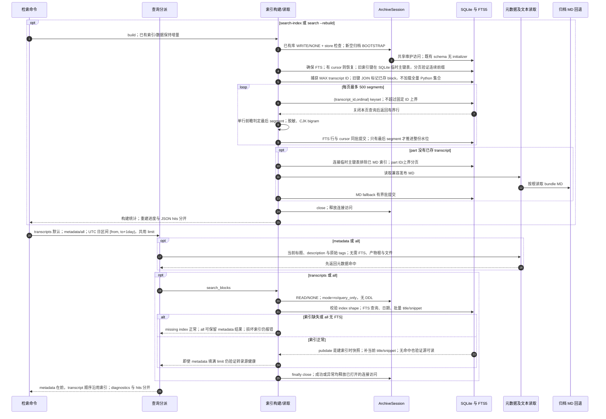

# FTS 增量索引、元数据检索与组合结果

源码基线：本次架构边界修复的固定代码提交 `5d7a57e201564a10dec7a360b2ef8f7874dc51a7`；这是从 main 开始的本地修复身份，不表示远端 main 已包含修复。

[交互时序图](14-search-index.html) · [Archify 规格](14-search-index.json) · [全部时序图](../architecture-sequences.md)

## 调用顺序与条件分支

## 边界与恢复

- FTS 是 archive.db 内的派生表，不是单独搜索服务；只有显式构建或 --rebuild 写索引。
- 每批 FTS 与精确进度一起提交，崩溃可从最后已提交 segment 恢复。
- segment keyset 每页最多 500 行，整份 transcript 水位在最后一段提交后前进；构建开始后的新 transcript 留下一轮。失败不跳过未提交页，也不重复已提交 block。
- 旧无 cursor 索引的全部 block_key 保存在 SQLite 临时主键表，连续前缀按有界 keyset 核对；后续页 JOIN 标记已存 block，保留前缀后已完成转录，不加载 O(index) Python 集合。只读 legacy stamp 使用一次 materialized CTE 后流式核对，保持无 DDL。
- MD 回退独立分页，不重新探测已经 MD 索引的 part。
- READ/NONE 查询不会 schema 初始化/FTS DDL；WRITE/NONE 保留旧库形状，显式构建仅加索引表，新空 archive 才 BOOTSTRAP。连接持有维护 lease 到 close。
- metadata 使用当前 source tags；edition tags 为创建/显式同步时快照，二者不同。

## 源码证据

- [src/bili_asr/cli/search.py:80–132](../../src/bili_asr/cli/search.py#L80)：`_cmd_search`。
- [src/bili_asr/cli/search.py:48–78](../../src/bili_asr/cli/search.py#L48)：`_cmd_search_index`。
- [src/bili_asr/search_index/store.py:426–542](../../src/bili_asr/search_index/store.py#L426)：`TranscriptSearchIndex.build`。
- [src/bili_asr/search_index/store.py:320–362](../../src/bili_asr/search_index/store.py#L320)：`TranscriptSearchIndex._new_store_rows`。
- [src/bili_asr/search_index/store.py:546–640](../../src/bili_asr/search_index/store.py#L546)：`TranscriptSearchIndex.search_blocks`。
- [src/bili_asr/archive_session.py:64–149](../../src/bili_asr/archive_session.py#L64)：`ArchiveSession`。
- [src/bili_asr/search_index/store.py:283–311](../../src/bili_asr/search_index/store.py#L283)：`TranscriptSearchIndex._store_progress`。
- [src/bili_asr/search_index/store.py:364–410](../../src/bili_asr/search_index/store.py#L364)：`TranscriptSearchIndex._published_md_candidates`。
- [src/bili_asr/search_index/metadata.py:1–60](../../src/bili_asr/search_index/metadata.py#L1)：`模块入口`。
- [src/bili_asr/search_index/store.py:412–424](../../src/bili_asr/search_index/store.py#L412)：`TranscriptSearchIndex._published_md_text_for`。
- [src/bili_asr/search_index/query.py:21–63](../../src/bili_asr/search_index/query.py#L21)：`search_archive`。
