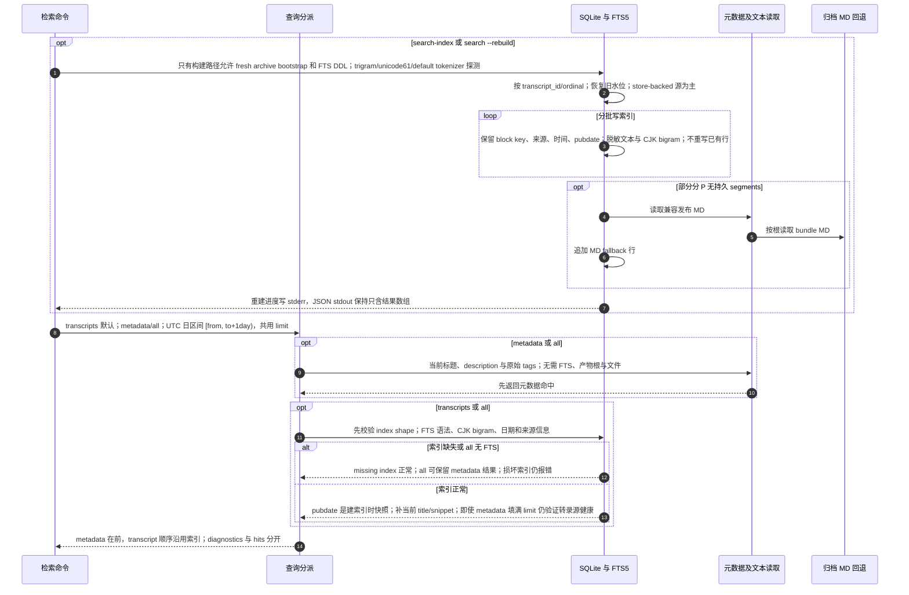

# FTS 增量索引、元数据检索与组合结果

源码基线：main `9b289570494b5e8f7cc564a7eaa5b2eb2c28c3ad`。

[交互时序图](14-search-index.html) · [Archify 规格](14-search-index.json) · [全部时序图](../architecture-sequences.md)

## 调用顺序与条件分支

## 边界与恢复

- FTS 是 archive.db 内的派生表，不是单独搜索服务；只有显式构建或 --rebuild 写索引。
- 每批 FTS 与精确进度一起提交，崩溃可从最后已提交 segment 恢复。
- metadata 使用当前 source tags；edition tags 为创建/显式同步时快照，二者不同。

## 源码证据

- [src/bili_asr/cli/search.py:80–132](../../src/bili_asr/cli/search.py#L80)：`_cmd_search`。
- [src/bili_asr/cli/search.py:48–78](../../src/bili_asr/cli/search.py#L48)：`_cmd_search_index`。
- [src/bili_asr/search_index/query.py:21–63](../../src/bili_asr/search_index/query.py#L21)：`search_archive`。
- [src/bili_asr/search_index/store.py:343–471](../../src/bili_asr/search_index/store.py#L343)：`TranscriptSearchIndex.build`。
- [src/bili_asr/search_index/store.py:475–569](../../src/bili_asr/search_index/store.py#L475)：`TranscriptSearchIndex.search_blocks`。
- [src/bili_asr/search_index/metadata.py:1–60](../../src/bili_asr/search_index/metadata.py#L1)：`模块入口`。
- [src/bili_asr/search_index/readers.py:1–60](../../src/bili_asr/search_index/readers.py#L1)：`模块入口`。
- [src/bili_asr/search_index/store.py:329–341](../../src/bili_asr/search_index/store.py#L329)：`TranscriptSearchIndex._published_md_text_for`。
