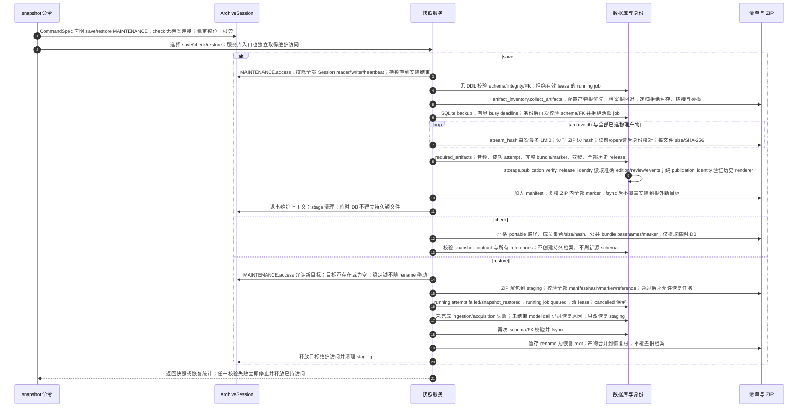

# 统一维护访问、公开清单与归档 ZIP 恢复

源码基线：架构修复提交 `5d7a57e201564a10dec7a360b2ef8f7874dc51a7`。

[交互时序图](15-archive-snapshot.html) · [Archify 规格](15-archive-snapshot.json) · [全部时序图](../architecture-sequences.md)

## 调用顺序与条件分支

## 边界与恢复

- MAINTENANCE 由统一 ArchiveSession 取得独占访问；普通查询、写入和心跳连接均持有共享访问直至 close。外部直接 SQLite writer 仍必须由操作者停止。
- artifact_inventory 统一路径、冲突、临时文件和有界流式 hash；artifacts 公开 BUNDLE_BASENAMES/BUNDLE_MARKER_NAME/owns_bundle_paths，维护服务不导入 archive 私有实现。
- 快照 storage 通过 storage.publication 的公开 identity reader 校验历史 release；纯 publication_identity 验证准确审核、事件、path/hash 和固定 renderer，无反向 application 依赖。
- check 不打开持久 archive Session。stage DB 使用共享 connect_database 配置且不创建邻接维护锁；恢复只改 staging，成功后才发布目标根。

## 源码证据

- [src/bili_asr/cli/snapshot.py:29–47](../../src/bili_asr/cli/snapshot.py#L29)：`_cmd_snapshot`。
- [src/bili_asr/cli/registry.py:1–65](../../src/bili_asr/cli/registry.py#L1)：`模块边界`。
- [src/bili_asr/archive_session.py:95–104](../../src/bili_asr/archive_session.py#L95)：`ArchiveSession.access`。
- [src/bili_asr/archive_maintenance.py:84–160](../../src/bili_asr/archive_maintenance.py#L84)：`archive_access`。
- [src/bili_asr/services/archive_snapshot.py:157–221](../../src/bili_asr/services/archive_snapshot.py#L157)：`save_snapshot`。
- [src/bili_asr/services/archive_snapshot.py:317–323](../../src/bili_asr/services/archive_snapshot.py#L317)：`check_snapshot`。
- [src/bili_asr/services/archive_snapshot.py:335–360](../../src/bili_asr/services/archive_snapshot.py#L335)：`restore_snapshot`。
- [src/bili_asr/storage/snapshots.py:182–206](../../src/bili_asr/storage/snapshots.py#L182)：`create_database_snapshot`。
- [src/bili_asr/storage/snapshots.py:235–294](../../src/bili_asr/storage/snapshots.py#L235)：`required_artifacts`。
- [src/bili_asr/storage/snapshots.py:297–343](../../src/bili_asr/storage/snapshots.py#L297)：`recover_interrupted_jobs`。
- [src/bili_asr/artifact_inventory.py:89–119](../../src/bili_asr/artifact_inventory.py#L89)：`collect_artifacts`。
- [src/bili_asr/artifact_inventory.py:122–130](../../src/bili_asr/artifact_inventory.py#L122)：`stream_hash`。
- [src/bili_asr/services/archive_snapshot.py:291–314](../../src/bili_asr/services/archive_snapshot.py#L291)：`_validate_into`。
- [src/bili_asr/storage/publication.py:303–311](../../src/bili_asr/storage/publication.py#L303)：`verify_release_identity`。
- [src/bili_asr/publication_identity.py:12–41](../../src/bili_asr/publication_identity.py#L12)：`validate_release_identity`。
- [src/bili_asr/artifacts.py:1–33](../../src/bili_asr/artifacts.py#L1)：`模块边界`。
