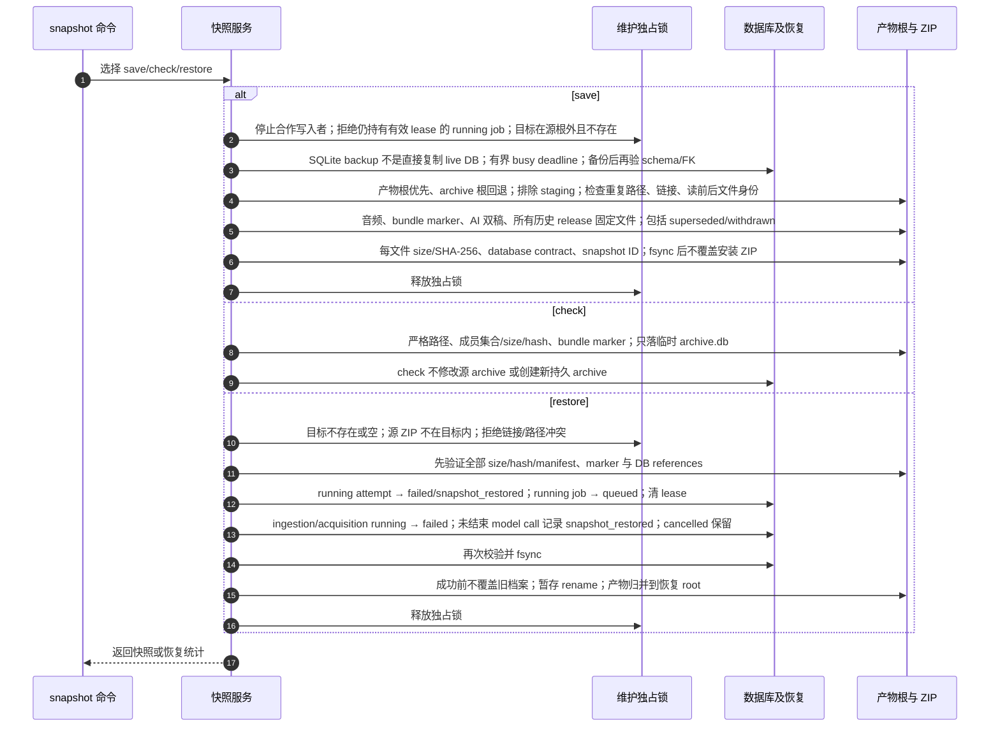

# 归档 ZIP 保存、离线校验与跨设备恢复

源码基线：main `48b31843510e5b1d78ee4f1448cec6dee7ab2296`。

[交互时序图](15-archive-snapshot.html) · [Archify 规格](15-archive-snapshot.json) · [全部时序图](../architecture-sequences.md)

## 调用顺序与条件分支

## 边界与恢复

- 私有归档快照保存完整数据库与历史产物；与公开阅读目录快照用途和数据集合不同。
- 过期 running job 可随 save 保留，restore 再恢复；有效运行租约会被 save 拒绝。
- 维护协议只约束合作 writer；直接绕开 CLI/repository 的外部写入仍需操作者停止。

## 源码证据

- [src/bili_asr/cli/snapshot.py:28–46](../../src/bili_asr/cli/snapshot.py#L28)：`_cmd_snapshot`。
- [src/bili_asr/services/archive_snapshot.py:260–324](../../src/bili_asr/services/archive_snapshot.py#L260)：`save_snapshot`。
- [src/bili_asr/services/archive_snapshot.py:420–426](../../src/bili_asr/services/archive_snapshot.py#L420)：`check_snapshot`。
- [src/bili_asr/services/archive_snapshot.py:438–463](../../src/bili_asr/services/archive_snapshot.py#L438)：`restore_snapshot`。
- [src/bili_asr/archive_maintenance.py:64–137](../../src/bili_asr/archive_maintenance.py#L64)：`archive_access`。
- [src/bili_asr/storage/snapshots.py:185–209](../../src/bili_asr/storage/snapshots.py#L185)：`create_database_snapshot`。
- [src/bili_asr/storage/snapshots.py:305–351](../../src/bili_asr/storage/snapshots.py#L305)：`recover_interrupted_jobs`。
- [src/bili_asr/services/archive_snapshot.py:394–417](../../src/bili_asr/services/archive_snapshot.py#L394)：`_validate_into`。
- [src/bili_asr/storage/snapshots.py:242–302](../../src/bili_asr/storage/snapshots.py#L242)：`required_artifacts`。
