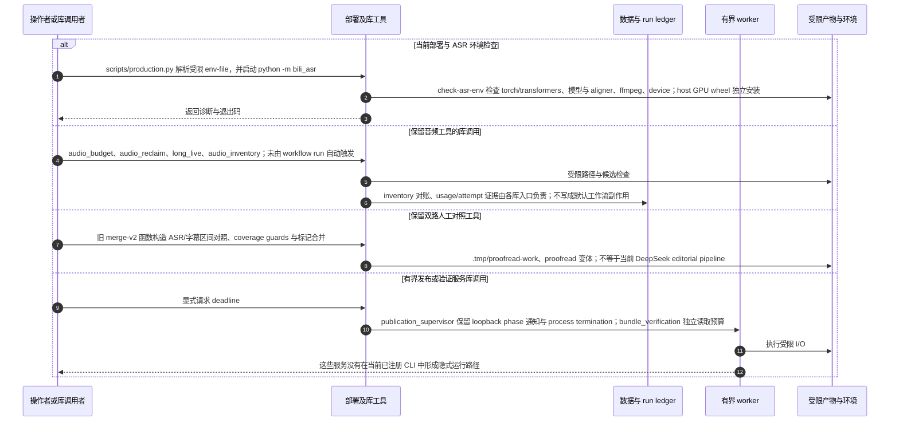

# 部署启动与保留库工具的显式调用边界

源码基线：main `9b289570494b5e8f7cc564a7eaa5b2eb2c28c3ad`。

[交互时序图](16-library-and-operations.html) · [Archify 规格](16-library-and-operations.json) · [全部时序图](../architecture-sequences.md)

## 调用顺序与条件分支

## 边界与恢复

- 这张图说明代码仍存在的显式能力，不将其当成当前 CLI 的命令清单。
- workflow index、publication supervisor、旧 proofread 命令名、audio retention CLI 不能从历史说明反推为当前默认行为。
- 验证/评测脚本、tests 和 references 为工程支持；完整路径分类见 architecture-sources.md。

## 源码证据

- [src/bili_asr/cli/parser.py:11–113](../../src/bili_asr/cli/parser.py#L11)：`build_parser`。
- [src/bili_asr/check_asr_env.py:1–60](../../src/bili_asr/check_asr_env.py#L1)：`模块入口`。
- [src/bili_asr/proofread.py:1–60](../../src/bili_asr/proofread.py#L1)：`模块入口`。
- [src/bili_asr/audio_budget.py:1–60](../../src/bili_asr/audio_budget.py#L1)：`模块入口`。
- [src/bili_asr/persistence.py:1–60](../../src/bili_asr/persistence.py#L1)：`模块入口`。
- [src/bili_asr/services/audio_inventory.py:173–341](../../src/bili_asr/services/audio_inventory.py#L173)：`reconcile_audio_inventory`。
- [src/bili_asr/services/publication_supervisor.py:72–144](../../src/bili_asr/services/publication_supervisor.py#L72)：`supervise_publication`。
- [src/bili_asr/concurrency_gate.py:1–60](../../src/bili_asr/concurrency_gate.py#L1)：`模块入口`。
- [src/bili_asr/audio_reclaim.py:1–60](../../src/bili_asr/audio_reclaim.py#L1)：`模块入口`。
- [src/bili_asr/path_policy.py:1–60](../../src/bili_asr/path_policy.py#L1)：`模块入口`。
