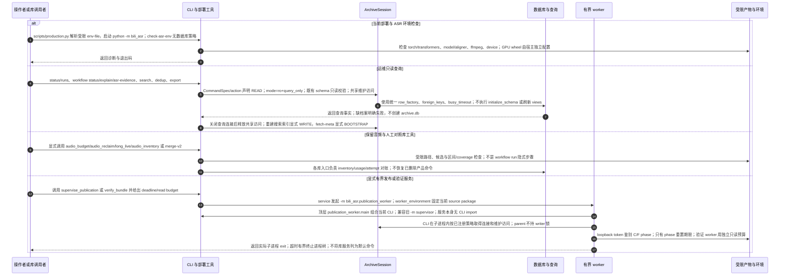

# 运维查询、显式库工具与独立 worker 组合入口

源码基线：架构修复提交 `5d7a57e201564a10dec7a360b2ef8f7874dc51a7`。

[交互时序图](16-library-and-operations.html) · [Archify 规格](16-library-and-operations.json) · [全部时序图](../architecture-sequences.md)

## 调用顺序与条件分支

## 边界与恢复

- CommandSpec 显式区分数据库访问与产物访问；search --rebuild 升级为 WRITE，snapshot check/check-asr-env 无档案连接，migration 使用显式 source_root。
- 查询不再调用 bootstrap；RO/RW runtime 只检查已存 schema。初始化与派生 view 刷新仅属于显式 BOOTSTRAP，历史 incompatible schema 拒绝且不原地迁移。
- publication_supervisor 不反向 import cli.main，顶层 publication_worker 承担真实进程组合；保留历史 -m 入口但不恢复 publish-transcripts 等已删除命令。
- C/F 阶段通知是保留的监督协议；当前注册命令没有 publication_phase 调用点，通常按一次 invocation 的初始 deadline 计时。验证 worker 的读取字节预算独立计算。
- Kernel-blocked 子进程可能在强制停止后继续存活直到 I/O 恢复；锁归子进程持有，parent 不代释放。phase 状态与预算由各一次性进程维护。
- 旧 proofread/merge、音频保留与预算服务仍是显式库能力，当前注册 CLI 与默认 workflow 路径以 parser/application 代码为准。

## 源码证据

- [src/bili_asr/cli/parser.py:11–115](../../src/bili_asr/cli/parser.py#L11)：`build_parser`。
- [src/bili_asr/cli/main.py:41–102](../../src/bili_asr/cli/main.py#L41)：`_main`。
- [scripts/production.py:1–55](../../scripts/production.py#L1)：`模块边界`。
- [src/bili_asr/cli/registry.py:1–65](../../src/bili_asr/cli/registry.py#L1)：`模块边界`。
- [src/bili_asr/archive_session.py:106–132](../../src/bili_asr/archive_session.py#L106)：`ArchiveSession.open`。
- [src/bili_asr/cli/_shared.py:40–52](../../src/bili_asr/cli/_shared.py#L40)：`_open_read_repository`。
- [src/bili_asr/services/audio_inventory.py:173–341](../../src/bili_asr/services/audio_inventory.py#L173)：`reconcile_audio_inventory`。
- [src/bili_asr/storage/database.py:87–111](../../src/bili_asr/storage/database.py#L87)：`connect_database`。
- [src/bili_asr/services/publication_supervisor.py:86–158](../../src/bili_asr/services/publication_supervisor.py#L86)：`supervise_publication`。
- [src/bili_asr/publication_worker.py:13–26](../../src/bili_asr/publication_worker.py#L13)：`main`。
- [src/bili_asr/services/bundle_verification.py:62–150](../../src/bili_asr/services/bundle_verification.py#L62)：`verify_bundle`。
- [src/bili_asr/check_asr_env.py:1–65](../../src/bili_asr/check_asr_env.py#L1)：`模块边界`。
- [src/bili_asr/path_policy.py:1–65](../../src/bili_asr/path_policy.py#L1)：`模块边界`。
- [src/bili_asr/audio_reclaim.py:1–65](../../src/bili_asr/audio_reclaim.py#L1)：`模块边界`。
- [src/bili_asr/process_environment.py:1–14](../../src/bili_asr/process_environment.py#L1)：`模块边界`。
- [src/bili_asr/proofread.py:1–65](../../src/bili_asr/proofread.py#L1)：`模块边界`。
- [src/bili_asr/audio_budget.py:1–65](../../src/bili_asr/audio_budget.py#L1)：`模块边界`。
