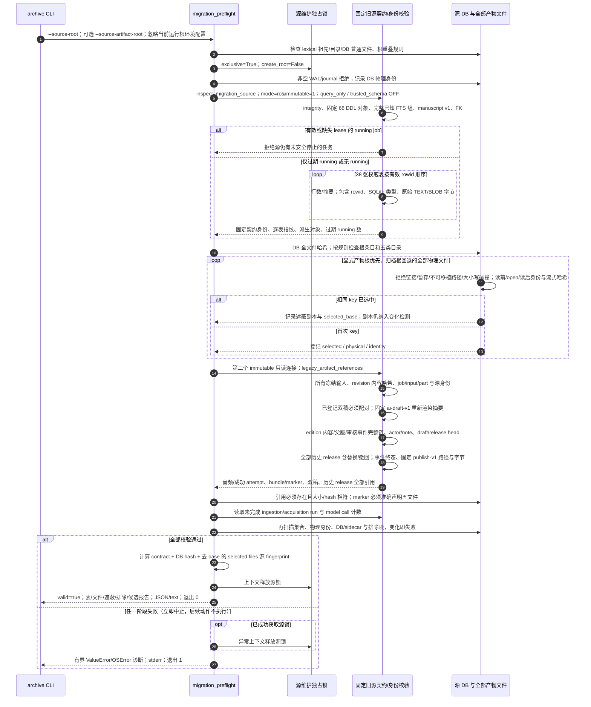

# 固定旧源迁移预检与完整历史校验

源码基线：main `48b31843510e5b1d78ee4f1448cec6dee7ab2296`。

[交互时序图](17-migration-preflight.html) · [Archify 规格](17-migration-preflight.json) · [全部时序图](../architecture-sequences.md) · [操作指南](../archive-migration-preflight.md)

## 调用顺序与条件分支

## 边界与恢复

- 操作者必须停止全部 writer 并完成 checkpoint；非空 WAL/journal、有效或缺失租约的 running job 拒绝。
- 旧源契约固定于 9b28957；运行架构证据固定于当前 main。immutable / query_only 不调用当前 initializer。
- 服务持有源独占维护锁；只报告恢复候选，不恢复、不转换、不创建目标。锁协调文件位于根旁。
- DDL / integrity / FK / manuscript v1；38 表逐行包含 rowid、SQLite 类型与原始 TEXT/BLOB 字节，已知完整 FTS 组归类为派生缓存。
- 校验所有 input/revision 身份与 job/part 绑定；双稿配对和 ai-draft-v1 渲染摘要；edition/父版/准确审核事件链与双 head。
- 全部历史 release 状态、事件与 publish-v1 字节；音频对象/成功 attempt、bundle 五文件及 marker、AI 双稿/历史发布引用。
- 五类目录全量扫描；产物根优先旧根回退，遮蔽文件也哈希；未知/暂存/链接/路径碰撞拒绝，凭据/模型/日志/缓存仅排除名称。
- 哈希前后校验身份；完成时复查文件集合、全部物理身份、DB/sidecar 与排除项，变化即失败。
- 所有失败分支立即结束预检；图中 B01/B02 展开为互斥结果，已获取的锁由上下文释放。预检报告包含私有路径。

## 源码证据

- [src/bili_asr/cli/archive.py:25–46](../../src/bili_asr/cli/archive.py#L25)：`_cmd_archive`。
- [src/bili_asr/services/migration_preflight.py:118–212](../../src/bili_asr/services/migration_preflight.py#L118)：`migration_preflight`。
- [src/bili_asr/archive_maintenance.py:64–137](../../src/bili_asr/archive_maintenance.py#L64)：`archive_access`。
- [src/bili_asr/storage/migration_source.py:176–228](../../src/bili_asr/storage/migration_source.py#L176)：`inspect_migration_source`。
- [src/bili_asr/storage/migration_artifacts.py:147–189](../../src/bili_asr/storage/migration_artifacts.py#L147)：`_legacy_editorial_checks`。
- [src/bili_asr/storage/migration_artifacts.py:88–144](../../src/bili_asr/storage/migration_artifacts.py#L88)：`_legacy_publication_checks`。
- [src/bili_asr/services/migration_preflight.py:44–53](../../src/bili_asr/services/migration_preflight.py#L44)：`_hash_file`。
- [src/bili_asr/services/migration_preflight.py:95–115](../../src/bili_asr/services/migration_preflight.py#L95)：`_verify_markers`。
- [src/bili_asr/storage/migration_artifacts.py:192–252](../../src/bili_asr/storage/migration_artifacts.py#L192)：`_legacy_artifact_references`。
