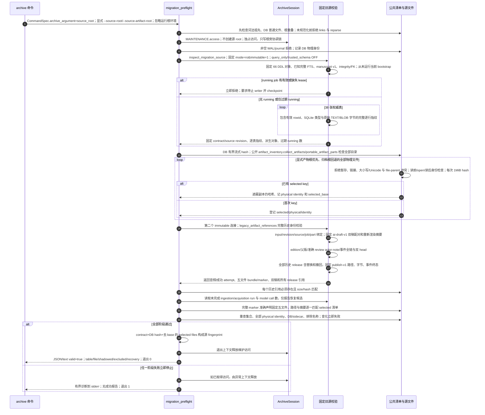

# 固定旧源契约、公开清单与完整历史预检

源码基线：架构修复提交 `5d7a57e201564a10dec7a360b2ef8f7874dc51a7`。

[交互时序图](17-migration-preflight.html) · [Archify 规格](17-migration-preflight.json) · [全部时序图](../architecture-sequences.md)

## 调用顺序与条件分支

## 边界与恢复

- 迁移源契约仍固定于 legacy source revision 9b28957；运行入口证据固定于本次代码提交。共享清单和 Session 只协调访问，从不升级或重写旧源 DDL/JSON/hash。
- Session 在本路径仅提供 MAINTENANCE.access；旧源的 immutable/trusted_schema OFF 是独立冻结读取规则，不调用当前 runtime schema 检查或 initializer。
- migration_preflight 直接使用 artifact_inventory 公开路径、临时文件、冲突、inventory 和 stream_hash 契约，不再导入 archive_snapshot 私有函数。
- 显式产物根优先、归档根回退；遮蔽文件也参与 hash 与变化检查。五类目录全量扫描，credentials/models/logs/cache 只排除名称，不扫描内容。
- 必须停止所有 writer 并 checkpoint，包括未采用维护协议的旧程序。报告包含私有路径；此入口只报告候选，不恢复、不转换、不创建目标档案。

## 源码证据

- [src/bili_asr/cli/archive.py:25–46](../../src/bili_asr/cli/archive.py#L25)：`_cmd_archive`。
- [src/bili_asr/cli/registry.py:1–65](../../src/bili_asr/cli/registry.py#L1)：`模块边界`。
- [src/bili_asr/services/migration_preflight.py:119–213](../../src/bili_asr/services/migration_preflight.py#L119)：`migration_preflight`。
- [src/bili_asr/archive_session.py:95–104](../../src/bili_asr/archive_session.py#L95)：`ArchiveSession.access`。
- [src/bili_asr/archive_maintenance.py:84–160](../../src/bili_asr/archive_maintenance.py#L84)：`archive_access`。
- [src/bili_asr/storage/migration_source.py:176–228](../../src/bili_asr/storage/migration_source.py#L176)：`inspect_migration_source`。
- [src/bili_asr/storage/migration_artifacts.py:147–189](../../src/bili_asr/storage/migration_artifacts.py#L147)：`_legacy_editorial_checks`。
- [src/bili_asr/storage/migration_artifacts.py:88–144](../../src/bili_asr/storage/migration_artifacts.py#L88)：`_legacy_publication_checks`。
- [src/bili_asr/artifact_inventory.py:89–119](../../src/bili_asr/artifact_inventory.py#L89)：`collect_artifacts`。
- [src/bili_asr/artifact_inventory.py:122–130](../../src/bili_asr/artifact_inventory.py#L122)：`stream_hash`。
- [src/bili_asr/services/migration_preflight.py:45–54](../../src/bili_asr/services/migration_preflight.py#L45)：`_hash_file`。
- [src/bili_asr/storage/migration_artifacts.py:192–252](../../src/bili_asr/storage/migration_artifacts.py#L192)：`_legacy_artifact_references`。
- [src/bili_asr/artifact_inventory.py:34–46](../../src/bili_asr/artifact_inventory.py#L34)：`portable_artifact_parts`。
- [src/bili_asr/artifact_inventory.py:53–72](../../src/bili_asr/artifact_inventory.py#L53)：`check_artifact_collisions`。
