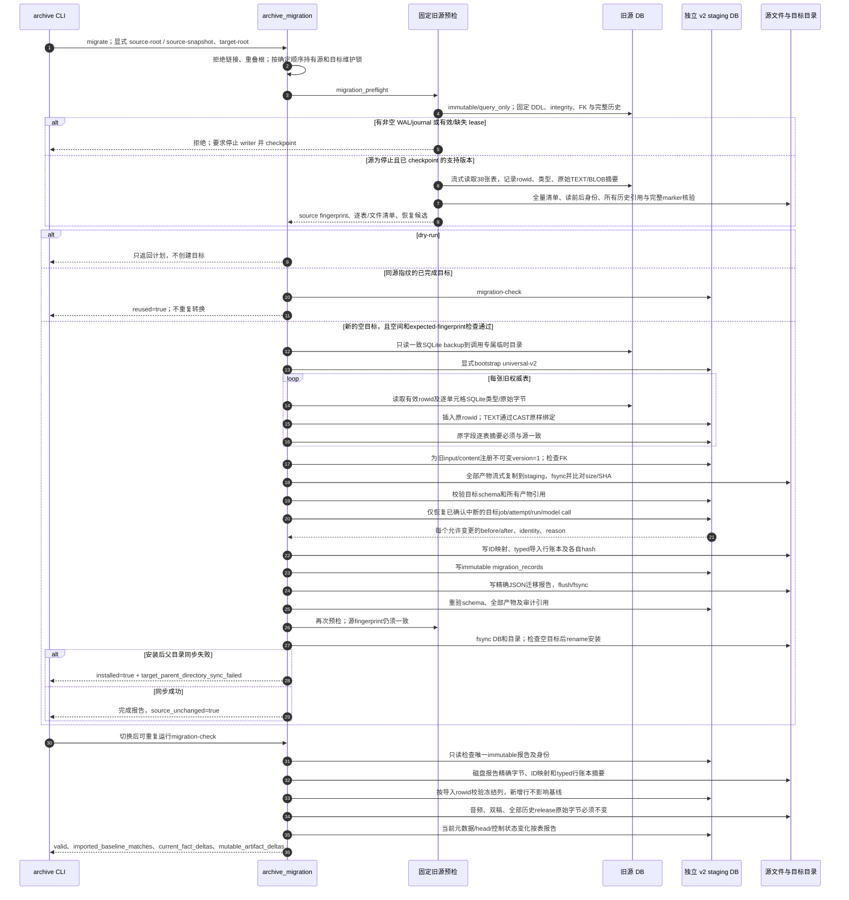

# 旧归档显式迁移：保真、恢复审计与切换验证

源码固定于提交 `857906d3b3c54b31fd9bc0ba94b84618f68cd6f3`；旧源的独立读取契约仍固定于 `9b289570494b5e8f7cc564a7eaa5b2eb2c28c3ad`，保真基准包由变更前的 writer 生成。

[交互时序图](18-universal-migration.html) · [完整 Archify 规格](18-universal-migration.json) · [本轮实现说明](../issues-implementation.md)

迁移只恢复 staging 目标。旧源不会被升级、恢复任务、重编码 JSON 或清理历史；已完成和取消的旧历史在搬运时保持原值。源 writer 必须已经停止，维护锁无法代替停止不遵守此协议的旧进程。任一安装前步骤失败仅清理调用专属临时目录，不发布部分目标。

持续 checker 保护冻结权威行、原始 payload 和历史文件，同时允许切换后的新行与可变事实继续演进。唯一 payload 例外是已知的规范 `publish:<part_id>` 请求：同一 part 可改为另一真实转录 ID，其他字段、JSON表示和存储类型仍受严格约束。元数据、发布 heads、调度状态、tags/依赖关系的合法变化按表计数；可变 transcript bundle 差异单独列出。ID映射、行账本和磁盘报告都是快照的必需引用，缺失或摘要不符会拒绝保存/校验。

源码证据均使用固定提交：

| 责任 | 证据 |
| --- | --- |
| 显式入口与快照迁移选项 | [cli/archive.py:25–59](https://github.com/SuperCatQR/bilibili-asr-archive/blob/857906d3b3c54b31fd9bc0ba94b84618f68cd6f3/src/bili_asr/cli/archive.py#L25-L59) |
| 固定旧源预检和停止条件 | [migration_preflight.py:119–213](https://github.com/SuperCatQR/bilibili-asr-archive/blob/857906d3b3c54b31fd9bc0ba94b84618f68cd6f3/src/bili_asr/services/migration_preflight.py#L119-L213) |
| 原始typed搬运、比对及目标恢复 | [archive_migration.py:51–128](https://github.com/SuperCatQR/bilibili-asr-archive/blob/857906d3b3c54b31fd9bc0ba94b84618f68cd6f3/src/bili_asr/services/archive_migration.py#L51-L128) |
| 导入行账本、保护策略与publish例外 | [archive_migration.py:158–297](https://github.com/SuperCatQR/bilibili-asr-archive/blob/857906d3b3c54b31fd9bc0ba94b84618f68cd6f3/src/bili_asr/services/archive_migration.py#L158-L297) |
| staging、文件复制、审计和安装 | [archive_migration.py:300–395](https://github.com/SuperCatQR/bilibili-asr-archive/blob/857906d3b3c54b31fd9bc0ba94b84618f68cd6f3/src/bili_asr/services/archive_migration.py#L300-L395) |
| 切换后只读checker | [archive_migration.py:425–474](https://github.com/SuperCatQR/bilibili-asr-archive/blob/857906d3b3c54b31fd9bc0ba94b84618f68cd6f3/src/bili_asr/services/archive_migration.py#L425-L474) |
| 快照必须携带迁移审计引用 | [storage/snapshots.py:244–351](https://github.com/SuperCatQR/bilibili-asr-archive/blob/857906d3b3c54b31fd9bc0ba94b84618f68cd6f3/src/bili_asr/storage/snapshots.py#L244-L351) |

图的验证状态见 [本轮图表验证凭据](../issue-diagram-validation/README.md)。自动化 browser-check 与视觉人工审阅分开记录。
