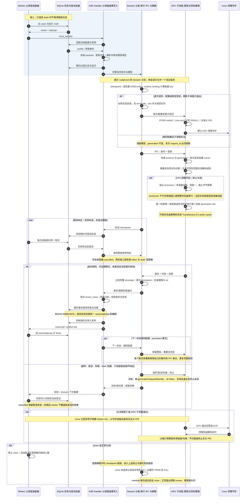

# 持久 GPU 会话：租约、热模型与故障回收

源码固定于提交 `857906d3b3c54b31fd9bc0ba94b84618f68cd6f3`。以下 Mermaid 保留[最终 Archify 规格](19-persistent-asr.json)的全部 29 条跨参与者消息，并补充源码中的条件、轮询、自调用与退出边界；[交互时序图](19-persistent-asr.html)按准入、正常完成及异常替代路径展示同一过程。

Worker 父进程领取任务、续约并提交权威状态，ASR Handler 读取冻结 profile、音频依赖与配对字幕，解析可验证的运行时模型绑定后构造本次推理身份。GPU 子进程只持有模型和任务输入，不连接 SQLite。每次请求同时绑定 `protocol=1`、会话 `generation`、随机 `request_id`、`job_id`、`owner`、`attempt_count`、`profile_digest` 与 `runtime_binding`，父端逐项比较响应并在响应前后执行 checkpoint；数据库写入又独立检查当前 owner、attempt、running 状态与未过期租约。推理响应通过不等于任务已经完成，转录保存、发布排队及尝试终态仍必须分别通过围栏。

会话复用依据完整 ASR 配置和经过校验的模型绑定，不只依据模型名称。绑定解析要求原始逻辑身份、固定 revision、manifest 摘要、模型文件清单与逐文件摘要一致；修改实际绑定会改变会话 key，旧进程必须先销毁。双轮推理只复用同一音频的解码波形并检查文件身份变化，任务热词、检测结果和诊断重新建立；没有可保留热词时跳过第二轮。CPU 预取只为当前音频下一 chunk 准备输入，默认关闭，独立 processor 避免与解码线程并发使用同一对象；保守预留和实际输入大小都受预算约束，无法准备时使用串行输入路径。

等待期间，独立线程使用自己持有的 SQLite 连接续约同一尝试；临时续约错误可以重试，但提交围栏不能跳过。取消、租约被回收、drain 宽限期耗尽或期限到达都会通过 checkpoint 或响应校验中止推理，Session 丢弃返回并终止，下一请求重新创建进程。子进程已经退出但队列 feeder 仍在交付时，父端仅给予一次有界读取机会。Handler 的采集记录失败关闭同样受原尝试权限约束；失租错误不能使旧 worker 重写新尝试，取消仍按 authoritative cancelled 计数。

drain 文件或停止信号先停止领取新任务，活动推理在宽限期内继续心跳；超过宽限期后通过 checkpoint 进入同一失败处理。Session 关闭先发送哨兵并有界等待，随后按需要对自有进程组 TERM、KILL、join 和关闭队列。Linux 子进程建立独立进程组，内核父死信号在原生推理占用 GIL 时仍可杀死 GPU owner，独立 EOF 守护负责清理同组解码后代。Supervisor 回收已拥有的句柄并在重启前清理退出组。`oneshot` 是每次推理后关闭的回退配置；CPU 与 legacy 路径另见[实施说明](../issues-implementation.md)和[ASR worker 文档](../asr-workers.md)。阶段 wall-time、父端等待与任务间隙只是诊断证据，WSL 控制测试不能代替真实 GPU 利用率、生产部署或 Windows 完整进程树验收。

源码证据均固定于 `857906d3b3c54b31fd9bc0ba94b84618f68cd6f3`：

| 责任 | 固定源码证据 |
| --- | --- |
| Worker 组成、资源关闭、信号与 drain 配置 | [workflow_application.py:102–168](https://github.com/SuperCatQR/bilibili-asr-archive/blob/857906d3b3c54b31fd9bc0ba94b84618f68cd6f3/src/bili_asr/services/workflow_application.py#L102-L168) |
| 任务领取、Handler 调用、finish/fail 与失租处理 | [workflow.py:103–172](https://github.com/SuperCatQR/bilibili-asr-archive/blob/857906d3b3c54b31fd9bc0ba94b84618f68cd6f3/src/bili_asr/workflow.py#L103-L172) |
| 独立心跳连接、drain 宽限期和续约失租 token | [workflow.py:178–247](https://github.com/SuperCatQR/bilibili-asr-archive/blob/857906d3b3c54b31fd9bc0ba94b84618f68cd6f3/src/bili_asr/workflow.py#L178-L247) |
| checkpoint 的权威取消与租约检查 | [workflow_runtime.py:114–120](https://github.com/SuperCatQR/bilibili-asr-archive/blob/857906d3b3c54b31fd9bc0ba94b84618f68cd6f3/src/bili_asr/workflow_runtime.py#L114-L120) |
| 冻结配置、音频、运行登记、Session 请求、转录与发布排队 | [workflow_runtime.py:241–350](https://github.com/SuperCatQR/bilibili-asr-archive/blob/857906d3b3c54b31fd9bc0ba94b84618f68cd6f3/src/bili_asr/workflow_runtime.py#L241-L350) |
| running、owner、attempt、期限及事务前后围栏 | [job_commit.py:23–62](https://github.com/SuperCatQR/bilibili-asr-archive/blob/857906d3b3c54b31fd9bc0ba94b84618f68cd6f3/src/bili_asr/storage/job_commit.py#L23-L62) |
| 工作流 claim/续约入口与终态提交 | [storage/workflow.py:203–294](https://github.com/SuperCatQR/bilibili-asr-archive/blob/857906d3b3c54b31fd9bc0ba94b84618f68cd6f3/src/bili_asr/storage/workflow.py#L203-L294)、[storage/workflow.py:687–748](https://github.com/SuperCatQR/bilibili-asr-archive/blob/857906d3b3c54b31fd9bc0ba94b84618f68cd6f3/src/bili_asr/storage/workflow.py#L687-L748) |
| 请求身份、父死信号、EOF 守护与 GPU 请求循环 | [asr/session.py:31–111](https://github.com/SuperCatQR/bilibili-asr-archive/blob/857906d3b3c54b31fd9bc0ba94b84618f68cd6f3/src/bili_asr/asr/session.py#L31-L111) |
| 配置 key、串行请求、期限、响应校验与终止关闭 | [asr/session.py:128–267](https://github.com/SuperCatQR/bilibili-asr-archive/blob/857906d3b3c54b31fd9bc0ba94b84618f68cd6f3/src/bili_asr/asr/session.py#L128-L267) |
| 模型绑定的 manifest、固定身份与文件校验 | [runtime_bindings.py:95–179](https://github.com/SuperCatQR/bilibili-asr-archive/blob/857906d3b3c54b31fd9bc0ba94b84618f68cd6f3/src/bili_asr/runtime_bindings.py#L95-L179) |
| 同一音频复用范围与预取配置 | [asr/runner.py:276–301](https://github.com/SuperCatQR/bilibili-asr-archive/blob/857906d3b3c54b31fd9bc0ba94b84618f68cd6f3/src/bili_asr/asr/runner.py#L276-L301) |
| 推理诊断、波形准备、深度一预算预取与回收 | [asr/runner.py:473–713](https://github.com/SuperCatQR/bilibili-asr-archive/blob/857906d3b3c54b31fd9bc0ba94b84618f68cd6f3/src/bili_asr/asr/runner.py#L473-L713) |
| 双轮热词重建与新生成调用 | [asr/runner.py:831–864](https://github.com/SuperCatQR/bilibili-asr-archive/blob/857906d3b3c54b31fd9bc0ba94b84618f68cd6f3/src/bili_asr/asr/runner.py#L831-L864) |
| Supervisor drain、拥有句柄回收与重启边界 | [workflow_supervisor.py:90–225](https://github.com/SuperCatQR/bilibili-asr-archive/blob/857906d3b3c54b31fd9bc0ba94b84618f68cd6f3/src/bili_asr/workflow_supervisor.py#L90-L225) |

[本图验证凭证](../issue-diagram-validation/19-persistent-asr/receipt.json)记录固定源码 SHA、规格与 HTML 摘要；showcase 验证 9/9 通过、0 errors、0 warnings，`validate`、`deliver`、strict `check` 与自动化 `browser-check` 均通过，视觉人工审阅为 `not-requested`。其他图表的统一证据见[验证索引](../issue-diagram-validation/README.md)。
