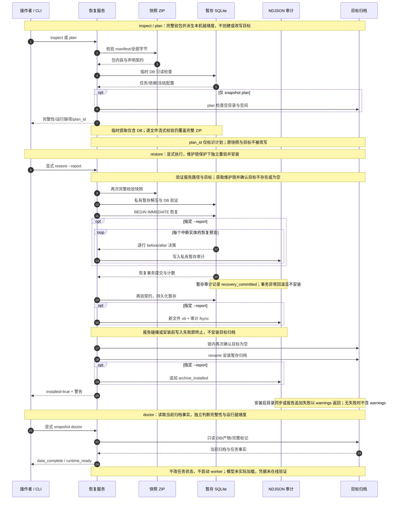

# 快照恢复：完整校验、暂存改写与安装审计

源码固定于 `857906d3b3c54b31fd9bc0ba94b84618f68cd6f3`。[打开交互时序图](20-recovery-plan.html)、[查看最终图规格](20-recovery-plan.json)、[查看交付验证收据](../issue-diagram-validation/20-recovery-plan/receipt.json)。以下 Mermaid 保留最终 JSON 的全部 24 条消息及顺序；条件块说明仅 `plan` 或指定 `--report` 时发生的步骤。

## 检查与计划的范围

`inspect` 和 `plan` 使用 `verified_snapshot_reader`：检查 manifest、ZIP 成员与便携路径，读取每个声明文件的全部字节核对尺寸及 SHA-256，再验证 bundle 完整标记、数据库契约及数据库中的产物引用。只有 `archive.db` 被提取到临时目录用于只读查询，结束后清理；原 ZIP 保持不变，目标目录及其父目录不会由这两个命令创建。完整验证失败会抛出错误，不输出成功的完整性报告。

`inspect` 返回 `data_complete`、版本与契约、任务派生状态及逐实体 `recovery_changes`，属于恢复前预览。它按假设恢复后的租约和调度语义评估原来的 `running` 任务，数据库仍保留原状态。`plan` 在相同检查之上要求目标不存在或为空、路径不含链接、源 ZIP 不位于目标内，并从最近的已有祖先目录读取可用空间。空间需求为包中声明文件的尺寸总和加两倍 DB 尺寸及 16 MiB 预留；报告给出 `target_ready`、空间数值、ZIP 摘要、Python 和包版本。

`plan_id` 由 `snapshot_id`、整包 SHA-256、数据库契约、目标路径及消费程序版本生成。计划期间还检查源文件物理身份是否改变。`restore` 没有凭 `plan_id` 跳过校验的入口；执行时重新验包并重新检查目标。这里的预览就是 `inspect` / `plan`，CLI 未定义额外的 `--dry-run` 恢复参数。

## 暂存恢复与安装审计

`restore` 在目标父目录中的私有暂存目录解压完整归档，在维护锁内操作；父目录可以在执行恢复时创建。所有恢复改写都发生于暂存 DB 的单个 `BEGIN IMMEDIATE` 事务中：

| 原事实 | 暂存恢复后的事实 |
| --- | --- |
| `workflow_jobs.status = running` | 改为 `queued`，清除 `lease_owner` / `lease_expires_at`，设置可执行时间及 `snapshot_restored` 错误码；尝试计数保留。 |
| `workflow_attempts.outcome = running` | 改为 `failed`，关闭时间不早于开始时间，记录 `snapshot_restored`；既有结果中加入 `snapshot_recovery` 的快照身份与原因。 |
| 运行中的 `ingestion_runs` / `acquisition_runs` | 改为 `failed` 并关闭结束时间。 |
| `editorial_model_calls.finished_at IS NULL` | 关闭调用并记录 `snapshot_restored`。 |
| 已成功、已取消、已有失败与历史尝试，以及冻结配置 | 保留；已有失败任务仍需显式重试，恢复不会自动重试这些任务。 |

指定 `--report` 时，先在私有暂存审计中逐行记录 `recovery_change` 的 `entity`、`identity`、`before`、`after`、`snapshot_id`、`reason`；事务提交后记录 `recovery_committed` 与计数。记录采用实体身份和状态，不复制凭据值或完整运行配置。事务失败会回滚；提交后再校验 DB 契约，同步 DB 及暂存目录。

外部报告必须是尚不存在的新文件，位于目标归档之外，不能等于源 ZIP；其父目录必须已经存在。报告可与 ZIP 位于同一父目录。安装前用 `xb` 独占创建外部报告，复制并持久化审计；碰撞或此阶段写入失败会终止，目标归档不安装。写入失败可能留下未完成的报告文件，因此报告存在本身不能证明安装成功。不指定 `--report` 时，不发布外部审计文件，恢复事务和安装仍执行。

持久化暂存及可选报告后，锁内再次确认目标不存在或为空，移除已有空目录并以 `rename` 安装暂存归档。安装后尝试同步目标父目录，再追加并持久化 `archive_installed`。这两个后续步骤的 `OSError` 以 `installed=true` 和 `installed_directory_sync_failed` / `installed_recovery_report_failed` 警告返回；报告后续写入失败时 `recovery_report_written=false`。没有此类失败时不返回 `warnings`。恢复不会自动启动 worker。

## 当前环境与任务状态

`doctor` 通过只读会话检查已安装 DB、所需产物路径与可用摘要、出版 bundle 完整标记，并根据当前存储状态重新派生任务报告。它读取配置的产物根及归档根，不写 schema、重排任务或清理租约。`data_complete` 表示归档完整性，`runtime_ready` 表示待处理任务没有环境或配置缺项，两者分别报告。

就绪度检查按任务类型核对本机工具、Python 包、可用设备、非空凭据的名称及模型文件可用性。YouTube 还检查可选运行环境；需要 GPU 的待处理 ASR 配置才触发隔离进程中的设备枚举。默认只有 CPU，枚举成功才报告相应 CUDA / ROCm 设备。这些检查没有执行真实推理：始终报告 `model_load_tested=false`、`credentials_verified_online=false`，凭据名称存在不代表在线可用。

冻结 ASR 配置通过 `--runtime-bindings` 为 `inspect`、`plan`、`doctor` 提供显式路径迁移：模型及 aligner 必须与冻结逻辑身份和精确 revision 一致，独立 manifest 摘要及其中全部文件摘要必须匹配，文件库存需完整且不能包含链接。绑定仅替换当前运行配置中的模型路径，并报告绑定身份，不改写 DB 中的冻结配置、设备或其他参数。缺乏已固定身份的旧本地模型或 aligner 会被拒绝；不能从目录名称推断旧权重身份。`restore` 本身不接收 `--runtime-bindings`，也不需要先加载模型才能安装数据。

任务状态是报告字段 `derived_state`，不引入第二套持久状态。优先级为：坏 payload → `blocked_invalid_payload`；已有失败 → `manual_retry`；`doctor` 看到的运行任务 → `running_owned` 或 `expired_lease`；环境缺项 → `blocked_environment`；未成功的前置依赖 → `waiting_dependency`；未来的 `available_at` → `waiting_schedule`；其余 → `ready_now`。成功和已取消任务分别汇总为 `completed`、`cancelled_terminal`，不列为待处理任务。`runtime_ready=true` 不保证所有任务都 `ready_now`，等待依赖、调度或人工重试仍可能存在。

CLI 遇到异常、`data_complete=false` 或 `target_ready=false` 返回失败退出码；仅 `runtime_ready=false` 不改变成功退出码，操作者需读取报告中的缺项。离线检查和恢复不构成在线凭据、生产切换或真实 GPU 验收；快照 ZIP 格式版本保持原有定义。命令示例与配置细节见[实施说明](../issues-implementation.md)。

## 源码依据

以下全部链接固定到完整提交 SHA `857906d3b3c54b31fd9bc0ba94b84618f68cd6f3`，覆盖六个参与者及上述条件边界。[验证收据](../issue-diagram-validation/20-recovery-plan/receipt.json)记录最终 JSON / HTML 摘要、四项交付门禁和自动浏览器证据；这些证据对应交互图，不声称完成了人工视觉评审。

| 依据 | 固定源码与行号 |
| --- | --- |
| CLI 命令、参数和退出码 | [cli/snapshot.py:13–72](https://github.com/SuperCatQR/bilibili-asr-archive/blob/857906d3b3c54b31fd9bc0ba94b84618f68cd6f3/src/bili_asr/cli/snapshot.py#L13-L72) |
| 本机工具、包、设备、凭据名和模型可用性 | [services/archive_recovery.py:38–123](https://github.com/SuperCatQR/bilibili-asr-archive/blob/857906d3b3c54b31fd9bc0ba94b84618f68cd6f3/src/bili_asr/services/archive_recovery.py#L38-L123) |
| 批量任务事实、状态优先级及就绪度 | [services/archive_recovery.py:126–220](https://github.com/SuperCatQR/bilibili-asr-archive/blob/857906d3b3c54b31fd9bc0ba94b84618f68cd6f3/src/bili_asr/services/archive_recovery.py#L126-L220) |
| 恢复预览及只读计划、稳定快照与空间检查 | [services/archive_recovery.py:227–278](https://github.com/SuperCatQR/bilibili-asr-archive/blob/857906d3b3c54b31fd9bc0ba94b84618f68cd6f3/src/bili_asr/services/archive_recovery.py#L227-L278) |
| 已安装归档的只读 doctor | [services/archive_recovery.py:280–316](https://github.com/SuperCatQR/bilibili-asr-archive/blob/857906d3b3c54b31fd9bc0ba94b84618f68cd6f3/src/bili_asr/services/archive_recovery.py#L280-L316) |
| manifest、ZIP 成员及 bundle 完整标记验证 | [services/archive_snapshot.py:225–323](https://github.com/SuperCatQR/bilibili-asr-archive/blob/857906d3b3c54b31fd9bc0ba94b84618f68cd6f3/src/bili_asr/services/archive_snapshot.py#L225-L323) |
| 全字节校验与临时 DB 只读提取生命周期 | [services/archive_snapshot.py:292–333](https://github.com/SuperCatQR/bilibili-asr-archive/blob/857906d3b3c54b31fd9bc0ba94b84618f68cd6f3/src/bili_asr/services/archive_snapshot.py#L292-L333) |
| 维护锁、暂存恢复、报告独占创建、安装及安装后警告 | [services/archive_snapshot.py:353–418](https://github.com/SuperCatQR/bilibili-asr-archive/blob/857906d3b3c54b31fd9bc0ba94b84618f68cd6f3/src/bili_asr/services/archive_snapshot.py#L353-L418) |
| DB 契约及引用完整性入口 | [storage/snapshots.py:157–189](https://github.com/SuperCatQR/bilibili-asr-archive/blob/857906d3b3c54b31fd9bc0ba94b84618f68cd6f3/src/bili_asr/storage/snapshots.py#L157-L189) |
| 逐实体恢复预览、单事务改写与历史保留 | [storage/snapshots.py:331–392](https://github.com/SuperCatQR/bilibili-asr-archive/blob/857906d3b3c54b31fd9bc0ba94b84618f68cd6f3/src/bili_asr/storage/snapshots.py#L331-L392) |
| 运行时绑定的冻结身份、文件库存及摘要验证 | [runtime_bindings.py:79–178](https://github.com/SuperCatQR/bilibili-asr-archive/blob/857906d3b3c54b31fd9bc0ba94b84618f68cd6f3/src/bili_asr/runtime_bindings.py#L79-L178) |
| 可选绑定文件加载与错误边界 | [runtime_bindings.py:181–188](https://github.com/SuperCatQR/bilibili-asr-archive/blob/857906d3b3c54b31fd9bc0ba94b84618f68cd6f3/src/bili_asr/runtime_bindings.py#L181-L188) |
