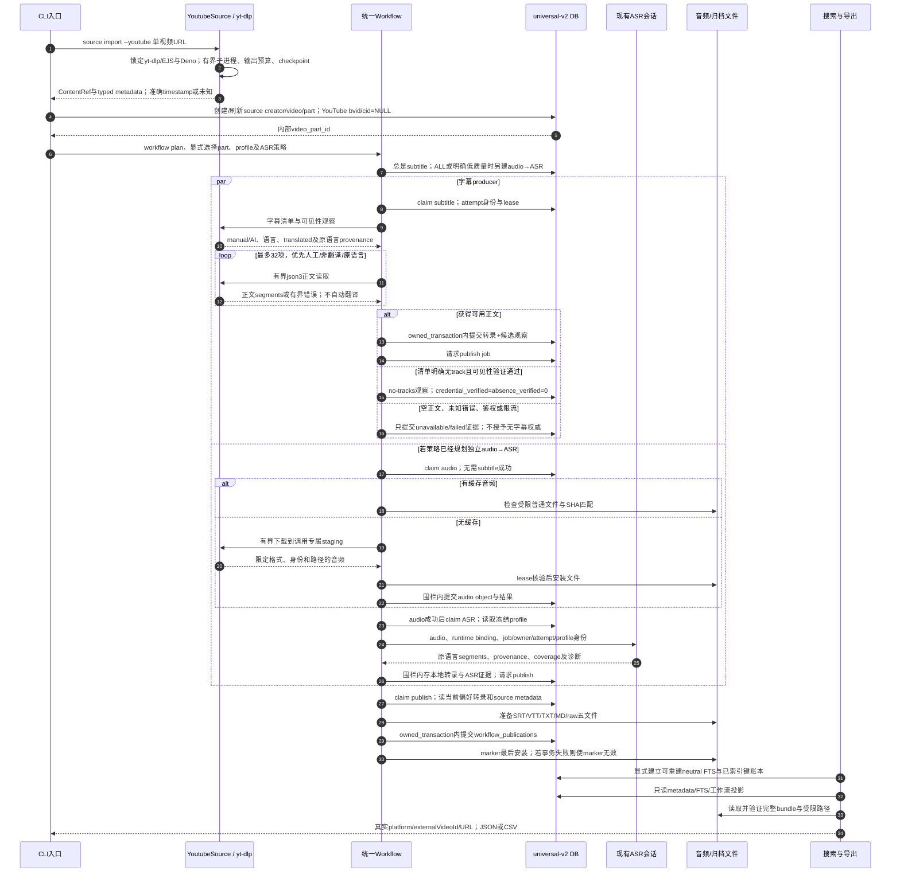

# YouTube 单视频：统一任务、租约与归档消费链

源码固定于提交 `857906d3b3c54b31fd9bc0ba94b84618f68cd6f3`。

[交互时序图](21-youtube-workflow.html) · [完整 Archify 规格](21-youtube-workflow.json) · [本轮实现说明](../issues-implementation.md)

两条 producer 路径复用原有工作流和租约机制。字幕失败不会给独立 audio job 增加前置条件；`BELOW_THRESHOLD` 在质量未知时也不会自行建立 ASR，`ALL` 可直接规划 audio→ASR。图按纵向展开两个条件路径，实际任务可由不同 worker 消费。

平台凭据只在运行时进入适配器，支持显式 cookie 文件及 worker 的 `BILI_YOUTUBE_COOKIES` 配置；路径和 cookie 不进入数据库。适配器使用有界 yt-dlp 子进程，拒绝播放列表、直播和不可信单视频入口，错误正文脱敏。上游只给日期而没有明确 timestamp 时，发布日期保持未知。正文语言、人工/AI和翻译 provenance 原样保留；匿名可见性与空正文不替代 Bilibili 的凭据核验和字幕缺失权威。

长网络请求和推理在短权威写事务外执行，任务执行器续租，SQLite/最终文件由父工作流围栏提交。GPU 会话子进程复用模型并核对请求身份；CPU 使用现有 runner。bundle 发布选择当前偏好转录，并与 publication fact 同时受取消/失租围栏保护；这是转录 bundle，经过人工审核的 edition/release 另有完整出版链。

neutral FTS 使用真实源身份并可重建，metadata 搜索可在转录或索引尚不存在时使用。JSON/CSV导出、marker完整性与快照恢复已经有真实子进程模拟的链路回归；该测试不构成对线上YouTube服务或真实GPU设备的验证。

源码证据均使用固定提交：

| 责任 | 证据 |
| --- | --- |
| 单视频导入与明确运行环境检查 | [cli/source.py:20–45](https://github.com/SuperCatQR/bilibili-asr-archive/blob/857906d3b3c54b31fd9bc0ba94b84618f68cd6f3/src/bili_asr/cli/source.py#L20-L45) |
| 有界extractor、元数据精度与字幕/音频 | [youtube_source.py:147–320](https://github.com/SuperCatQR/bilibili-asr-archive/blob/857906d3b3c54b31fd9bc0ba94b84618f68cd6f3/src/bili_asr/sources/youtube_source.py#L147-L320) |
| 平台身份与数据库part | [storage/sources.py:17–66](https://github.com/SuperCatQR/bilibili-asr-archive/blob/857906d3b3c54b31fd9bc0ba94b84618f68cd6f3/src/bili_asr/storage/sources.py#L17-L66) |
| 独立producer规划与质量未知分支 | [workflow_planning.py:60–90](https://github.com/SuperCatQR/bilibili-asr-archive/blob/857906d3b3c54b31fd9bc0ba94b84618f68cd6f3/src/bili_asr/workflow_planning.py#L60-L90) |
| source handler复用现有控制面 | [source_workflow.py:32–159](https://github.com/SuperCatQR/bilibili-asr-archive/blob/857906d3b3c54b31fd9bc0ba94b84618f68cd6f3/src/bili_asr/services/source_workflow.py#L32-L159) |
| claim、lease、attempt及短写事务 | [storage/workflow.py:203–299](https://github.com/SuperCatQR/bilibili-asr-archive/blob/857906d3b3c54b31fd9bc0ba94b84618f68cd6f3/src/bili_asr/storage/workflow.py#L203-L299) |
| 现有ASR输入与产物/出版事实提交 | [workflow_runtime.py:241–461](https://github.com/SuperCatQR/bilibili-asr-archive/blob/857906d3b3c54b31fd9bc0ba94b84618f68cd6f3/src/bili_asr/workflow_runtime.py#L241-L461) |
| neutral索引与当前发布日期过滤 | [source_store.py:94–164](https://github.com/SuperCatQR/bilibili-asr-archive/blob/857906d3b3c54b31fd9bc0ba94b84618f68cd6f3/src/bili_asr/search_index/source_store.py#L94-L164) |
| 实际子进程到bundle/search/export/snapshot回归 | [test_youtube_workflow.py:30–87](https://github.com/SuperCatQR/bilibili-asr-archive/blob/857906d3b3c54b31fd9bc0ba94b84618f68cd6f3/tests/test_youtube_workflow.py#L30-L87) |

图的验证状态见 [本轮图表验证凭据](../issue-diagram-validation/README.md)。自动化 browser-check 与视觉人工审阅分开记录。
