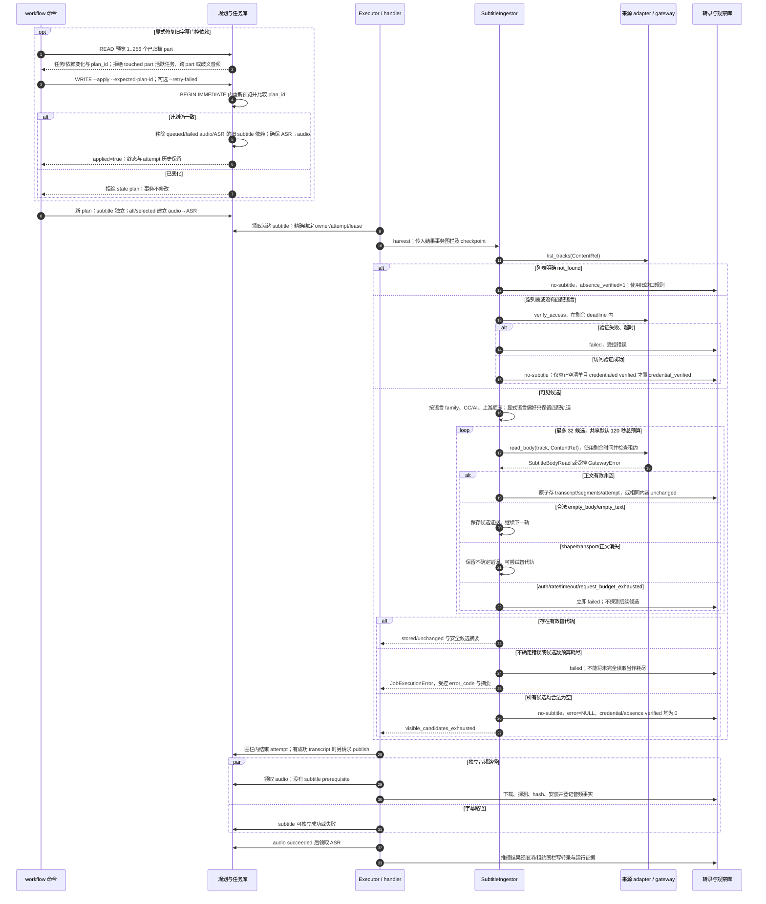

# 字幕候选、可信证据与独立 ASR

源码基线：`857906d3b3c54b31fd9bc0ba94b84618f68cd6f3`。
对应 issue #285 的字幕结果分类与旧依赖修复；旧文档中的历史基线不被本图替换。

[交互时序图](22-subtitle-candidates.html) · [Archify 规格](22-subtitle-candidates.json) · [全部时序图](../architecture-sequences.md)

## 候选处理与任务执行

## 条件与边界

- 合法空正文与空 inventory 不同：可见正文全部为空不会新增 Bilibili 可信缺失权限；旧 `v_missing_audio` 仍要求明确已验证 not_found，或多次独立 credentialed 空 inventory。
- 文本为空可以合法；无效/非有限时间轴、缺字段、破损正文不能被转成合法空结果。严格兼容 `fetch_segments` 路径仍拒绝没有有效 segment 的正文。
- 一轮字幕最多存一个有效轨道；前面的空轨道或可替代失败不阻止后面有效轨道。所有候选未确定可读时保持失败。
- `all/selected` 需要 ASR profile；`below-threshold` 仅对已知低分规划 audio/ASR，未知分数不自动生成该链。字幕合法空结果不负责自动改写计划。
- 修复只作用于明确选中 part 的旧生产者依赖；应用保留 attempts、attempt_count 与 succeeded/cancelled 终态。failed audio/ASR 是否重排由显式 flag 控制。
- acquiring 转录与工作流 attempt 是两种证据。handler 结果通过 owner/attempt/lease 围栏提交，失败摘要只含有界代码、候选身份与计数，不保存 cookie、URL 或原始异常文本。
- 本图聚焦 Bilibili 候选语义；YouTube 的 public inventory 与 json3 provenance 使用单独版本化策略，不能借用 Bilibili 的 credential 标志。

## 固定源码证据

- [CLI 的预览/应用入口](https://github.com/SuperCatQR/bilibili-asr-archive/blob/857906d3b3c54b31fd9bc0ba94b84618f68cd6f3/src/bili_asr/cli/workflow.py#L189-L221)。
- [任务规划的独立依赖](https://github.com/SuperCatQR/bilibili-asr-archive/blob/857906d3b3c54b31fd9bc0ba94b84618f68cd6f3/src/bili_asr/workflow_planning.py#L60-L91)。
- [旧图修复与事务内计划复验](https://github.com/SuperCatQR/bilibili-asr-archive/blob/857906d3b3c54b31fd9bc0ba94b84618f68cd6f3/src/bili_asr/storage/workflow_dependency_repair.py#L12-L85)。
- [候选预算、typed 读取及失败条件](https://github.com/SuperCatQR/bilibili-asr-archive/blob/857906d3b3c54b31fd9bc0ba94b84618f68cd6f3/src/bili_asr/services/subtitle_ingest.py#L467-L565)。
- [gateway 合法空正文规范化](https://github.com/SuperCatQR/bilibili-asr-archive/blob/857906d3b3c54b31fd9bc0ba94b84618f68cd6f3/src/bili_asr/sources/bilibili_api_gateway.py#L645-L656)。
- [Bilibili 可信缺口视图](https://github.com/SuperCatQR/bilibili-asr-archive/blob/857906d3b3c54b31fd9bc0ba94b84618f68cd6f3/src/bili_asr/storage/schema-transcripts.sql#L262-L331)。
- [handler 的结果与诊断](https://github.com/SuperCatQR/bilibili-asr-archive/blob/857906d3b3c54b31fd9bc0ba94b84618f68cd6f3/src/bili_asr/workflow_runtime.py#L120-L163)。

## 交付验证

Showcase 9/9、零错误/警告，严格 artifact/provenance 检查与真实 Chrome 的四档 light、两档 dark 检查通过，READ/Still 状态和水平包含通过。按宽度建议仅将列展开为 `spread` 后完整重验。保留 [紧凑交付凭据](../issue-diagram-validation/22-subtitle-candidates/receipt.json)；未进行截图感知评审，不以离线验证推断账号、实网或 GPU 吞吐可用。
