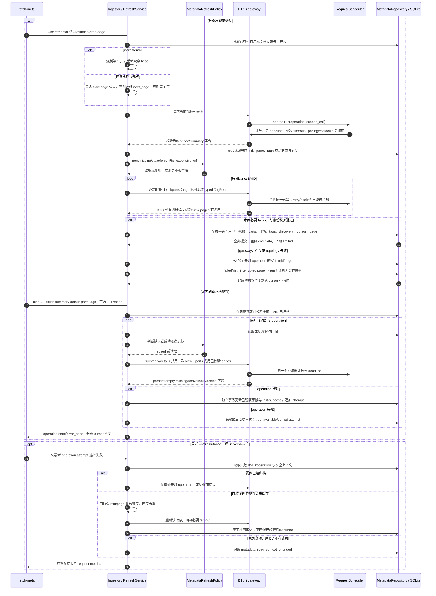

# 增量发现、字段刷新与失败重放

源码基线：`857906d3b3c54b31fd9bc0ba94b84618f68cd6f3`。
对应 issue #286 的当前源元数据与 #287 的增量采集、字段刷新和失败补采。

[交互时序图](23-metadata-refresh.html) · [Archify 规格](23-metadata-refresh.json) · [全部时序图](../architecture-sequences.md)

## 扫描、刷新与恢复

## 字段、游标与预算语义

- 增量扫描明确回到上传者列表头；恢复游标表示上次扫描位置，不能作为发现新上传的增量水位。`incremental` 与 `resume/start-page` 互斥。
- 默认 `force` 保留重采行为。`new` 只补新视频的 expensive 操作；`missing` 补未成功观察；`stale` 按 last-success 与 TTL 判断。复用事实不重写观察时间，也不伪造网络调用。
- present 更新字段；明确 empty 可撤回；missing/unavailable/denied 保留最后成功事实。标签成功空集合才清空，失败仍保留旧集合。
- 分页普通 summary 允许补齐 `pubdate=0`；已知正值由显式 summary refresh 修正，传入 0 不覆盖已有正值。aid 与分 P CID 保持稳定身份，冲突不会重绑已有转录。
- 一页载荷的 SQL 提交原子。可选 tags 失败记录覆盖缺口而保留旧标签；必须的 detail/parts 失败使该页载荷不提交。显式 `skip-failed-page` 是独立游标推进操作，仍保留失败证据，限流不能跳过。
- v2 的 `source_metadata_observations` 保存逐字段当前观察与最后成功值；`metadata_refresh_attempts` 是追加尝试账本。v1 不自动补这两张表，`refresh-failed` 明确要求显式新建或迁移目标。
- 新视频失败时页事务外留下安全 mid/page；整页重放不会回退更后的成功游标。页面变化后无法找回原 BV 必须保留未解决失败。
- 请求协调器按 gateway operation 计数，应用重试与 credential 验证共用预算；单次 timeout 受总 deadline 约束，限流设置共享冷却。它只协调同一个进程内实例，SDK 内部 HTTP 子请求不逐个计量。
- 当前事实可刷新；已经冻结的 AI 输入、稿件内容、审核、release 与历史渲染字节保持原版本契约。

## 固定源码证据

- [CLI 模式、字段与预算参数](https://github.com/SuperCatQR/bilibili-asr-archive/blob/857906d3b3c54b31fd9bc0ba94b84618f68cd6f3/src/bili_asr/cli/parser.py#L38-L73)。
- [分页发现、fan-out 与事务调用](https://github.com/SuperCatQR/bilibili-asr-archive/blob/857906d3b3c54b31fd9bc0ba94b84618f68cd6f3/src/bili_asr/services/metadata_ingest.py#L240-L583)。
- [定向刷新与失败操作选择](https://github.com/SuperCatQR/bilibili-asr-archive/blob/857906d3b3c54b31fd9bc0ba94b84618f68cd6f3/src/bili_asr/services/metadata_refresh.py#L30-L151)。
- [成功观察时间与字段事务](https://github.com/SuperCatQR/bilibili-asr-archive/blob/857906d3b3c54b31fd9bc0ba94b84618f68cd6f3/src/bili_asr/services/metadata_refresh.py#L153-L202)。
- [共享计数、timeout、冷却与等待](https://github.com/SuperCatQR/bilibili-asr-archive/blob/857906d3b3c54b31fd9bc0ba94b84618f68cd6f3/src/bili_asr/request_budget.py#L14-L79)。
- [字段保留与观察账本](https://github.com/SuperCatQR/bilibili-asr-archive/blob/857906d3b3c54b31fd9bc0ba94b84618f68cd6f3/src/bili_asr/storage/metadata.py#L365-L420)。
- [页原子提交与失败证据](https://github.com/SuperCatQR/bilibili-asr-archive/blob/857906d3b3c54b31fd9bc0ba94b84618f68cd6f3/src/bili_asr/storage/metadata.py#L545-L720)。
- [v2 独立 schema 对象](https://github.com/SuperCatQR/bilibili-asr-archive/blob/857906d3b3c54b31fd9bc0ba94b84618f68cd6f3/src/bili_asr/storage/schema-observations.sql#L1-L22)。

## 交付验证

Showcase 9/9、零错误/警告，严格 artifact/provenance 检查与真实 Chrome 的四档 light、两档 dark 检查通过。宽度建议只改变 `column_fit=spread` 并重验；正常纵向页面滚动通过声明的可读布局接受，无水平溢出。保留 [紧凑交付凭据](../issue-diagram-validation/23-metadata-refresh/receipt.json)。未进行截图感知评审；离线观察与回归不代表上游账号、实网或生产 archive 切换验收。
